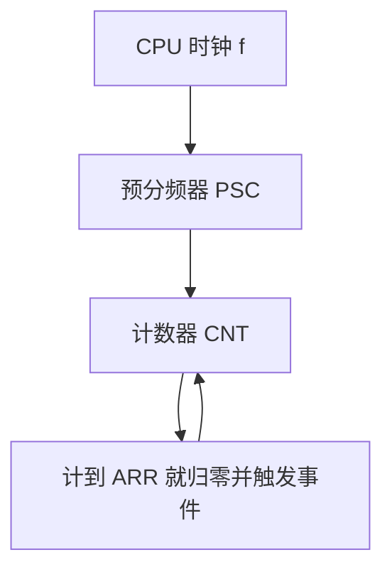
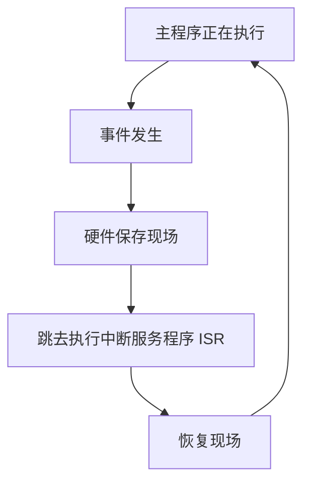

# Lab1 寄存器、定时器与中断

> [!info] 这个实验在做什么
> 表面上是四个任务，实际上是**在没有操作系统的裸机上，学会软件与硬件对话的三种基本方式**：
> 用**位运算**改写硬件的控制面板（寄存器）、用**定时器**把时间变成可数的东西、用**中断**让硬件在事件发生时主动叫你。
> 三者是递进的：位运算是语法，寄存器是词汇，定时器与中断是这门语言里最常用的两个句式。
> 板子是 **NUCLEO-F103RB**（STM32F103RB，Cortex-M3 内核，32 位寄存器）。
> 交付物（报告与代码）在 `大学文件/RTCS/实验/Lab1/`，这份笔记只管把原理讲懂。
> 课程总览见 [[00 课程信息与考情]]。

## 1 主线：寄存器是硬件的控制面板

裸机上没有操作系统，也就没有"设备驱动"这一层可以调用。那软件怎么让一个引脚输出高电平？

答案是：**硬件把自己的每一个开关、每一个状态位，都映射成了内存里的一个地址**。往那个地址写值，硬件的行为就变了；从那个地址读值，就能知道硬件当前的状态。这套做法叫**内存映射 I/O**（memory-mapped I/O）：外设不占用单独的指令，而是伪装成内存，用普通的读写指令去操作。这些被映射出来的地址就叫**外设寄存器**（peripheral register）——注意跟 CPU 内部那几个通用寄存器同名但不是一回事，后者没有地址、只有编号。

在 C 语言里，`GPIOA->ODR = 0x20;` 看起来像给结构体成员赋值，实际上是**往一个固定的物理地址写了一个 32 位字**，而那个地址背后连着的是端口 A 的输出驱动电路。这就是全部魔法。

STM32 的所有外设寄存器都是 **32 位**的。每个外设——GPIO 端口、定时器、串口、ADC——都有自己的一组寄存器。

### 1.1 为什么必须用位运算

问题出在**一个寄存器里挤着多个互不相关的字段**。

以本实验要用的 `GPIOB_CRL` 为例：它一个 32 位字里塞了 **8 个引脚**的配置，每个引脚占 4 位。你只想改 pin 5，但 `GPIOB->CRL = 0x3 << 20;` 这一句会**把另外 7 个引脚的配置全部清零**——它们可能正被别的功能用着。

所以裸机寄存器操作的基本动作永远是**读—改—写**（read-modify-write）：把整个字读出来，只动自己那几位，再整个写回去。位运算就是"只动自己那几位"的手段。

## 2 位运算：六个算子，四个套路

课件层面的位运算在 [[L02 数制]] 已经打过底（那里讲的是同一批位怎么被解释成不同的数），这里换个角度：**把位当成开关，而不是数**。

| 算子 | 符号 | 作用 |
| --- | --- | --- |
| 与 AND | `&` | 两位都是 1 才得 1 |
| 或 OR | `\|` | 有一位是 1 就得 1 |
| 异或 XOR | `^` | 两位不同才得 1 |
| 非 NOT | `~` | 逐位取反 |
| 左移 | `<<` | 各位左移，右端补 0，左端移出的丢弃 |
| 右移 | `>>` | 各位右移 |

这六个算子在寄存器操作里只组合出**四个套路**，把它们背熟，所有寄存器代码都是这四句的变体：

| 目的 | 写法 | 为什么成立 |
| --- | --- | --- |
| **置位**（把选中的位变 1，其余不动） | `REG \|= mask;` | 或 1 得 1、或 0 保持原值 |
| **清零**（把选中的位变 0，其余不动） | `REG &= ~mask;` | 与 0 得 0、与 1 保持原值 |
| **取反**（把选中的位翻转，其余不动） | `REG ^= mask;` | 异或 1 翻转、异或 0 保持原值 |
| **读取**（判断选中的位是不是 1） | `(REG & mask) != 0` | 与运算把无关位全部清零 |

> [!note] 为什么"其余不动"这件事对每个算子都成立
> 关键是每个算子都有一个**单位元**：`x | 0 = x`、`x & 1 = x`、`x ^ 0 = x`。
> 掩码里凡是**不想动**的位置就填单位元，凡是**想动**的位置就填另一个值。
> 记住这一条，四个套路不用死记——想清零就找"与 0 得 0"，所以掩码要在目标位上放 0，也就是 `~mask`。

**掩码怎么造**，只有两种：

- **单个位**：`1u << n`，得到只有第 $n$ 位是 1 的数。
- **一个字段**：`0xFu << k`，得到从第 $k$ 位起连续 4 位是 1 的数（`0xF` = `1111`）。字段宽 $w$ 位就用 $2^w-1$ 作基数。

> [!warning] 手册 §2.1 那个掩码例子有四处错，别照抄
> 手册的目标是"把第 3 位置 1、第 5 位置 0"，过程写成了六步，其中：
>
> - **Step 4 的运算符写反了**。原文 `xxxxxxxx | 11010111 = xx0x0xxx`——但 **OR 只能置 1、清不了零**（`x | 1` 恒等于 1）。用 OR 的真实结果是 `11x1x111`，六个位被强行拉高。要清零必须用 **AND**：`xxxxxxxx & 11010111 = xx0x0xxx`。
> - **Step 5 的数值错了**。原文 `001<<3 = 00000100`——`1 << 3` 是 `00001000`（第 3 位），`00000100` 是 `1 << 2`（第 2 位）。
> - 步骤编号从 2 直接跳到 4，没有 Step 3；随后又说"上面这 6 个 cycle"，可实际只列了 5 步。
> - **最后那两行 C 代码在 C 语言里不成立**。原文写 `Register &= ~(101<<3); Register |= (001<<3);`，意图显然是把 `101`、`001` 当二进制读；但 **C 编译器不这么读**：`101` 是十进制 101，`001` 以 0 开头是八进制（值为 1）。于是 `101 << 3` 等于 **808**，二进制 `1100101000`——清掉的是第 3、5、**8、9** 位，多清了两位。（`001 << 3` 侥幸等于 8，正好是想要的，纯属巧合。）写成编译器认可的形式应是 `~(0x5u << 3)` 与 `(0x1u << 3)`。
>
> TASK 1 恰好就要求写这种逐步推演，**跟着错例走必然丢分**。正确的推演见交付物里的报告。

> [!tip] 顺手记住：C 里没有"看起来像二进制就是二进制"这回事
> 字面量的进制由前缀决定：`0x` 十六进制、`0` 开头八进制、其余十进制。`0b101` 这种二进制字面量是 GCC 扩展，标准 C 到 C23 才纳入。
> 所以写掩码时**要么用十六进制、要么用 `1u << n`**，不要写光秃秃的一串 0/1——它会被当成一个很大的十进制数。

## 3 GPIO：把套路用到真硬件上

**GPIO**（general purpose input/output，通用输入输出）是最简单的外设：一根引脚，要么由芯片驱动它输出高低电平，要么由芯片读它当前的电平。

STM32F103 的 GPIO 按**端口**分组，每个端口 16 根引脚：端口 A 的引脚记作 PA0–PA15，端口 B 是 PB0–PB15，依此类推。本实验只用到三个寄存器：

| 寄存器 | 全称 | 干什么 |
| --- | --- | --- |
| `GPIOx_CRL` / `GPIOx_CRH` | Configuration Register Low / High | **配置**引脚：是输入还是输出、什么类型、多快 |
| `GPIOx_ODR` | Output Data Register | **写**引脚电平（引脚为输出时有效） |
| `GPIOx_IDR` | Input Data Register | **读**引脚电平（引脚为输入时有效） |

### 3.1 CRL 与 CRH：每个引脚 4 位

一个端口 16 根引脚、每根引脚要 4 位配置，共 64 位——**装不进一个 32 位寄存器**，所以拆成两个：

- `CRL`（Low）管 **pin 0–7**
- `CRH`（High）管 **pin 8–15**

在各自的寄存器里，引脚 $n$ 占的是第 $4n$ 位起的 4 位。所以：

$$
\text{pin } n \text{ 的 4 位字段} =
\begin{cases}
\texttt{CRL} \text{ 的 bit}[\,4n+3:4n\,], & 0 \le n \le 7\\[4pt]
\texttt{CRH} \text{ 的 bit}[\,4(n-8)+3:4(n-8)\,], & 8 \le n \le 15
\end{cases}
$$

注意 CRH 那一支要**先减 8 再乘 4**：pin 11 在 CRH 的 bit[15:12]，不是 bit[47:44]——每个寄存器都只管 8 根引脚，位号在各自的寄存器里从 0 重新起算。

例如 **pin 5 在 CRL 的 bit [23:20]**（$4\times5=20$）。这个偏移量是后面所有掩码里那个移位数的来源。

### 3.2 这 4 位是什么：两个正交的维度

4 位从高到低是 `CNF1 CNF0 MODE1 MODE0`，但它们管的是**两件独立的事**：

- **MODE[1:0] 决定"是不是输出，以及输出多快"**

  | MODE | 含义 |
  | --- | --- |
  | 00 | 输入模式 |
  | 01 | 输出，最大速度 10 MHz |
  | 10 | 输出，最大速度 2 MHz |
  | 11 | 输出，最大速度 50 MHz |

  > [!note] 这个"速度"不是你想的那个速度
  > 它量的是**压摆率**（slew rate），即引脚电平跳变时**边沿有多陡**，本质是输出驱动能力的档位。
  > 它**不决定**你的程序能多快翻转这根引脚——那由 CPU 和代码决定。
  > 选高档的代价是边沿陡 ⇒ 电磁干扰与功耗都更大，所以实际工程里按需要选最低的够用档。
  > 本实验点个 LED，选哪档现象都一样；TASK 1 指定 50 MHz 只是为了让你填 `MODE=11`。

- **CNF[1:0] 决定"这一路的电气类型"**，而且**它的含义随 MODE 是输入还是输出而变**：

  | CNF | MODE = 00（输入时） | MODE ≠ 00（输出时） |
  | --- | --- | --- |
  | 00 | 模拟输入 | 通用推挽输出 |
  | 01 | 浮空输入 | 通用开漏输出 |
  | 10 | 带上拉/下拉的输入 | 复用功能推挽输出 |
  | 11 | 保留 | 复用功能开漏输出 |

  输入时上拉还是下拉，不由 CNF 区分，而由该引脚的 ODR 位决定（ODR=1 上拉、ODR=0 下拉）。

  这五个词第一次出现，各给一句：

  | 词 | 英文 | 一句话 |
  | --- | --- | --- |
  | **推挽** | push-pull | 输出级有上下两个管子，高电平和低电平**都由芯片主动驱动**。默认选它。 |
  | **开漏** | open-drain | 只有下面的管子，芯片**只能把线拉低**，高电平要靠外部上拉电阻。多个器件可以并在同一根线上（如 I²C）。 |
  | **复用功能** | alternate function，AF | 这根引脚不由你的程序读写，而是**交给片内某个外设**（串口、定时器、SPI…）直接控制。 |
  | **浮空输入** | floating input | 既不上拉也不下拉，引脚电平完全由外部电路决定；外部悬空时读数随机。 |
  | **模拟输入** | analog input | 关掉数字输入缓冲，把引脚直接接到 ADC 之类的模拟外设上。 |

> [!warning] 手册 Table 2 有两处与 ST 官方手册不符
> **一、它把 CNF 和 MODE 绑死了。** Table 2 给 "General Function Output / Push Pull" 配 MODE=01、给 "Open Drain" 配 MODE=10，读起来像是"选了开漏就只能 2 MHz"。这不成立——**在输出模式内，CNF 选类型、MODE 选速度，两者可以任意组合**。Table 3 自己就说 MODE 是速度，跟 CNF 无关；同一张表里两处自相矛盾。它在 "Alternate Function / Open Drain" 那一行写 "See Table 3"，那才是正确的写法。
>
> （注意"任意组合"只在输出模式内成立。MODE 确实**管着 CNF 该查哪张表**——MODE=00 查输入那一列，MODE≠00 查输出那一列——但这跟"把推挽绑在 10 MHz 上"是两回事。）
>
> **二、输入模式的 CNF 编码错了。** Table 2 把 Analog 与 Input Floating 都标成 CNF=00，把 Pull Down 标成 CNF=11、Pull Up 标成 CNF=10。ST 官方参考手册 RM0008（手册自己在 §3.1 引用的那一份，第 171 页）给的是上表：Analog=00、Floating=01、上拉与下拉共用 10、11 保留。
>
> 好在**本次四个任务都用不到手写输入配置**（按钮引脚由 CubeMX 图形界面配好），所以这处错误不影响作答；但若要纯寄存器地配一个输入引脚，以 RM0008 为准。
>
> （**CubeMX** 是 ST 的图形化配置工具，已经内嵌在 STM32CubeIDE 里：你在引脚图上点选每根引脚干什么、在页面上填外设参数，它就生成对应的初始化代码——本质是替你写上面这些寄存器赋值。后面 §4 要在它的界面里读时钟、填定时器参数。）

把这两个维度合起来，**通用推挽输出 + 50 MHz** 就是 `CNF=00`、`MODE=11`，即 4 位字段 `0b0011 = 0x3`。这就是 TASK 1 要往 `GPIOB_CRL` 的 bit[23:20] 里写的值。

### 3.3 ODR 与 IDR：写和读

两个寄存器结构一样：**低 16 位对应 16 根引脚，高 16 位保留**（写了也没用）。

- `ODR`：往第 $n$ 位写 1，引脚 $n$ 输出高电平；写 0 输出低。用置位/清零/取反三个套路操作。
- `IDR`：读第 $n$ 位，得到引脚 $n$ 当前的电平。用读取套路：`(GPIOx->IDR & (1u << n)) != 0`。

> [!note] `!= 0` 到底有没有用——TASK 2 的要害，但要说准
> `GPIOC->IDR & (1u << 13)` 的结果只有两种：`0`，或者 `0x2000`（即 $2^{13}$）。**它不会是 1。**
>
> 于是有两句话，一句对一句错，别混：
>
> - ❌「必须写 `!= 0`，否则 `bool` 存不对」——**不对**。C 里任何标量转成 `bool` 时，非 0 一律变 1、0 变 0。所以 `bool Pinx = GPIOC->IDR & (1u<<13);` 和加了 `!= 0` 的版本**完全等价**，就 `bool` 而言这一步确实是冗余的。
> - ✅「`!= 0` 值得写」——**对**，但理由是另外两条：
>     1. **换个类型就出事**。写成 `uint8_t Pinx = GPIOC->IDR & (1u<<13);`，赋值会截掉高位，`0x2000 & 0xFF = 0`——**这个变量恒为 0**，引脚怎么动都读不出来。加上 `!= 0` 先归一化成 0/1，截断就伤不到它。
>     2. **它堵死了 `== 1` 这个错写法**。与运算只是把无关位清零，**被留下的那一位仍在原来的权位上**，不会被搬到最低位；所以 $n>0$ 时 `== 1` 恒为假。
>
> 答 TASK 2 时把第 2 条讲透即可（题面问的就是这个表达式怎么工作）；第 1 条作为"为什么这样写更稳"的补充，是加分项。
> 另外手册在 TASK 2 题面旁专门提了一句：`bool` 要 `#include <stdbool.h>`，新版 CubeIDE 不会自动带上，否则报 `unknown type name 'bool'`。这是手册自己点名的内容，答题时顺手写上。

> [!warning] 手册 §3.2 里还有一个同类错误：`ODR |= (0b0<<5)`
> 原文在讲 ODR 时连着给了三句：
> ```c
> GPIOA->ODR &= ~(0b1<<5)   // 把位清零        ← 对
> GPIOA->ODR |=  (0b1<<5)   // 把位置 1        ← 对
> GPIOA->ODR |=  (0b0<<5)   // "把位置 0"     ← 错
> ```
> 第三句什么也不会发生：`0b0<<5` 就是 0，而 `x | 0 = x`——**OR 永远清不了零**，这正是 §2 里"每个算子有自己的单位元"那条规则。
> 想清零只能用第一句 `&= ~(1u<<5)`，而它就在上面两行。
> TASK 3（20 分）用的正是 ODR，照抄第三句会得到"灯亮了就再也灭不掉"。
> （顺带：这几行的 `0b1`/`0b0` 也是不能直接写进 C 的，见上面那条 tip。）

> [!note] 直接操作寄存器 vs 用 HAL 库
> **HAL**（hardware abstraction layer，硬件抽象层）是 ST 提供的库，把寄存器读写包装成 `HAL_GPIO_WritePin()` 这类函数，可读性好、可移植。
> 代价是每次调用要经过参数检查与若干层函数，**比直接写寄存器慢**。
> 所以时间敏感的地方（比如中断服务程序内部）常直接操作寄存器，其余地方用 HAL。本实验两种都要会——TASK 1、3 考的是寄存器写法，TASK 4 的定时器与中断则用 HAL 的框架。

## 4 定时器：把时间变成可数的东西

### 4.1 为什么需要预分频器

CPU 的时钟是一串固定频率的脉冲，比如 64 MHz——每秒 6400 万个。要"过 1.5 秒做一件事"，最朴素的想法是数脉冲：数到 9600 万个就动手。

问题是 **TIM2 的计数器只有 16 位**，最大数到 65535。9600 万根本装不下。

**预分频器**（prescaler）就是来解决这个的：它先把时钟"稀释"一遍——每收到 $k$ 个脉冲才往外吐 1 个。这样计数器面对的就是一个慢得多的脉冲流。整条链是：



### 4.2 核心公式，以及那两个"+1"

设定时器的输入时钟为 $f_{\text{TIMxCLK}}$，预分频寄存器值为 $\mathrm{PSC}$，自动重装载寄存器值为 $\mathrm{ARR}$（在 CubeMX 界面里叫 Counter Period），则一个完整周期是

$$
T = \frac{(\mathrm{PSC}+1)\,(\mathrm{ARR}+1)}{f_{\text{TIMxCLK}}} \tag{1}
$$

**两个 +1 从哪来？** 因为这两个寄存器都是**从 0 开始数**的：

- 预分频器写 0 表示"不分频"（每 1 个脉冲吐 1 个），写 1 表示二分频。所以实际分频比是 $\mathrm{PSC}+1$。
- 计数器从 0 数到 $\mathrm{ARR}$ 才归零，一共经过了 $\mathrm{ARR}+1$ 个数。

手册用一句话提了这件事——「the prescaler that is entered in the configuration settings is always one less than the actual prescaler」——但它自己的两个算例都没贯彻，见下。

> [!warning] 手册的两个定时器算例都算错了
> **§4.1 的例题**（80 MHz，要 2.5 秒）：正文说 prescaler 选 **80**，算式里却写 $80\,\text{MHz}/8000 = 10\,\text{kHz}$，结论又说 prescaler 是 **16** ——同一道题里出现三个互相矛盾的数。按式 $(1)$ 反推，唯一自洽的答案是 $\mathrm{PSC}+1 = 8000$、$\mathrm{ARR}+1 = 25000$（$\dfrac{8000 \times 25000}{80\times10^6} = 2.5$ s ✓）。文中还把 2.5 秒误写成 "5.5 sec"。
>
> **§4.2 的例题**（64 MHz，要 1 秒）：说时钟是 64 MHz，算式却用 65 MHz；最后给的配置是 `Prescaler = 65000-1`、`Counter Period = 1000-1`，代进式 $(1)$ 得 $\dfrac{65000\times1000}{64\times10^6} = 1.0156$ 秒，**不是 1 秒**。要精确 1 秒应取 $\mathrm{PSC}+1=64000$、$\mathrm{ARR}+1=1000$。
>
> TASK 4 正好要你写出 prescaler 与 counter period，所以必须自己按式 $(1)$ 算，不能抄手册的数。

### 4.3 怎么挑 PSC 与 ARR

式 $(1)$ 给的是一个乘积约束：

$$
(\mathrm{PSC}+1)\,(\mathrm{ARR}+1) = f_{\text{TIMxCLK}} \times T \tag{2}
$$

把右边这个数**分解成两个因子**，且**两个因子都不超过 65536**，就得到一组合法配置。通常有多组解，随便选一组都对。

这里的 65536 不是笔误：被分解的因子是 $\mathrm{PSC}+1$ 与 $\mathrm{ARR}+1$，而**寄存器本身最大只能写 65535**，所以因子的上限恰好是 $65535+1 = 65536$。填进 CubeMX 的数永远比因子小 1。

一个好用的挑法是**先定 tick 频率**：让预分频后的脉冲频率 $F$ 取个整数，比如 2000 Hz（每 tick 0.5 ms），于是

$$
\mathrm{PSC}+1 = \frac{f_{\text{TIMxCLK}}}{F}, \qquad \mathrm{ARR}+1 = F \times T \tag{3}
$$

这样 ARR 就只跟你想要的时间有关，跟时钟多少无关——换块板子只要改 PSC。$T=1.5$ s、$F=2000$ Hz 时 $\mathrm{ARR}+1 = 3000$ 固定不变，$\mathrm{PSC}+1 = f/2000$。

> [!warning] $f_{\text{TIMxCLK}}$ 不一定等于主频，必须去时钟树上读
> TIM2 挂在 **APB1** 总线上。APB1 的时钟由主频经过预分频得到，而且当 APB1 预分频不为 1 时，**送给定时器的时钟还会再乘以 2**。
> 所以不要拿"64 MHz"直接往式 $(1)$ 里代。正确做法是：在 CubeMX 的 **Clock Configuration** 页面上找到标着 **APB1 timer clocks (MHz)** 的那个框，**读框里的数字**。
> 交付的代码里这个值做成了一个宏，注释写明了要去哪读、怎么改，同学照着填即可。

> [!warning] PSC 是"影子寄存器"：写进去不会立刻生效
> 这是个很容易踩、而且现象极隐蔽的坑。**预分频寄存器 PSC 是带缓冲的**：你往它写一个值，硬件只是先存进一个预装载区，**要等到下一次更新事件（计数器归零的那一刻）才真正换成新的分频比**。
> 后果是：如果在程序里改了 PSC 就直接启动定时器，**第一个周期仍然按旧分频比走**，之后才对。只测一次会以为"时间不准"，多等一会儿又正常了——很难查。
> 解决办法是**手动制造一次更新事件**，逼硬件立刻装载：
> ```c
> htim2.Instance->EGR = TIM_EGR_UG;   // UG = update generation
> ```
> HAL 自己在 `TIM_Base_SetConfig()` 末尾用的就是这一句。
> 但它有个副作用：**更新事件会顺带把更新标志 UIF 置起来**。若此时中断已使能，定时器一启动就会立刻多触发一次中断（LED 会莫名其妙多翻转一下）。所以启动前要清一次标志：
> ```c
> __HAL_TIM_CLEAR_FLAG(&htim2, TIM_FLAG_UPDATE);
> ```
> 交付代码里这两句都在，注释也标了原因。
> 相比之下 **ARR 默认不带缓冲**（CubeMX 里 auto-reload preload 选 Disable 时），写了立即生效。

### 4.4 为什么轮询不够，必须上中断

手册 §4.2 给了个"用定时器代替 delay"的写法：在 `while(1)` 里不断读计数器，够了 1000 就翻转 LED。手册自己也指出了它的毛病，但没说透，这里补上。

毛病在于**判断是离散采样的，而计数器是连续跑的**。主循环转一圈要花时间；如果在这段时间里计数器正好越过了你判断的那个值，这一圈的 `if` 就落空了，而下一圈时计数器已经归零重新开始——**这次事件被永久错过**，而不是延后。事件越密、主循环越长，漏得越多。

**中断**（interrupt）换了个方向：不是软件去问硬件"到了吗"，而是**硬件在事件发生的那一刻主动打断 CPU**。流程是：



**ISR**（interrupt service routine，中断服务程序）就是"事件发生时该做什么"的那段代码。因为跳转由硬件在事件发生时立即完成，**不存在漏检**。

这也解释了手册那句"delay 是阻塞的、定时器是非阻塞的"：`HAL_Delay()` 期间 CPU 在空转，什么也干不了；而定时器在后台自己数，CPU 该干嘛干嘛，时间到了才被叫一下。这正是 [[L01 实时系统#4 实时系统的定义|实时系统要的那种"值正确且时间正确"]] 的实现基础——阻塞式延时会让其它任务错过自己的截止期限。

本实验用到两种中断源：

| 来源 | 触发条件 | HAL 的回调函数 |
| --- | --- | --- |
| **内部**：定时器溢出 | 计数器从 ARR 归零的那一刻 | `HAL_TIM_PeriodElapsedCallback(TIM_HandleTypeDef *htim)` |
| **外部**：GPIO 边沿 | 指定引脚出现上升沿/下降沿 | `HAL_GPIO_EXTI_Callback(uint16_t GPIO_Pin)` |

> [!note] 回调函数里那个 if 判断是干什么的
> `HAL_TIM_PeriodElapsedCallback` 是**所有定时器共用**的一个回调——TIM2、TIM3、TIM4 溢出都会调到它。所以函数里必须先问一句"这次是谁叫我的"：
> ```c
> if (htim->Instance == TIM2) { /* 只处理 TIM2 的溢出 */ }
> ```
> 手册用的是 `if (htim == &htim2)`，两种都能跑。区别在于：前者比较的是**外设的物理基地址**，后者比较的是**句柄变量的地址**。一旦工程里出现第二个指向同一定时器的句柄（多见于用了 HAL 的其它子模块时），后者会失配而前者不会，所以交付代码统一用 `->Instance` 形式。
> 外部中断同理，`HAL_GPIO_EXTI_Callback` 的参数 `GPIO_Pin` 告诉你是哪根引脚触发的。
> 现在只用一个定时器、一个按钮，看起来这句是多余的；但漏了它，日后加第二个定时器时会出现极难查的错误——两个定时器的处理逻辑会互相串。**加上它是习惯，不是可选项。**

> [!note] 为什么要勾**两个**使能框：NVIC 与外设各是一道闸
> CubeMX 里配中断要点两处，很多人不明白为什么，漏一个就"程序没反应"。
>
> - **外设那一侧**：让 TIM2 自己愿意在溢出时发出中断请求（对应 `DIER` 寄存器里的使能位）。
> - **NVIC 那一侧**：**NVIC**（nested vectored interrupt controller，嵌套向量中断控制器）是 Cortex-M 内核里管所有中断的总调度台，负责决定"这个请求要不要打断 CPU、优先级多高、被更高优先级打断时怎么排队"。它有自己的一张使能表。
>
> 两道闸串联：外设发了请求但 NVIC 没放行，CPU 收不到；NVIC 放行了但外设不发请求，也什么都不会发生。**必须都开。**
>
> 外部中断这一侧还多一个名字：**EXTI**（external interrupt/event controller，外部中断控制器）是 GPIO 与 NVIC 之间的一层，负责"检测边沿"这件事——你选上升沿还是下降沿，就是在配它。
> 界面上那个古怪的名字 `EXTI line[15:10]` 是因为**第 10–15 号线共用同一个中断向量**（芯片的向量表位置有限），所以它们只能一起使能；进了 ISR 之后靠 `HAL_GPIO_EXTI_Callback` 的 `GPIO_Pin` 参数分辨到底是哪一根。这也解释了为什么 PC13 要去勾 `EXTI line[15:10]` 而不是"EXTI13"。

> [!warning] ISR 里不要做耗时的事
> 中断期间主程序是停着的。ISR 里若做长循环、`HAL_Delay()`、或者等待外设应答，整个系统的响应都会被拖住，严重时下一个中断还没处理完就又来了。
> 原则是：**ISR 只置标志、只做最短的动作**，复杂逻辑挪回主循环。本实验的 ISR 只翻转一个引脚、改一个变量，符合这个原则。

> [!warning] ISR 与主程序共享的变量必须加 `volatile`
> 交付代码里那两个变量写成 `static volatile bool blinking;`、`static volatile uint32_t last_press;`，`volatile` 不是装饰。
> 编译器优化时会假设"没人在我背后改这个变量"，于是把它**缓存在 CPU 寄存器里**，甚至把一个"值不会变"的循环整个删掉。可中断随时会在背后改它——于是主程序读到的是过期的旧值，现象是"变量明明改了但程序没反应"，而且**关掉优化就复现不出来**。
> `volatile` 的意思就是"每次用都必须真的去内存里读一遍、写就必须真的写回去"。
> 判据很简单：**一个变量只要同时被 ISR 和 ISR 之外的代码碰过，就要加 `volatile`。**

### 4.5 按键这一侧的两个现实问题

前面讲的都是芯片内部。一旦接上一个**机械按键**，会冒出两个纯物理的麻烦，TASK 3 和 TASK 4 都绕不开。

**问题一：按下到底是高电平还是低电平？** 这取决于电路怎么接，不是软件能决定的。NUCLEO-64 板（型号 MB1136，本课的 F103RB 就是这块板）的接法是：**PC13 通过一个外部上拉电阻常年被拉到高电平，按键按下时把它接到地**。所以

$$
\text{松开} \Rightarrow \text{PC13} = 1, \qquad \text{按下} \Rightarrow \text{PC13} = 0
$$

两个推论：

- 判断"按下"是"引脚为低"。交付代码里等价地写成两步——先按 TASK 2 的表达式取引脚电平 `bool pc13_high = (GPIOC->IDR & (1u<<13)) != 0;`，再 `if (!pc13_high)`——这样 TASK 2 的表达式原样出现在 TASK 3 里，衔接更顺；
- 外部中断要选**下降沿**（falling edge）触发，因为"按下"这个动作产生的是 1→0 的跳变。

ST 官方给这块板的板级支持包里，这颗按键正是配成 `GPIO_NOPULL` + `GPIO_MODE_IT_FALLING`——**NOPULL 是因为板上已经有外部上拉了**，再开片内上拉是多余的。手册 §4.3 让你选 falling edge，与此一致。

**问题二：一次按下会产生好几个边沿。** 机械触点在闭合的瞬间会弹跳（bounce），几毫秒内反复通断。对轮询来说这只是读到几次抖动值，问题不大；但对**边沿触发的中断**来说，一次按下会**触发好几次中断**——TASK 4 里"按一下切换一次状态"就会变成"按一下切换奇数或偶数次"，现象是有时按了没反应。

软件消抖（debounce）最省事的做法是**记住上次被接受的边沿发生在什么时刻，太近的边沿一律丢弃**。计时用 `HAL_GetTick()`：

**SysTick** 是 Cortex-M 内核自带的一个系统滴答定时器，HAL 默认把它配成**每 1 ms 中断一次**，中断里给一个计数变量加一。`HAL_GetTick()` 做的事就是把那个变量读出来返回，**单位是毫秒、起点是开机**。所以下面的 `200U` 就是 200 ms。

```c
uint32_t now = HAL_GetTick();          // 只是读 SysTick 计数，不阻塞
if ((now - last_press) < 200U) return; // 200 ms 内的重复边沿，忽略
last_press = now;
```

这里 `HAL_GetTick()` 之所以能放进 ISR，是因为它**只读一个变量**，没有等待、没有循环——符合 §4.4 那条"ISR 只做最短动作"的原则。真正阻塞的 `HAL_Delay()` 才是绝对不能进 ISR 的。

> [!note] 为什么门限取 200 ms
> 触点弹跳通常在 10 ms 量级，取 20–50 ms 就够。取 200 ms 是把"手指连按两下"也当成一次——对本实验的"按一下切换"语义更稳。代价是每秒最多识别 5 次按键，这里完全够用。

## 5 四个任务分别在考什么

| 任务 | 分值 | 考的是 | 需要板子吗 |
| --- | --- | --- | --- |
| TASK 1 | 25 | §3.1 的位置计算 + §3.2 的编码 + §2 的清零/置位套路，且要求**写出逐步推演** | 不需要，手册明写 "for the report only" |
| TASK 2 | 20 | §3.3 那个"结果是 $2^n$ 不是 1"的要害 | 不需要 |
| TASK 3 | 20 | 读取套路 + 置位/清零套路的组合 | 需要验证 |
| TASK 4 | 35 | 式 $(1)$ 的计算 + 两种中断的配合 + 用一个布尔量记住"当前在不在闪" | 需要验证 |

> [!note] TASK 4 的题面有歧义，答题时要把取舍写出来
> 原文是 "blink the built-in LED **for 1.5 seconds** when the button is pressed once, and to turn it off when the button is pressed again"。
> 「for 1.5 seconds」字面上可以读成"闪 1.5 秒然后停"——但后半句说要**再按一次才灭**，两者矛盾，所以这个读法不成立。
> 剩下两种读法：
>
> | 读法 | 含义 | ARR |
> | --- | --- | --- |
> | **A（采用）** | LED **每 1.5 秒翻转一次**，即亮 1.5 s、灭 1.5 s | 2999 |
> | B | 一个完整的亮灭**周期**是 1.5 s，各占 0.75 s | 1499 |
>
> 取 A，理由是手册自己的算例就是"每 1 秒触发一次事件并翻转 LED"，题面是同一句式的类推。
> 但**报告里要把这个判断写出来**——遇到歧义时说明自己按哪种读法作答、另一种只差一个参数，这是稳妥的答题方式，也顺带展示你读懂了公式。

完整解答、代码与逐步推演在交付物里：`大学文件/RTCS/实验/Lab1/`。
这份笔记负责的是**为什么**，报告负责的是**怎么写才拿分**。

## 本实验速记

- 外设寄存器是**硬件控制面板的内存映射**；因为一个寄存器里挤着多个字段，所以操作必须是**读—改—写**。
- 四个套路：置位 `|= mask`、清零 `&= ~mask`、取反 `^= mask`、读取 `(REG & mask) != 0`。掩码：单位 `1u<<n`、四位字段 `0xFu<<k`。
- **`GPIOx_CRL` 管 pin 0–7，`CRH` 管 pin 8–15；引脚 $n$ 占 bit[4n+3:4n]。** pin 5 → bit[23:20]。
- 4 位 = `CNF1 CNF0 MODE1 MODE0`，**CNF 管类型、MODE 管速度，两者正交**。通用推挽输出 + 50 MHz = `0b0011`。
- `ODR` 写、`IDR` 读，都是低 16 位对应 16 根引脚。**`(IDR & (1<<n))` 的结果是 0 或 $2^n$，绝不是 1**，所以 `== 1` 恒假；`!= 0` 对 `bool` 而言冗余但值得写——换成 `uint8_t` 时不写就会被截断成恒 0。
- 定时器周期 $T = (\mathrm{PSC}+1)(\mathrm{ARR}+1) / f_{\text{TIMxCLK}}$；两个 +1 因为寄存器从 0 开始数。
- 挑参数就是把 $f \times T$ **分解成两个都不超过 65536 的因子**；先定 tick 频率最省事。
- $f_{\text{TIMxCLK}}$ **要去 CubeMX 时钟树上读 "APB1 timer clocks"**，不等于主频。
- **PSC 带缓冲**：改了要靠 `EGR = TIM_EGR_UG` 逼它立刻装载，否则第一个周期还是旧分频比；UG 会顺带置起 UIF，启动前得清掉。
- 轮询会**永久漏掉**事件（判断是离散的、计数器是连续的）；中断由硬件在事件发生时立即跳转，不会漏。
- HAL 的回调是**多个源共用**的，必须用 `if (htim->Instance == TIM2)` 或 `GPIO_Pin` 判断来源。
- **ISR 只置标志、只做最短动作。** `HAL_GetTick()` 只读变量（返回开机以来的毫秒数），可以进；`HAL_Delay()` 会阻塞，绝对不能进。
- 中断要**开两道闸**：外设自己的使能位 + NVIC 的使能位，漏一个就没反应。`EXTI line[15:10]` 是因为第 10–15 号线共用一个向量。
- **ISR 与主程序共享的变量必须 `volatile`**，否则编译器会把它缓存在寄存器里，主程序读到过期值。
- 板上 **PC13 外部上拉、按下接地**：按下 = 低电平 = 下降沿，片内上下拉都不要开。
- 机械按键**一次按下会产生多个边沿**，边沿中断必须消抖，最省事的是"距上次接受的边沿不足 200 ms 就丢弃"。
- 手册里已核实的错误：§2.1 掩码例子的 Step 4 该用 AND、Step 5 应为 `00001000`、末尾两行 C 代码把 `101` 当二进制（实为十进制 808）、步骤编号缺 Step 3；**§3.2 的 `ODR |= (0b0<<5)` 清不了零**；§4.1 与 §4.2 两个定时器算例的数字都不自洽；Table 2 把 CNF 与 MODE 绑死、且输入模式编码与 RM0008 不符。
