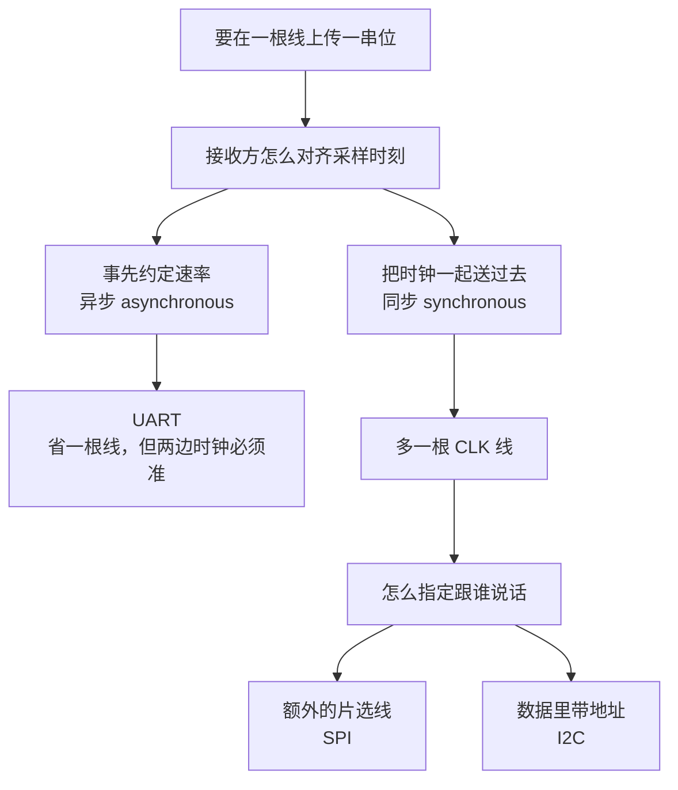

# Lab2 串行通信与PWM

> [!info] 这个实验在做什么
> 表面上是四个任务、三种协议（UART、I2C、SPI）加一个 PWM，实际上只有**两个**问题：
> **一、只有一根线，接收方怎么知道现在这一位是什么？** —— 三种协议是这个问题的三种答案。
> **二、一个只能输出 0 和 1 的引脚，怎么表达一个连续的量？** —— 这就是 PWM。
> 把这两个问题想透，三种协议的每一个参数（波特率、起止位、CPOL/CPHA、从机地址、上拉电阻）都不用背，都是从问题里长出来的。
> 硬件：**NUCLEO-F103RB** 当主机，**Arduino Nano（Every）** 当从机，外加一个电位器、几个 LED 和一个舵机。
> 交付物（报告、代码、同学指引）在 `大学文件/RTCS/实验/Lab2/`。
> 前置：[[Lab1 寄存器、定时器与中断]]（定时器与中断的机制在这里直接复用）。课程总览见 [[00 课程信息与考情]]。

## 1 主线：串行通信唯一的难题是"对齐采样时刻"

### 1.1 为什么非得串行

**并行**（parallel）通信是每一位一根线：传 8 位就要 8 根数据线加 1 根地线，传 32 位就要 33 根。
线的数量随位宽线性增长，而**线是要钱、要空间、要连接器的**，还会互相串扰。一块芯片上引脚就那么多，全用来接一个外设显然不行。

**串行**（serial）通信把同样的 8 位排成队，在**一根**线上一位一位地发。代价是慢了 8 倍，换来的是线数与位宽脱钩——传 8 位和传 1024 位用的线一样多。

> [!note] 为什么串行反而能更快
> 直觉上并行应该更快，实际的高速接口（USB、PCIe、SATA、以太网）全是串行。
> 原因是并行有个天花板：多根线的延迟做不到完全一致，位宽越宽、速率越高，**各位到达时刻的偏差**（skew，时滞）就越难压住，最终限制了整体速率。串行没有这个问题，所以可以把单线速率推得很高。
> 本实验用的都是低速串行（几百 kbit/s），体会不到这一点，但知道结论免得形成错误印象。

### 1.2 核心难题：接收方怎么知道"现在"

发送方在线上摆出一串高低电平。接收方要把它还原成位，就必须在**每一位的有效期内采样一次，且不多不少**。
早采一点、晚采一点问题不大，但**多采一次或漏采一次，后面全错**。

所以整个串行通信的设计，就是在回答这一个问题。**只有两条路**：



- **异步**（asynchronous）：两边**事先约定好速率**，各自按自己的时钟数节拍。没有时钟线，省一根线。
  代价是两边的时钟必须够准，而且每传一小段就要**重新对齐一次**，否则误差会累积——这就是起始位和停止位的来历。UART 走这条路。
- **同步**（synchronous）：发送方**把时钟也用一根线送过去**。接收方不需要自己的精确时钟，只要在时钟的边沿采样即可，速率可以任意、甚至可以中途变。代价是多一根线。SPI 和 I2C 走这条路。

同步这条路走下去，立刻遇到第二个问题：**一根线上挂了好几个器件，怎么说明这句话是对谁说的？**
又是两条路：**多拉一根片选线**（SPI），或者**把地址放进数据里**（I2C）。

**这张图就是这节实验的骨架。** 下面三节分别走这三条分支，每种协议的参数都能在图上找到它的位置。

## 2 异步：UART

**UART**（universal asynchronous receiver/transmitter，通用异步收发器）是没有时钟线的那一条分支。
（另有 **USART**，多一个 S 是 synchronous，意思是这个外设也能工作在同步模式。STM32 上叫 USART 的外设，用作异步时就是 UART。）

### 2.1 没有时钟线，怎么活

两边各自有一个时钟，按同一个约定好的**波特率**（baud rate，每秒传多少个符号）数节拍。
9600 baud 就是每位持续

$$
T_{\text{bit}} = \frac{1}{9600} \approx 104\ \mu\text{s}
$$

接收方的做法是：看到线上电平从高变低，就认为一帧开始了，然后**在各位的中点**（起始沿之后 $1.5 T_{\text{bit}}$、$2.5T_{\text{bit}}$……）依次采样。

> [!note] 为什么在中点采样，而不是在边界
> 两边的时钟总有偏差，采样点会随着位数增加而慢慢漂移。在中点采样，就给了漂移**左右各半个位**的余量。
> 一帧只有 10 位左右，累计漂移小于半个位就不会出错，这对应两边时钟偏差小于约 5%——普通晶振甚至 RC 振荡器都能满足。
> 一帧结束后停止位把线拉回高电平，下一帧的起始沿**重新对齐一次**，误差不会跨帧累积。这就是异步通信"每帧重新同步"的含义。

### 2.2 一帧长什么样

```
空闲   起始位          8 个数据位（低位先发）           停止位   空闲
───┐   ┌───┬───┬───┬───┬───┬───┬───┬───┬───┬────────
   └───┘ b0  b1  b2  b3  b4  b5  b6  b7 └────
    ↑
   下降沿，接收方在这里开始计时
```

三个要素，两边必须完全一致，错一个就是满屏乱码：

| 要素 | 含义 | 本实验用的值 |
| --- | --- | --- |
| **波特率** baud rate | 每秒多少位 | 9600 |
| **数据长度** word length | 一帧里几个数据位 | 8 |
| **校验与停止位** parity / stop bits | 有没有校验位、几个停止位 | 无校验、1 个停止位 |

合起来写作 **9600-8-N-1**。

> [!warning] 手册的帧结构图（Figure 2）位序画反了
> 手册用 182（`10110110`）举例，图上从起始位之后按 `1 0 1 1 0 1 1 0` 依次画出，即**高位先发**。
> **真实的 UART 一律低位先发（LSB first）**，线上应该是 `0 1 1 0 1 1 0 1`。
> 这不影响做实验（HAL 自己处理），但写报告时别照抄这张图。

### 2.3 在 STM32 上：USART2 就是那个虚拟串口

NUCLEO-F103RB 上 **USART2 的 TX/RX 接到了板载 ST-LINK**，ST-LINK 再通过同一根 USB 线把它变成电脑上的一个虚拟串口。
所以**烧录用的那根线同时就是串口线**，不用额外接任何东西——Task 1 完全不需要 Arduino 和面包板。

> [!warning] 出厂是 115200，手册让你改成 9600，之后再没说改回
> 手册 Figure 3 显示默认 115200，Figure 5 让你在 CubeMX 里改成 9600，后文再没提。
> 结论：**CubeMX 里是多少，电脑上的终端就要设成多少**，两边不一致就是满屏乱码。本实验统一用 9600。

### 2.4 三种接收方式，以及为什么用中断

| 方式 | 做法 | 问题 |
| --- | --- | --- |
| **轮询** polling | `HAL_UART_Receive()` 死等，等到收满或超时 | **阻塞**：等的时候 CPU 什么也干不了 |
| **中断** interrupt | `HAL_UART_Receive_IT()` 收满了才叫你 | 本实验用这个 |
| **DMA** | 外设直接搬进内存，收完才通知 CPU | 大批量数据才值得 |

中断方式和 [[Lab1 寄存器、定时器与中断#4.4 为什么轮询不够，必须上中断|Lab1 里定时器中断]] 是同一套机制：
硬件在事件发生时打断 CPU，跳去回调函数。UART 的回调是 `HAL_UART_RxCpltCallback()`。

> [!warning] 忘了在回调末尾重新武装接收，是最常见的坑
> `HAL_UART_Receive_IT()` 是**一次性**的：收满指定字节数就停了。
> 想继续收，必须在回调里**再调一次** `HAL_UART_Receive_IT()`。
> 漏掉这一句的现象是"只收到第一个字符，之后再没反应"。

> [!note] 手册的定长接收表达不了"输入一个数然后回车"
> 手册示范的是 `HAL_UART_Receive_IT(&huart2, rx_data, 9)`——**等够 9 个字节才返回**。
> 可 TASK 1 要求"输入三个两位数、再问加还是乘"，每次输入的长度事先并不知道。
> 交付代码的做法是**每次中断只收 1 个字节**，在回调里把字符攒进缓冲区，直到收到回车（CR 或 LF）才置一个"整行就绪"的标志；解析、算术、打印全部放回主循环。
> 这样长度就无关紧要了，同一套接收代码服务全部四个提示。顺带也满足 [[Lab1 寄存器、定时器与中断#4.4 为什么轮询不够，必须上中断|ISR 只做最短动作]] 那条纪律。

## 3 同步 + 片选：SPI

**SPI**（serial peripheral interface，串行外设接口）走的是"把时钟送过去"这条分支，并且用**一根额外的片选线**指定对象。

### 3.1 四根线，各管一件事

| 线 | 全称 | 方向 | 作用 |
| --- | --- | --- | --- |
| **SCK** | serial clock | 主 → 从 | 时钟。每个边沿推进一位，速率完全由主机说了算 |
| **MOSI** | master out, slave in | 主 → 从 | 主机发给从机的数据 |
| **MISO** | master in, slave out | 从 → 主 | 从机发给主机的数据 |
| **CS / NSS** | chip select / slave select | 主 → 从 | **低电平有效**。拉低表示"接下来这段话是对你说的" |

> [!warning] MOSI 和 MISO **不交叉**，这点和串口相反
> 串口是 TX 接对方的 RX，因为那两个名字是按**本地角色**取的（我发/我收）。
> SPI 的线名是按**全局角色**取的：MOSI 的意思是"主机发出的那根线"，它在主机那头叫 MOSI，在从机那头**还是**叫 MOSI。所以**同名接同名**。
> 手册的接线表把 MOSI 接到对方 D12（那是 MISO）、MISO 接到对方 D11（那是 MOSI），**接反了**。
> 后果不只是不通：STM32 的 MOSI 是输出，Arduino 的 MISO 也是输出，**两个输出顶在一起**，有损坏风险。

每多挂一个从机就要多一根片选线，这是 SPI 的主要代价：**线数随从机数增长**。换来的是快、简单、全双工。

### 3.2 CPOL 与 CPHA：有了时钟线，就必须约定在哪个沿采样

时钟线只是一串方波。"在上升沿采样还是下降沿采样"、"空闲时时钟是高还是低"，双方必须一致，否则每一位都会错位。两个参数：

- **CPOL**（clock polarity，时钟极性）：**空闲时 SCK 是低（0）还是高（1）**。
- **CPHA**（clock phase，时钟相位）：**在时钟的第一个跳变沿采样（0），还是第二个（1）**。

两两组合出四种"SPI 模式"。本实验用的是 **模式 0**：CPOL = 0（空闲低）、CPHA = 0（第一个沿采样），
由于空闲是低，第一个沿就是上升沿，所以**在上升沿采样、在下降沿换数据**。

> [!note] CubeMX 里那个让人困惑的 "CPHA = 1 Edge"
> CubeMX 写的是 `Clock Phase: 1 Edge`，意思是"第 1 个边沿"，对应 **CPHA = 0**，不是 CPHA = 1。
> 配合 `Clock Polarity: Low` 就是模式 0，与 Arduino 那边的 `SPI_MODE_0_gc` 一致。
> 容易看成"CPHA 等于 1"，记住它读作"第一个边沿"。

**速率**由主机的预分频器决定。SPI1 挂在 APB2 上，所以

$$
f_{\text{SCK}} = \frac{f_{\text{APB2}}}{\text{prescaler}}
$$

手册按主频 64 MHz、预分频 128 算出 500 kbit/s（一字节 16 µs）；但**这取决于工程的时钟配置**——
若工程停在 CubeMX 的默认 8 MHz（Lab1 的工程就是），同样的预分频给出的是 62.5 kbit/s，一字节 128 µs。
两者都能用，**写报告时要写自己工程实际的那个数**。

### 3.3 全双工：想"收"就必须同时"发"

SPI 的移位寄存器是**环形**的：时钟每来一个边沿，主机的寄存器往 MOSI 挤出一位，同时从 MISO 吸进一位。
**发和收是同一个动作的两面**，没有"只收不发"这回事。

所以当主机只想读数据时，它仍然必须发点什么出去——这个没有意义、只为产生时钟的字节叫**哑字节**（dummy byte）。
HAL 里对应 `HAL_SPI_TransmitReceive()`：一次调用同时给出要发的和收到的。

> [!warning] 哑字节的值不是随便填的
> 从机收到的每一个字节都会被它解释。本实验的 Arduino 从机把 `0x80`–`0x83` 当作"改变闪烁速率"的命令。
> 如果拿 `0x82` 当哑字节，就会在读数据的同时**悄悄把闪烁速率改掉**。
> 交付代码固定用 `0x00` 当哑字节——它在从机那边的含义是"准备好低字节"，重复执行无害。

### 3.4 从机比主机晚一拍——理解 TASK 3、4 的关键

这是整个 Lab 最容易卡住的地方，而手册一个字都没提。

从机是**被动**的：它没有时钟，只能等主机发起传输。当主机开始发第 $n$ 个字节时，从机的移位寄存器里装的是**上一次**它填进去的内容——因为传输已经开始了，此刻再填已经来不及。
从机的中断是在**一个字节传完之后**才触发的，那时该发的已经发出去了。

于是从机代码 `SPI0.DATA = lower_val;` 填进去的值，要等到**下一次**传输才被移出来。
主机想读一个值，就必须发两次：

| 第几次 | 主机发出 | 从机移出 | 主机怎么处理 |
| --- | --- | --- | --- |
| 1 | `0x00`（命令：准备低字节） | 上次残留的内容 | 丢弃 |
| 2 | `0x00`（哑字节） | 低字节 | **收下** |
| 3 | `0x01`（命令：准备高字节） | 低字节（又一次） | 丢弃 |
| 4 | `0x00`（哑字节） | 高字节 | **收下** |

读一个 10 位的模拟值要**四次传输**。想不到这一点，现象就是"读回来的永远是上一次的值"或者"永远是 0"。

> [!warning] 老师给的 SPI 从机代码是死的，必须先改一行
> `SPI_ArduinoNanoEvery_Slave.ino` 第 17 行：
> ```c
> SPI0.CTRLA = (SPI_DORD_bm & (SPI_ENABLE_bm & (~SPI_MASTER_bm)));
> ```
> `DORD`、`ENABLE`、`MASTER` 是**三个不同的单比特掩码**。两个不同的单比特相与，结果必然是 **0**——
> 这正是 [[Lab1 寄存器、定时器与中断#2 位运算：六个算子，四个套路|Lab1 讲的位运算规则]]：`&` 只能保留双方都为 1 的位。
> 所以这一行等于 `SPI0.CTRLA = 0x00`，把 ENABLE 位清掉、**SPI 外设直接关闭**，中断永远不会触发。
> 正确写法是"置 ENABLE、清 MASTER（当从机）、清 DORD（高位先发）"：
> ```c
> SPI0.CTRLA = (SPI0.CTRLA | SPI_ENABLE_bm) & ~(SPI_MASTER_bm | SPI_DORD_bm);
> ```
> 顺带：原注释写"set MSB first"，但**置** DORD 恰恰是低位先发，注释也反了。

## 4 同步 + 地址：I2C

**I2C**（inter-integrated circuit，字面"集成电路之间"，读作 I-squared-C）走的是"把地址放进数据里"这条分支。
两根线：**SDA**（serial data，数据）和 **SCL**（serial clock，时钟）。**无论挂多少个器件，永远是两根线**，这是它相对 SPI 的全部优势。

### 4.1 地址：两根线上怎么区分对象

总线上每个从机有一个**7 位地址**，出厂时定死或由几个引脚配置。主机每次通信的开头都先广播地址，地址对上的那个从机才应答，其余的继续装睡。

7 位地址意味着一条总线最多 128 个器件（实际更少，有保留地址）。

> [!note] 为什么 HAL 要你把地址左移一位
> I2C 的第一个字节是 **7 位地址 + 1 位读写方向**，凑成 8 位：
> ```
>  bit7 bit6 bit5 bit4 bit3 bit2 bit1 | bit0
>  └────────── 7 位地址 ──────────┘  └ R/W
> ```
> **R/W = 0 表示写、1 表示读。** 所以地址占的是高 7 位，要先左移一位腾出最低位。
> 本实验的 Arduino 是 `Wire.begin(0x55)`，7 位地址 0x55，传给 HAL 的应当是 `0x55 << 1 = 0xAA`，
> 最低位那一格由 HAL 按你调的是 `Transmit` 还是 `Receive` 自动填。
> 填 `0x55` 而不左移，是这一节最常见的错误，现象是"永远收不到 ACK"。

### 4.2 开漏与上拉：两根线要共享，就不能有人硬拉高

总线上多个器件共用 SDA 和 SCL。如果每个器件都用推挽输出，一个拉高、一个拉低，就是**电源直接对地短路**。

I2C 的解法是**开漏输出**（open-drain）：每个器件**只能把线拉低，不能拉高**。线的高电平由一个**上拉电阻**（pull-up resistor）提供。于是：

- 没人说话 → 上拉电阻把线拉到高
- 任何一个器件拉低 → 线就是低

这叫**线与**（wired-AND）：线上的电平是所有器件输出的逻辑与。没有冲突的可能，代价是**上升沿靠电阻充电，比推挽慢**，这也是 I2C 速率上不去的物理原因（标准模式 100 kbit/s，快速模式 400 kbit/s）。

> [!warning] 手册全文没提上拉电阻
> 没有上拉，SDA 和 SCL 永远回不到高电平，通信根本不会开始。
> 好在 Arduino 的 `Wire.begin()` 会打开片内上拉（约 20–50 kΩ），短线通常能凑合。
> 不稳的话在 SDA、SCL 上各加一个 **4.7 kΩ 到 5 V**。STM32 这边的 PB8/PB9 是 5 V 容忍脚，这么接是安全的。

### 4.3 一次完整的读，时序上发生了什么


- **START / STOP** 是两个特殊状态：正常传数据时 SDA 只在 SCL 为低时改变；**SCL 为高时 SDA 变化**就是起止标志，不会与数据混淆。
- **ACK**（acknowledge，应答）：接收方把 SDA 拉低一个时钟，表示"收到了"。收不到 ACK，主机就知道没人在家。
- 最后一个字节主机故意**不**应答（NACK），告诉从机"别再发了"。

HAL 把这一整套封装成两个函数，上面这些细节它自己处理：

```c
HAL_I2C_Master_Transmit(&hi2c1, addr, buf, n, timeout);
HAL_I2C_Master_Receive (&hi2c1, addr, buf, n, timeout);
```

> [!warning] 手册 §2.2 里漏了一个 "not"，意思正好反了
> 原文：`In STM32 IDE you do need to worry about all this procedure rather the HAL library managed everything for you.`
> 前后两半自相矛盾，应当是 `you do **not** need to worry`。

### 4.4 手册的 I2C 命令表与源码对不上

手册 Table 1 和图 11a 的注释、以及 `i2c_arduino.ino` 的实际代码，**三者互相打架**。以源码为准：

| 命令 | 源码里的 `time` | 实际现象 | 手册 Table 1 说 |
| --- | --- | --- | --- |
| `0x80` | 0 | **不延时**，灯以主循环速度翻转，看着是"半亮" | "LED 常亮" |
| `0x81` | 250 | 亮 250 ms、灭 250 ms，周期 500 ms | 500 ms ✓ |
| `0x82` | 500 | 周期 1000 ms | "75 ms"（应是 750，且与源码也不符） |
| `0x83` | 1000 | 周期 2000 ms | "once a second"，即 1 s，与源码的 2 s 不符 |
| `0x00` | — | 下一次读返回 **2 字节**：低字节、高字节 | ✓ |
| `0x01` | — | 下一次读返回 **4 字节**，内容是 `"RTCA"` | 手册没说是什么 |

Table 1 其实是把 SPI 那张表（Table 2，与 SPI 源码完全吻合）抄过来又抄漏了。**I2C 和 SPI 两份 Arduino 代码的映射本来就不一样。**

## 5 三者对比：一张表回到主线

每一格都能在 [[#1.2 核心难题：接收方怎么知道"现在"|§1.2 那张决策图]] 上找到出处，不用背。

| | **UART** | **SPI** | **I2C** |
| --- | --- | --- | --- |
| 怎么对齐采样 | 事先约定波特率（**异步**） | 时钟线（**同步**） | 时钟线（**同步**） |
| 怎么指定对象 | 点对点，不需要 | **片选线**，一从机一根 | **数据里的 7 位地址** |
| 线数 | 2（TX、RX） | 4 + 每多一个从机 +1 | **2，恒定** |
| 双工 | 全双工 | **全双工** | 半双工 |
| 典型速率 | 9.6 k – 115.2 k | 几 M – 几十 M | 100 k / 400 k |
| 输出级 | 推挽 | 推挽 | **开漏 + 上拉** |
| 有没有应答 | 无（顶多加校验位） | 无 | **有 ACK** |
| 主要代价 | 两边时钟要准；每帧有起止位开销 | 线多 | 慢；时序复杂 |
| 适合 | 和 PC、模块之间的低速通信 | 高速、近距离，如 Flash、显示屏 | 多个低速传感器挂一条总线 |

> [!tip] 考试怎么问
> Q2 区（硬件接口与 I/O）历年爱考"对比某两种方案的优缺点"。
> 答这类题**不要罗列参数，要给出取舍的理由**：UART 省一根线换来对时钟精度的要求；
> SPI 用线数换速度和简单；I2C 用速度和复杂时序换恒定的两根线。

## 6 PWM：用时间比例表达一个连续量

### 6.1 问题：引脚只有 0 和 1

想让 LED 亮到一半、让电机转到一半速度——可引脚只能输出 0 V 或 3.3 V。

**PWM**（pulse width modulation，脉冲宽度调制）的做法是：**在时间上切换**。
一个周期内有 $D$ 的比例输出高、$1-D$ 的比例输出低，只要切换得足够快，负载（LED 的视觉、电机的惯性、电容的储能）**自己把它平均掉**，效果等价于一个大小为 $D \times V$ 的直流量。

$D$ 就是**占空比**（duty cycle）。

### 6.2 在 STM32 上：Lab1 的定时器加一个寄存器

PWM 用的就是 [[Lab1 寄存器、定时器与中断#4 定时器：把时间变成可数的东西|Lab1 那套定时器]]，只多一个寄存器：

| 寄存器 | 管什么 | Lab1 讲过吗 |
| --- | --- | --- |
| `PSC` | 把时钟分频，决定计数器一格多久 | ✓ |
| `ARR` | 计到多少归零，决定**周期** | ✓ |
| `CCR` | 计到多少翻转输出，决定**占空比** | 新增 |

> [!warning] CCR 也是预装载的——和 Lab1 的 PSC 是同一类坑
> CubeMX 生成的 `HAL_TIM_PWM_ConfigChannel()` 内部**无条件置位了 `OC1PE`**（输出比较预装载使能）。
> 所以 `__HAL_TIM_SET_COMPARE()` 写进去的新占空比，**要等到下一次更新事件才真正生效**，
> 最坏延迟一个 PWM 周期。这与 [[Lab1 寄存器、定时器与中断#4.3 怎么挑 PSC 与 ARR|Lab1 里 PSC 那个影子寄存器]] 是同一个机制。
> 本实验里无碍（Task3 每 200 ms 改一次而周期只有 1 ms；Task4 每 100 ms 改一次而周期 20 ms），
> 但要知道它存在，别以为写下去就立刻改变了波形。
> 另外注意 CubeMX 里那个 `auto-reload preload` 开关管的是 **ARR**，不是 CCR，两者别混。

**CCR**（capture/compare register，捕获比较寄存器）在 CubeMX 界面里叫 **Pulse**。计数器从 0 往上数：

```
计数值 0 ────────► CCR ────────► ARR ─┐ 归零
输出    ────高────┤────低──────────────┘
        └ CCR 格 ┘└─ (ARR+1-CCR) 格 ─┘
```

$$
f_{\text{PWM}} = \frac{f_{\text{TIMxCLK}}}{(\mathrm{PSC}+1)(\mathrm{ARR}+1)}
\qquad
D = \frac{\mathrm{CCR}}{\mathrm{ARR}+1}
$$

第一个式子和 Lab1 的周期公式是同一个，只是换了个名字叫频率。**两个 $+1$ 的来历也完全一样**：寄存器从 0 开始数。

### 6.3 频率怎么选：取决于"谁来做平均"

这是手册没讲、但决定成败的一点。**PWM 的频率不能随便选，要看负载靠什么把它平均掉。**

| 用途 | 谁在做平均 | 频率要求 |
| --- | --- | --- |
| **LED 调光** | 人眼的视觉暂留 | 高于闪烁融合频率，**几百 Hz 以上**。本实验取 **1 kHz** |
| **电机调速** | 转子的机械惯性 | 几 kHz–几十 kHz（还要避开可听频段的啸叫） |
| **舵机** | **不做平均**，见下 | **固定 50 Hz** |

> [!warning] 手册的 10 Hz 既不能调光，也不能驱动舵机
> 手册 §3.2 用 `Prescaler = 64000-1`、`Counter Period = 100` 得到"10 Hz"，并说可以用来控制亮度。两个问题：
>
> **一、这个配置根本不是 10 Hz。** 周期是 $\mathrm{ARR}+1 = 101$ 格，所以
> $f = 1000/101 = 9.90$ Hz。要精确 10 Hz，Counter Period 应当填 **99**。
> 有意思的是同一页在 PSC 上老老实实写了 `64000 - 1`，到 ARR 就忘了减一——而 Lab1 手册还专门强调过"配置里填的值总比实际小 1"。
>
> **二、就算改对了，10 Hz 也不能用来调光。** 人眼的闪烁融合频率约 60 Hz，10 Hz 是**肉眼可见的一闪一闪**，不是亮度变化。
>
> TASK 3、4 明确要求 `show the calculations`，这个 ±1 和频率选择正是给分点。交付代码取 $\mathrm{PSC}=63$（计数 1 MHz）、$\mathrm{ARR}=999$，得 1 kHz。

> [!warning] 手册 Figure 18 的占空比循环有三处不成立
> ```c
> uint16_t duty_cycle = 10;
> while (1) { duty_cycle += 10;
>             if (duty_cycle == 100) { duty_cycle = 10; }
>             htim4.Instance->CCR1 = duty_cycle; HAL_Delay(1000); }
> ```
> 实际输出序列是 `20,30,...,90,10,20,...`：
> **最大只到 90**（正文说"最亮"达不到）、**一轮 9 秒**（正文说 10 秒）、
> **第一个被写进 CCR1 的是 20 而不是 10**（因为循环先自增再赋值；10 只在每轮末尾归位时出现一次）。
> 还有第四点：手册说"想要 30% 占空比就把 pulse 填 30"，但 ARR = 100 时 $D = 30/101 = 29.7\%$——
> **那个漏掉的 $-1$ 不只污染频率，也污染占空比**。

### 6.4 舵机：它看的是脉宽，不是占空比

**舵机**（servo）内部有一个位置反馈电路，它测量的是**每个脉冲持续多久**，而不是占空比：

$$
1.0\ \text{ms} \rightarrow \text{一端}, \qquad
1.5\ \text{ms} \rightarrow \text{中位}, \qquad
2.0\ \text{ms} \rightarrow \text{另一端}
$$

帧率固定 **50 Hz**（每 20 ms 一个脉冲），这个数字本身不携带信息，只是"多久刷新一次命令"。
所以舵机的占空比永远在 5%–10% 之间晃，**调占空比这个说法在这里是不适用的**。

参数怎么定？**先定分辨率，再定周期**——这是和调光相反的顺序：

$$
\text{让计数器 1 MHz（1 格 = 1 } \mu\text{s）} \Rightarrow \mathrm{PSC}+1 = \frac{64\ \text{MHz}}{1\ \text{MHz}} = 64
$$
$$
\text{20 ms 的帧} \Rightarrow \mathrm{ARR}+1 = 20\,000 \Rightarrow f = \frac{64\times10^6}{64 \times 20\,000} = 50.00\ \text{Hz}
$$

这样一来 **CCR 的数值直接就是微秒数**：`CCR = 1500` 就是 1.5 ms。两个因子 64 和 20000 都在 65536 以内，合法。

> [!note] 为什么手册的配置连"能不能用"都谈不上
> 手册那组参数计数器是 1 kHz，**一格就是 1 ms**。舵机的全部命令范围 1 ms–2 ms 只有**两格**，
> 也就是只能表达"两端"，中间什么也表达不了；而且它的帧是 100 ms，不是舵机要的 20 ms。
> 必须自己重算，手册对此零指导。

## 7 四个任务分别在考什么

| 任务 | 分值 | 考的是 | 需要什么硬件 |
| --- | --- | --- | --- |
| TASK 1 | 25 | UART 中断接收 + 变长输入解析 + 字符串与数字互转 | **只要 Nucleo + USB 线** |
| TASK 2 | 25 | I2C 主机收发 + 地址左移 + 多字节拼装 | Nucleo + 任意 Nano + 电位器 |
| TASK 3 | 25 | SPI 全双工 + 从机晚一拍 + PWM 参数计算 | 上面 + **Nano Every** + LED |
| TASK 4 | 25 | 同上 + 舵机的脉宽语义 + 参数反算 | 上面 + 舵机 + 独立电源 |

> [!note] TASK 3、4 按原文**不要求截图**
> 两题的原文只说 `Provide the commented code in your report. Also show the calculations and discuss how your code is working.`
> 只有 TASK 1、TASK 2 明确要 `screen shots`。所以硬件万一凑不齐，3、4 两题靠代码 + 计算 + 讨论仍能拿大部分分。
> **"show the calculations" 就是给分点**：PWM 频率的推导、两个 +1、ADC 0–1023 到 CCR 的映射、舵机 50 Hz 与 1–2 ms 的反算，一步都别省。

完整解答、代码与接线卡在交付物里：`大学文件/RTCS/实验/Lab2/`。
这份笔记负责**为什么**，报告负责**怎么写才拿分**，`README_协作说明.md` 负责**同学怎么接怎么点**。

## 8 手册已核实的错漏汇总

写报告时可以挑其中几条写进附录，既显出读懂了，也解释了为什么自己的做法和手册不一样。

| 位置 | 错在哪 | 正确的说法 |
| --- | --- | --- |
| Figure 2 UART 帧图 | 按高位先发画 | UART 一律**低位先发** |
| §2.2 正文 | 漏了一个 `not`，意思反了 | `you do **not** need to worry` |
| I2C 小节（§2.2.1 之前） | `0b1101001 or 0x6E`，二者不等 | `0b1101001` = 0x69；0x6E = `0b1101110`。两者必居其一有误 |
| Figure 8a | 标 `R/W: Read` 但该位画的是 0，正文也说这是写 | 应为 `Write` |
| Table 1 | I2C 命令表与源码、与图 11a 三者互相矛盾 | 以 `i2c_arduino.ino` 源码为准，见 §4.4 |
| §2.2.1 正文 | "Arduino 能测的最大值是 1024" | 10 位 ADC 范围是 **0–1023**，1024 是量化级数 |
| SPI 接线表 | MOSI、MISO 接反；CS 接 D10；漏了 GND | 同名接同名；CS 接 Nano Every 的 **D8**；必须共地 |
| Figure 9 I2C 接线图 | SDA 画到了 Nano 的 A6 | A6 是纯模拟输入脚，**没有** I2C 功能，应接 **A4** |
| 供给的 SPI 从机代码第 17 行 | `&` 把 CTRLA 写成 0，SPI 外设被关掉 | 见 §3.4 |
| Figure 15a | 两个变量都叫 `reg_0`，重复定义 | 第二个应为 `reg_1` |
| §3.2 PWM 算例 | Counter Period 填 100，实际 9.90 Hz | 填 **99** 才是 10 Hz；且 10 Hz 不能用来调光 |
| Figure 18 占空比循环 | 最大只到 90、一轮 9 秒、初值从未输出 | 见 §6.3 |
| PB6 | SPI 小节当片选、§3.2 当 TIM4_CH1 | **同一引脚不能兼任**，片选改用 PC7 |
| 章节编号 | SPI 小节印成 "2.2.1 SPI in STM32"，但 2.2.1 已经给了 I2C | 应为 2.3.1 |
| 全篇 | HAL 的 `Size` 参数被称作 "number of bits" | 是**字节数**，同段落里自己又写了 bytes |

## 本实验速记

- 串行通信只有一个难题：**接收方怎么对齐采样时刻**。两条解法：约定速率（异步，UART）或送一根时钟线（同步，SPI/I2C）。
- 同步之后还要回答"跟谁说话"：**片选线**（SPI，线随从机数增长）或 **数据里的地址**（I2C，永远两根线）。
- UART 三要素 **波特率 / 数据位 / 停止位**，两边必须一致；9600 baud 每位 104 µs；**低位先发**。
- `HAL_UART_Receive_IT()` 是一次性的，**回调里必须重新武装**，否则只收一个字符。
- SPI 的 **MOSI/MISO 同名接同名，不交叉**；**CPOL/CPHA 约定采样沿**，CubeMX 的 "1 Edge" 意思是 CPHA=0。
- SPI 是**全双工**：收必然伴随发，只读数据时也要发**哑字节**，而且哑字节的值会被从机解释。
- **SPI 从机比主机晚一拍**：从机在中断里填的值要下一次传输才移出，所以读一个字节要两次传输。
- I2C 地址是 **7 位 + 1 位读写方向**，所以 HAL 要的是 `addr << 1`。
- I2C 是**开漏 + 上拉**，因为总线共享、不能有人硬拉高；这也是它慢的原因。
- PWM = Lab1 的定时器 + 一个 **CCR**。$f = f_{\text{clk}} / ((\mathrm{PSC}+1)(\mathrm{ARR}+1))$，$D = \mathrm{CCR}/(\mathrm{ARR}+1)$。
- **PWM 频率取决于谁做平均**：LED 靠人眼（≥ 几百 Hz），电机靠惯性（几 kHz），**舵机根本不做平均**。
- **舵机看脉宽不看占空比**：50 Hz 帧、1–2 ms 命令。先定分辨率（1 MHz 计数 → 1 格 = 1 µs），再定帧长（ARR+1 = 20000），CCR 的数值就直接是微秒数。
