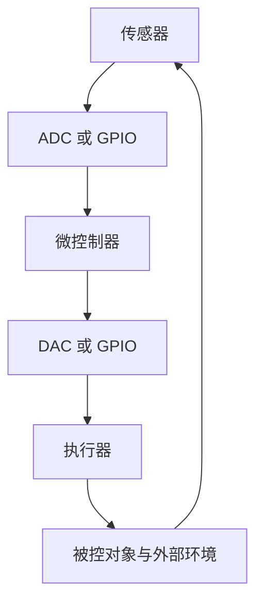

# L01 实时系统

> [!info] 这一讲在做什么
> 「实时」在日常语感里是个形容词，模模糊糊指"快"。这一讲的任务是把它变成一条**可判定的工程性质**：给你一个系统，你能说清它算不算实时、属于哪一档、余量还剩多少。
> 主线是：先把「系统」这个词定住 → 找出实时约束挂在哪个量上 → 给出实时系统的定义并按后果分档 → 引入衡量余量的量 → 补上两个影响可预测性的概念。
> 课程总览与考情见 [[00 课程信息与考情]]。对应课件 `L01H_Real-Time-Systems_2026-2027`，43 页。

## 1 软件的两层

这门课横跨硬件与软件，先把软件这一侧的分层说清楚，
后面提到「RTOS」「固件」时才有位置可放。

计算机的硬件靠反复执行机器语言指令来解决问题，这些指令的集合就是软件。软件传统上分成两层。

**系统程序**（system programs）是与底层硬件打交道的那一层，
包括驱动程序、中断处理程序、任务调度器，以及用来开发和分析应用程序的各种工具。
开发工具这条链值得单独看一眼，因为它解释了你写的代码是怎么变成板子上跑的东西的：

- **编译器**（compiler）把高级语言程序翻译成汇编代码；
- **汇编器**（assembler）把汇编代码转成一种叫目标代码（object code）或机器码的二进制格式；
- **链接器/定位器**（linker/locator）把目标代码整理成能在**某个具体硬件环境**上执行的形式。

链接器后面那个「定位器」在桌面开发里几乎感觉不到，但在嵌入式里是关键一步：
桌面程序由操作系统在运行时决定装到内存哪里，
而嵌入式程序要提前指定"这段代码烧到 Flash 的哪个地址、这些变量放在 RAM 的哪一段"，
因为板子上根本没有一个操作系统来替你做这件事。

**操作系统**（operating system）是系统程序里的一个专门集合，职责是管理计算机的物理资源。
其中**实时操作系统**（RTOS，real-time operating system）——
即以满足时限为首要目标、而非以吞吐量或公平性为首要目标的操作系统——对嵌入式系统尤其重要。

实时软件的需求通常在两类框架下解决：一类就是 RTOS，
另一类是**同步编程语言**（synchronous programming languages），
即把时间语义直接写进语言本身、使程序的时序行为可以被静态分析的语言。
实时应用软件就建在这两类框架之上。

**应用程序**（application programs）则是为解决具体问题而写的程序，
比如高层建筑里电梯群的最优呼叫分配、飞机的惯性导航、某工厂的工资结算。

要点在于：**运行在实时环境里，会对系统程序和应用程序的设计同时提出额外要求**——
不是"把程序写快一点"就完事，而是两层都要为时限负责。

## 2 系统是什么

**系统**（system）**是一组输入到一组输出的映射。**
这个映射函数可以看成一个黑箱：一个或多个输入进去，一个或多个输出出来。

这个定义的用处在于：它把注意力从"箱子里有什么零件"移到"给定输入，输出是什么、什么时候出来"。
实时性正是关于后者的性质。

Vernon 在 1989 年列出了任何系统都**具备**的五条一般性质：

1. 由若干部件按某种有组织的方式连接而成；
2. 有部件加入或离开时，系统会**从根本上被改变**；
3. 有目的；
4. 有一定的持久性；
5. 是被定义为"我们特别关心的那个对象"。

这五条是必要性质而非充分判据——满足它们并不能证明某个东西是系统，
但反过来用很有效：**你划的对象要是缺了其中某一条，多半说明边界划错了。**
第五条尤其实在：系统的边界不是客观给定的，是你划的。
你把摄像头划进系统内还是当作外部环境，会直接改变你要从哪一刻开始计时。

### 2.1 输入输出在物理上长什么样

在计算系统里，输入是来自硬件设备或其他软件系统的数字数据。
它们常常来自传感器、摄像头等器件——这些器件给出的是模拟量，要先转换成数字数据；
也有直接给数字输入的。反过来，系统的数字输出可以转换成模拟量去驱动执行器、显示器等外部硬件，
也可以不转换直接使用。

一条完整的数据采集（data acquisition）信号链如下，注意每一级信号的形态都变了一次：

![[L01 数据采集信号链.png]]

- **物理系统**给出的是温度、压力、位移、流量这类物理量；
- **换能器/传感器**（transducer/sensor）把物理量变成电信号，但这个电信号是**带噪声的**；
- **信号调理**（signal conditioning）做滤波和放大，把噪声压掉、把幅度抬到 ADC 能用的范围；
- **模数转换器**（ADC，analogue-to-digital converter）按一定的分辨率和采样率把连续波形离散化；
- 最后进入**计算机**的是一串二进制码。

课件给的例子是 8 位分辨率、每周期 16 个采样点。
这两个数字分别控制"幅度上分多细"和"时间上分多密"，
是后面 L02 讲数制、以及一切"精度够不够"讨论的物理起点。

### 2.2 一个典型的嵌入式控制回路

把上面的采集链接上输出侧，就得到嵌入式系统最常见的形态——一个闭环：

其中 **GPIO**（general purpose input/output，通用输入输出）指直接的数字 I/O 通道，
包括 I2C、SPI、CAN 这些数字接口；**DAC**（digital-to-analogue converter，数模转换器）做与 ADC 相反的事。
回路之外还挂着两样东西：**固件**（firmware），即存在 ROM、Flash 这类非易失存储器里的监控与控制软件；
以及**人机界面**（human interface），输出侧是 LED/LCD 显示，输入侧是触摸屏或键盘。

**微控制器**（micro-controller）**= 微处理器 + 存储器 + I/O**，三样封在一颗芯片里。
这个等式解释了为什么嵌入式设计里"选一颗 MCU"往往就等于把计算、存储、接口三件事一起定了。

这张图要记住的不是方框名字，而是**信号绕一圈要花时间**，
而这门课后面要加的时间约束，正是加在这一圈上。

## 3 响应时间

从输入呈现（excitation，激励）到输出出现（response，响应）之间必然存在延迟——
这是物理决定的，不可能为零。

> [!note] 响应时间（response time）
> 从**一组输入呈现给系统**，到**所要求的行为得以实现、并且所有相关输出都已可用**，这之间的时间。

定义里有两个容易被读漏的限定词，而它们正是判分点：

- **"一组"输入**：不是单个信号到达就开始计时，是这一组输入都齐了才算激励完成；
- **"所有相关输出都已可用"**：不是主输出算完就结束，要等到全部相关输出都能被取用。
  少算了这一段，估出来的响应时间会偏乐观。

响应时间要多快、多准时，取决于具体系统的特性和用途——
正是"多快才算够"这个问题，把系统分成了实时与非实时。

## 4 实时系统的定义

**实时计算**（real-time computing，RTC；也叫反应式计算 reactive computing）
研究的是那些受**实时约束**支配的软硬件系统，
所谓实时约束就是"从事件发生到系统响应"的操作性截止期限（deadline）。
反过来，**非实时系统是压根没有截止期限的系统**——
即使人们希望它快、希望它性能好，那只是偏好，不是约束。

这条对照给出了判据的关键：**区分实时与非实时的不是速度，是有没有一条硬性的时间线。**

课件对**实时系统**（real-time system）给了三句表述，它们是同一件事的三个侧面：

1. 实时系统是**必须满足有界响应时间约束、否则将面临包括失效在内的严重后果**的计算机或嵌入式系统；
2. 系统**必须满足截止期限约束才算正确**；
3. 实时系统的**逻辑正确性同时建立在输出的正确性和输出的及时性之上**。

第三句是这一讲最该记住的一句。平时写程序，"正确"只有一个维度：算出来的值对不对。
实时系统把维度加到了两个：

$$
\text{正确} = \text{值正确} \;\wedge\; \text{时间正确} \tag{1}
$$

一个算得对但迟到的结果，在实时系统里和算错了是同一类事——都叫不正确。

> [!warning] 实时不等于瞬时
> 词典把「real time」解释为"计算机必须以用户所要求的、或被控过程所必需的速度作出响应"，
> 而多数人会把它读成"立刻""瞬间"。这是最常见的误解。
> 正确的理解是：**系统不必即时或瞬时地处理数据才算实时，它只需要响应时间被适当地约束住。**
> 一个响应时间要求是 24 小时、但超过 24 小时就出严重后果的系统，同样是实时系统。

### 4.1 拿三个例子练判断

课件给了三个场景，让你判断哪些是实时系统。判据只有一条：**有没有截止期限。**

| 场景 | 判断 | 理由 |
| --- | --- | --- |
| 飞机用一串加速度计脉冲确定自身位置 | 是 | 惯性导航要对脉冲逐个积分，晚一拍位置就错一段，误差还会随时间累积。截止期限由飞行动力学定死。 |
| 处理核电站的超温故障 | 是 | 必须在堆芯受损之前完成停堆动作，这个"之前"就是截止期限，且错过的后果是灾难性的。 |
| 旅客到值机柜台取登机牌，航班五分钟后起飞 | 是 | 反直觉的一个。截止期限是起飞时刻，错过的后果明确——赶不上飞机。它的时间尺度是分钟级，但这不影响判定。 |

第三个例子正是课件用来打掉"实时等于毫秒级"这个印象的：
**时间尺度不构成判据，有没有截止期限才是。**

## 5 硬实时、固实时、软实时

分档的依据只有一条：**错过截止期限的后果有多严重**。

| 类别 | 错过截止期限的后果 | 判断口诀 |
| --- | --- | --- |
| 软实时（soft real-time） | 性能**下降**，但不会被摧毁 | 迟到的结果没用了或价值降低，系统继续跑 |
| 固实时（firm real-time） | 少数几次错过不会导致整体失效，但**错过得多了**就可能导致完全或灾难性失效 | 允许偶发，不允许频发 |
| 硬实时（hard real-time） | **哪怕只错过一次**，都可能导致完全或灾难性失效 | 一次都不能错 |

硬实时还多一条**工程上的要求**：必须存在一种手段，能够验证时限在任何情况下都会被满足。
这一条常被漏答，而它正是后面 L19、L20 要讲可调度性分析的理由——
"我觉得来得及"不算数，得能证明。

> [!warning] 硬实时与软实时：这道 4 分题的采分点
> 2022-2023 卷 Q1(a)(ii) 原题是「Define the difference between hard real-time systems and soft real-time and give an example of each type.」[4 分]。课件给的标准答案里，硬实时有四条要点：
> - 其中一些截止期限是**硬的**；
> - 迟到的结果（超过截止期限之后）可能造成致命缺陷或灾难性后果；
> - 许多属于安全攸关（safety-critical）系统；
> - **必须有手段验证时限总能被满足**。
>
> 软实时一侧的要点是：希望按时完成；迟到的结果可能已经无用，也可能仍然有用、只是造成性能下降。
> 两侧各举一个例子。只写"硬实时要求高、软实时要求低"拿不到分——那没有说出判据。

课件给的任务分类可以直接当例子库用：

| 硬实时任务 | 软实时任务 |
| --- | --- |
| 安全攸关系统 | 视频播放 |
| 传感数据采集 | 音视频编解码 |
| 数据滤波与预测 | 在线图像处理 |
| 临界条件检测 | 分布式系统中的传感数据传输 |
| 数据融合与图像处理 | 用户界面的命令解释器 |
| 执行器伺服控制 | 处理键盘输入 |
| 关键部件的底层控制 | 屏幕消息显示 |
| 与环境紧耦合系统的动作规划 | 系统状态变量的表示 |

两列的分界线很清楚：**左边这些一旦晚了，物理世界会出事；右边这些晚了，只是人觉得卡。**

## 6 系统失效的定义

**失效**（failure）**是系统无法按照系统规格说明书运行。**
更精确地说，失效的系统是**不能满足系统需求规格说明书中所规定的一条或多条要求**的系统。

这个定义的分量在于它的推论：既然失效是"违反规格"，
那么**规格里必须把时间约束严格写进去**，否则"迟到"就无法被判定为失效——
没写进规格的东西，违反了也不算违反。
所以对实时系统而言，严格地写明包含时间约束在内的运行准则，不是文档工作，是定义正确性的前提。

## 7 嵌入式系统

课件给了四条定义，它们从不同角度描述同一件事。**嵌入式系统**（embedded system）是：

- 为执行**一项或少数几项专用功能**而设计的计算机系统，通常带实时计算约束；
- 含有一个或多个计算机（处理器）、且处理器在系统功能中起核心作用，
  但这个系统**不会被明确称为"计算机"**；
- 硬件与软件**紧耦合集成**、为执行专用功能而设计的计算装置；
- 嵌入在一个**更大的产品**里的信息处理系统。

把四条压成一句：**嵌入式系统是硬件与软件紧耦合、为专用功能而生、并且藏在别的产品里的计算机。**

它还有两条结构性特征：嵌入式系统**可以是更大系统里的一个子系统**，
而且**同一个宿主系统里可以并存多个嵌入式系统**。
一辆车就是现成的例子——ABS 防抱死、变速箱控制、发动机控制、空调控制、仪表信息，
各自是独立的嵌入式系统，共存于同一辆车里。

### 7.1 嵌入式计算的三个物理限制

- 为嵌入式系统写的程序指令称为**固件**（firmware），存放在只读存储器或 Flash 芯片里。
  之所以不叫"软件"，是因为它出厂后基本不变、更接近硬件的一部分。
- 这些指令通常运行在**受限的硬件资源**上：内存很小，键盘和屏幕很小甚至没有。
- 嵌入式处理器可以是**微处理器**，也可以是**微控制器**——
  后者的构成见 [[#2.2 一个典型的嵌入式控制回路|微控制器等于处理器加存储器加 I/O]]。

还有一个数字值得记：**生产出来的所有处理器里，估计有 99% 进入了嵌入式系统。**
这说明我们平时接触的 PC 和手机 SoC 只是处理器世界里很小的一角。
嵌入式产品遍布工业、汽车、航空航天、医疗、移动设备、通信、网络、家用电器、广播媒体、相机——
课件的原话是「in other words, everywhere」。

### 7.2 实时嵌入式与普通嵌入式的区别

这是 2023-2024 卷 Q1(a) 的原题 [2 分]。
答案的关键在于：**两者都是嵌入式系统，区别只在有没有时间约束这一维**。

普通嵌入式系统只要**功能正确**就算正确；
实时嵌入式系统还必须**在截止期限内**给出结果，
逻辑正确性同时包含值与时间两个维度，即 [[#4 实时系统的定义|值正确与时间正确的双重判据]]。
因此实时嵌入式系统在设计上多出一整套要求：可预测的响应时间、
通常要配实时操作系统或时间可分析的调度、以及对最坏情况而非平均情况做设计。

### 7.3 设计嵌入式系统要考虑什么

课件把考量分成四类，这是可以直接拿去答题的结构：

| 类别 | 具体考量 |
| --- | --- |
| 环境（environmental） | 尺寸、功耗与随之而来的发热、重量、抗辐射加固 |
| 性能（performance） | 响应速度、**可预测性** |
| 经济（economic） | 成本、上市时间 |
| 后果（consequential） | 安全性、可靠性、信息安全 |

性能一栏里的**可预测性**值得单独强调：在通用计算里，我们要的是"平均快"；
在实时系统里，我们要的是"最坏情况有界"。
一个平均很快但偶尔卡一下的系统，在实时场景里比一个一直不快但从不超时的系统更糟。
这条取向贯穿整门课后面的体系结构部分——
Cache、流水线、乱序执行这些提升平均性能的机制，都会以牺牲可预测性为代价。

## 8 CPU 利用率

有了"必须满足时限"这个要求，自然就要问：**这颗 CPU 还剩多少余量？**

**CPU 利用率**（CPU utilization），也叫**时间负载因子**（time-loading factor），记作 $U$，
**是对处理器上非空闲处理所占比例的相对度量。**
若 $U > 100\%$，称系统**时间过载**（time-overloaded）——
要做的活比时间还多，必然有任务错过时限。

求和要覆盖系统里的**每一个任务**，周期的与非周期的都算在内。
为了写出闭式，下面只设周期任务：系统有 $n \ge 1$ 个周期任务，
任务 $i$ 的执行周期为 $p_i$，因而执行频率 $f_i = 1/p_i$。
若任务 $i$ 的**最坏情况执行时间**（worst-case execution time）为 $e_i$，则任务 $i$ 的利用率为

$$
u_i = \frac{e_i}{p_i} \tag{2}
$$

整个系统的利用率就是各任务的贡献之和：

$$
U = \sum_{i=1}^{n} u_i = \sum_{i=1}^{n} \frac{e_i}{p_i} \tag{3}
$$

式 $(2)$ 的含义很朴素：任务 $i$ 每 $p_i$ 这么长的时间里要占掉 $e_i$，
那它长期占用 CPU 的比例就是这两者之比。
注意分子用的是**最坏情况**执行时间而不是平均值——
这正是 [[#7.3 设计嵌入式系统要考虑什么|对最坏情况而非平均情况做设计]] 在公式上的体现。

> [!example]- 三个周期任务算 U
> 某控制器上跑三个周期任务：
>
> | 任务 | 周期 $p_i$ | 最坏执行时间 $e_i$ | $u_i$ |
> | --- | --- | --- | --- |
> | A 采样 | 20 ms | 5 ms | 0.25 |
> | B 控制律计算 | 50 ms | 10 ms | 0.20 |
> | C 状态上报 | 100 ms | 20 ms | 0.20 |
>
> 按式 $(3)$，$U = 0.25 + 0.20 + 0.20 = 0.65$，即 65%，没有过载。

### 8.1 利用率取多少合适

利用率不是越低越好，也不是越高越好，两头都有问题：

- **太高**是危险的。系统被用得太满时，任何增加、修改或修正都可能把它推过 100%——
  你连打个补丁都要担心时序。
- **太低**未必划算。买了颗强得多的处理器却只用一小部分，成本上不合理。

课件给了三个经验数字：

- **50%**：新产品常见的取值，给后续迭代留足空间；
- **80%**：对预期不会再增长的系统可以接受；
- **70%**：在**任务为周期性且相互独立**的前提下，
  这是实时系统理论中最著名、也最有实用价值的结果之一。
  它的含义是：只要总利用率不超过这条线，这组任务在速率单调调度下**一定**都能按时完成。
  注意这是**充分条件而非必要条件**——超过 70% 未必真会错过时限，只是不再有保证。

回到上面那个例子，$U = 65\%$ 正落在这条线以下，所以既没过载、也还留着加功能的余地。

> [!note] 70% 这个数从哪来
> 它来自周期任务的可调度性判据，精确值是 $\ln 2 \approx 0.693$。
> 后面 L19、L20 讲 RMS（rate monotonic scheduling，速率单调调度）时会给出完整来源与公式。
> 这里先记住结论和它的适用前提——**周期性、相互独立**——两个前提缺一，这条线就不成立。

## 9 同步事件与异步事件

这一对概念决定了系统里哪些时刻是"可以预先安排的"，哪些是"必须随时准备应付的"。

**同步事件**（synchronous events）**是在控制流中于可预测的时刻发生的事件。**
例如条件分支指令引起的控制流改变，或者内部陷阱中断（trap）的发生——
这些都能被预先估计到，因为它们由程序自己的执行位置决定。

**异步事件**（asynchronous events）**在控制流中不可预测的位置发生，通常由外部源引起。**

> [!warning] 时钟驱动的事件必须按异步处理
> 理由是课件原话：工程师永远不能指望一个时钟严格按标称速率滴答。
> 晶振有频率偏差、有温漂、有抖动，所以"每 10 ms 来一次"实际上是"大约每 10 ms 来一次"。
> 既然到达时刻不精确，就不能把它当成控制流里可预测的点。
> 这条容易搞反：直觉上"定时器中断是我自己设的，当然可预测"，
> 但可预测的是**期望时刻**，不是**实际时刻**。

## 10 确定性与事件确定性

**若对系统的每一个可能状态与每一组输入，都能确定出唯一的一组输出和唯一的下一状态，
则称该系统是确定性的**（deterministic）。

**事件确定性**（event determinism）是它的一个弱化版本：
对每一组**触发事件**的输入，系统的下一状态与输出都是已知的。

两者的关系是单向的：**确定性的系统一定是事件确定性的**——
因为确定性对"每一组输入"都成立，触发事件的输入自然也包含在内。
反过来不成立：一个系统可能对事件输入有确定的反应，但对其他输入不确定。

确定性之所以在这门课里出现，是因为它是**可预测性的前提**：
如果同样的状态加同样的输入可能得出不同结果，
那"最坏情况执行时间"就无从谈起，时限也就无从保证。

## 本讲速记

- 实时系统的**逻辑正确性 = 输出值正确 + 输出及时**。迟到的正确结果等于错误结果。
- 实时与非实时的分界是**有没有截止期限**，不是快慢；实时不等于瞬时。
- **响应时间**从一组输入呈现算起，到所要求行为实现、**所有相关输出可用**为止。
- 三档按**错过时限的后果**分：软（性能下降）、固（少数可容忍、多了就可能失效）、硬（一次都不能错）；
  硬实时还要求**存在验证时限总能被满足的手段**。
- **失效 = 不满足需求规格中的一条或多条要求**，所以时间约束必须写进规格。
- 嵌入式系统 = 软硬件紧耦合、专用功能、藏在更大产品里；
  **微控制器 = 微处理器 + 存储器 + I/O**；固件存在 ROM 或 Flash 里；约 99% 的处理器进入嵌入式系统。
- 实时嵌入式与普通嵌入式的差别只在**多了时间维**。
- 嵌入式设计四类考量：**环境、性能、经济、后果**。
- 利用率 $u_i = e_i/p_i$，$U = \sum e_i/p_i$，周期与非周期任务都计入；$U > 100\%$ 为时间过载；
  经验值 50%（新产品）、70%（周期且独立任务的充分条件，$\ln 2$）、80%（无增长预期）。
- **时钟驱动事件必须按异步处理**，因为时钟不会严格按标称速率走。
- 确定性 ⇒ 事件确定性；确定性是可预测性、进而是时限保证的前提。

---

下一讲 [[L02 数制]]，它会把 [[#2.1 输入输出在物理上长什么样|8 位分辨率与每周期采样点数]]
这类说法展开成完整的数的表示体系，其中 IEEE-754 单精度浮点是历年必考的高分计算题。
