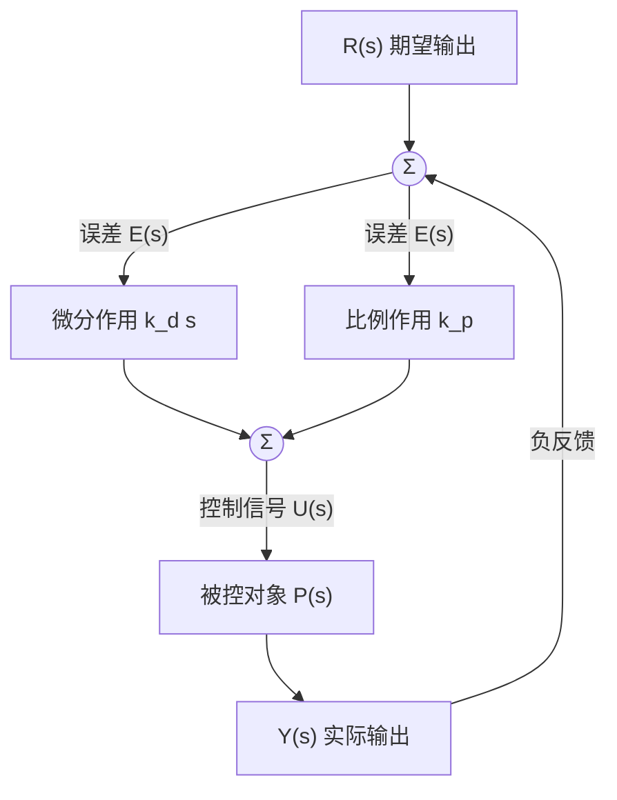

# Tutorial A 全解

> [!info] 这份文件是干什么的
> `Tutorial A` 是课程发的自测题（self-assessment），两道大题共 40 分。课程手册明确把 tutorial 列进考试范围，而且这套题的题型与分值切分方式很可能就是期末的样子，所以每一问都值得做透、对答案。
> 下面每问都给出完整解答；数值全部用代码验算过。做题前建议先自己动手，再来对。
> 相关讲义：[[A-I 控制系统导论]]、[[A-II 系统响应与稳定性]]、[[A-III 增益、根轨迹与系统特性]]。

## 这套题的考点分布

| 题号 | 分值 | 考点 | 对应讲次 |
| --- | --- | --- | --- |
| Q1(a) | 5 | 抗扰的概念、控制目标不止一条 | [[A-II 系统响应与稳定性#1 先把验收标准立起来\|A-II 四条控制目标]] |
| Q1(b) | 7 | 开环/闭环传递函数、特征方程、Routh 阵、K 的稳定域 | [[A-II 系统响应与稳定性#8 捷径二：Routh 稳定判据\|A-II Routh 判据]] |
| Q1(c) | 5 | 微分控制的缺点、derivative kick 与结构改法 | 课件未讲，属延伸 |
| Q1(d) | 3 | 对设计方案的批判性评价 | [[A-III 增益、根轨迹与系统特性#3 增益改变的到底是什么\|A-III 增益的收益与代价]] |
| Q2(a)(b) | 8 | 框图识读、PD 控制算法、开闭环传递函数 | [[A-II 系统响应与稳定性#4 第二次压缩：拉普拉斯把卷积换成乘法\|A-II 传递函数]] |
| Q2(c) | 4 | 根轨迹的定义与性质 | [[A-III 增益、根轨迹与系统特性#4 根轨迹的两个条件\|A-III 两个条件与实轴判据]] |
| Q2(d) | 8 | 相角条件判点、不用微分求分离/会合点 | [[A-III 增益、根轨迹与系统特性#5.1 分离点与会合点\|A-III 倒数和公式]] |

值得注意的两件事：**计算题占 26 分（65%）**，且全部集中在 Routh 与根轨迹上；**Q1(c) 的微分控制内容 Part A 课件里没有**，属于必须自己补的部分。

## Q1 房间恒温器

### (a)(i) 抗扰是什么，举两个扰动并说明系统如何响应

**抗扰**（disturbance rejection）指的是：系统的输出对扰动输入尽可能不敏感。
恒温器的场合，就是**不管外界怎么折腾，室温都要贴住设定值**。

之所以做得到，是因为闭环并不需要知道扰动是什么。它只看一个量——测得的室温与设定值之差。任何扰动，只要最终把室温拉偏，就会在这个差值上显形，控制器随即改变供热量把它压回去。这是反馈相对前馈的根本优势：**它对付的是"结果"，不需要辨认"原因"。**

两个扰动的例子：

| 扰动 | 系统怎么响应 |
| --- | --- |
| 开窗导致冷空气进入 | 室温下降 → 误差 $e=r-y$ 变正 → 控制器加大供热 → 室温回升至设定值附近 |
| 房间里多了几个人（人体散热）或阳光直射 | 室温上升 → 误差变负 → 控制器减少供热甚至停止 → 室温回落 |

定量的说法在 [[A-I 控制系统导论#3.3 这 0.69 是由两笔完全不同的账凑出来的|A-I 已经给过]]：扰动在输出上的残留被因子 $1+L$ 除，$L$ 是回路增益（信号绕反馈回路一圈的总增益）。
过程的样子见 [[A-I 控制系统导论#5.3 典型响应|A-I 的室温响应曲线]]：扰动一来温度先掉，控制器补上供热后再被拉回。

### (a)(ii) 完美抗扰为什么住户仍可能不满意，提一个改进

关键在于**"抗扰"只约束了输出，没有约束别的东西**。至少三条理由：

**一，它不约束控制量。** 为了把室温死死摁在设定值上，锅炉可能被迫频繁地全开全关（开关控制的典型行为）。住户感受到的是设备的启停噪音、忽强忽弱的气流，以及设备本身的短周期磨损。输出曲线的**平均值**很漂亮，体感很糟糕——[[A-I 控制系统导论#5.3 典型响应|A-I 那张响应图]]里的粉色纹波画的就是这件事。

**二，它只约束了被测量的那一个量。** 传感器测的是它所在位置的空气温度。而人的热舒适还取决于湿度、辐射温度（墙体和窗户的冷辐射）与气流速度。把玄关的空气温度稳在 22 °C，客厅靠窗的人照样觉得冷。

**三，快速抗扰往往以超调为代价。** 要"尽快"消除扰动就需要大的控制作用，而大的控制作用会冲过头，室温于是在设定值上下来回摆。

**改进**：把开关式控制换成**带积分作用的连续调节**（比例调节供热功率，而非全开全关），并**引入室外温度前馈**——直接测量室外温度，在室温还没掉下去之前就提前加大供热。前者消除周期性的启停与温度摆动，后者让系统在扰动显形之前就动作，两者都能在保住抗扰能力的同时改善住户实际体验。

### (b) 比例控制加单位负反馈的三阶系统

被控对象

$$
G_P(s)=\frac{s+1}{(s^{2}+5s-6)s}
$$

> [!warning] 先看清楚被控对象的两个特征
> $s^{2}+5s-6=(s+6)(s-1)$，所以开环极点是 $0$、$-6$、$+1$。
>
> 一是 **$s=+1$ 在右半平面**，被控对象开环不稳定。这决定了 (v) 的答案形状：$K$ 的稳定域会是一个**下界**而不是上界。
> 二是 **$s=0$ 这个极点是一个积分器**。它使闭环对阶跃输入的静差恰好为零（下面 (ii) 算出的 $T(0)=1$ 就是这件事），所以 [[A-I 控制系统导论#3.3 这 0.69 是由两笔完全不同的账凑出来的|A-I 那条"比例控制必然留静差"]]在这道题上**不成立**——那条结论的前提是回路里没有积分环节。
>
> 做题时先把分母因式分解、看一眼有没有右半平面极点和积分器，能省掉后面很多困惑。

**(i) 开环传递函数**

$$
L(s)=K\,G_P(s)=\frac{K(s+1)}{s(s^{2}+5s-6)}=\frac{K(s+1)}{s(s+6)(s-1)}
$$

**(ii) 闭环传递函数**

单位负反馈下 $T=\dfrac{L}{1+L}$：

$$
T(s)=\frac{K(s+1)}{s(s^{2}+5s-6)+K(s+1)}=\frac{K(s+1)}{s^{3}+5s^{2}+(K-6)s+K}
$$

顺带读一个数：$T(0)=K/K=1$，与 $K$ 无关。这就是上面说的"静差为零"。

**(iii) 特征方程**

$$
s^{3}+5s^{2}+(K-6)s+K=0 \tag{1}
$$

**(iv) Routh 阵**

| 行 | 第 1 列 | 第 2 列 |
| --- | --- | --- |
| $s^{3}$ | $1$ | $K-6$ |
| $s^{2}$ | $5$ | $K$ |
| $s^{1}$ | $\dfrac{5(K-6)-1\cdot K}{5}=\dfrac{4K-30}{5}$ | $0$ |
| $s^{0}$ | $K$ | |

**(v) 稳定的 $K$ 取值范围**

第一列要全为正：

$$
\frac{4K-30}{5}>0 \ \Longrightarrow\ K>7.5,
\qquad
K>0
$$

两者取交集：

$$
\boxed{K>7.5}
$$

注意这里**没有上界**——$K$ 越大越稳。原因就是前面提示的那个右半平面极点：增益不够大时，它拉不进左半平面。

数值核对：$K=7$ 时闭环极点为 $-5.075$、$0.037\pm j1.174$（有右半平面极点，不稳定）；$K=7.5$ 时为 $-5$、$\pm j1.225$（虚轴，临界）；$K=8$ 时为 $-4.924$、$-0.038\pm j1.274$（稳定）。
临界频率也可以从辅助多项式直接读出：$5s^{2}+K=0$，$\omega=\sqrt{K/5}=\sqrt{1.5}=1.225$ rad/s，与上面一致。

**(vi) 预测 $K$ 越过稳定界限后暂态响应会怎样，用极点位置论证**

> [!warning] 这一问的题干与本题的实际情况相反，答题要点出来
> 题干说的是 "increasing $K$ beyond the stability limit"，这个说法默认了**增大 $K$ 会失稳**。但本题的稳定域是 $K>7.5$，界限是**下界**：增大 $K$ 只会更稳，**减小** $K$ 才失稳。
> 稳妥的答法是两头都说清楚，并指明前提。

**若从 $K<7.5$ 一侧越界（即真正的失稳方向）**：越界的是那一对共轭极点。$K=7.5$ 时它们恰在虚轴上的 $\pm j1.225$，系统做 1.225 rad/s 的等幅振荡；$K$ 再小，这对极点进入右半平面（如 $K=7$ 时为 $0.037\pm j1.174$），实部为正使包络 $e^{\sigma t}$ 随时间增长，**暂态响应变成振幅不断增大的振荡，直到执行器饱和或设备损坏**。第三个极点始终在 $-5$ 附近，衰减很快，不影响结论。

**若按题干字面从 $K>7.5$ 继续增大**：系统始终稳定，暂态响应的变化是

| $K$ | 闭环极点 | 表现 |
| --- | --- | --- |
| 8 | $-4.92$，$-0.038\pm j1.27$ | 勉强稳定，阻尼极小，振荡要几十秒才衰完 |
| 20 | $-2.58$，$-1.21\pm j2.51$ | 阻尼明显改善，$\zeta\approx0.43$ |
| 50 | $-1.27$，$-1.86\pm j5.98$ | 更快，但振荡频率已升到约 6 rad/s |
| 750 | $-1.01$，$-1.99\pm j27.1$ | $\zeta\approx0.07$，剧烈振铃 |

趋势是：**实极点单调地趋向闭环零点 $-1$，共轭对的实部趋向 $-2$ 后饱和，虚部却随 $K$ 一路增大。**
所以增大 $K$ 先改善阻尼、后恶化阻尼，而响应速度早早就到了头。这正是 (d)(i) 要批判的那个提案的根据。

### (c) 微分控制

**(i) 微分控制在实际系统中的两个缺点**

**放大高频噪声。** 微分环节的频率响应是 $k_d\,j\omega$（$k_d$ 是微分增益），幅值与频率成正比。测量信号里的高频噪声本来幅度很小，经微分后被按频率成比例放大，直接送到执行器上，表现为阀门或电机的持续抖动、发热与磨损，严重时把执行器推进饱和。

**纯微分物理上无法实现。** $D(s)=k_d s$ 的分子次数高于分母次数（improper），任何实际器件都做不出来。工程实现必须加一个滤波极点，变成 $\dfrac{k_d s}{1+\tau s}$（$\tau$ 是滤波时间常数）。而这个极点本身带来额外相位滞后，把微分本该提供的相位超前削掉一部分——**为了能实现，就得牺牲一点它的作用。**

（另外两条也常被列为缺点：微分对稳态误差毫无帮助；数字实现时对采样周期和量化噪声很敏感。）

**(ii) 参考输入突变造成 derivative kick，怎么改控制器结构消除**

问题的来源写成式子就一清二楚。标准 PD 的控制律是

$$
u=k_p e+k_d\frac{\mathrm{d}e}{\mathrm{d}t},
\qquad e=r-y
\;\Longrightarrow\;
\frac{\mathrm{d}e}{\mathrm{d}t}=\frac{\mathrm{d}r}{\mathrm{d}t}-\frac{\mathrm{d}y}{\mathrm{d}t}
$$

参考输入 $r$ 做阶跃变化时 $\mathrm{d}r/\mathrm{d}t$ 是一个冲激，于是 $u$ 里出现一个极大的瞬时尖峰，这就是**微分冲击**（derivative kick）。

**改法：把微分作用只加在输出上，不加在参考上**，这种接法叫 **derivative-on-measurement**（微分取自测量值）：

$$
\boxed{\,u=k_p e-k_d\frac{\mathrm{d}y}{\mathrm{d}t}\,}
$$

去掉了 $\mathrm{d}r/\mathrm{d}t$ 这一项，参考输入再怎么跳变也不会在微分通道上产生尖峰。负号来自 $e=r-y$，保证微分作用的极性不变。
（在完整的 PID 里把 D 这样移到测量支路，习惯上写作 PI-D 结构；本题控制器只有 P 和 D，叫 derivative-on-measurement 更准确。）

**(iii) 这个改动对抗扰性能的影响**

**没有影响。**

理由：扰动进入的是被控对象，不经过参考通道。分析扰动响应时参考输入是常数，$\mathrm{d}r/\mathrm{d}t=0$，此时 $-k_d\,\mathrm{d}y/\mathrm{d}t$ 与 $k_d\,\mathrm{d}e/\mathrm{d}t$ 完全相等。两种结构的**扰动到输出的闭环传递函数逐项相同**，改动只影响参考跟踪那条路径。

这是一个很好的例子，说明**同一个闭环系统对参考和对扰动可以有不同的传递函数**，设计时要分开考察。

### (d) 工业过程，持续振荡不可接受

**(i) 有工程师提议把 $K$ 取成 (b) 中所得值的至少 100 倍，评价这是否明智**

$K\ge 100\times 7.5=750$。分三层说：

**名义上确实稳定。** Routh 的结论是 $K>7.5$ 即稳定且无上界，所以 $K=750$ 不会让系统发散。提案在这一点上没有错。

**但它直接违背了题目给的设计要求。** $K=750$ 时闭环极点是 $-1.99\pm j27.13$ 与 $-1.01$。
对一对共轭极点 $\sigma\pm j\omega_d$，把它到原点的距离读成 $\omega_n=\sqrt{\sigma^{2}+\omega_d^{2}}$，阻尼比就是实部占这段距离的比例 $\zeta=\lvert\sigma\rvert/\omega_n$（这正是与 [[A-III 增益、根轨迹与系统特性#3.1 二阶系统的标准写法|二阶标准形]] 逐项对照的结果）。于是

$$
\zeta=\frac{1.99}{\sqrt{1.99^{2}+27.13^{2}}}=0.073
$$

按 $M_p=e^{-\pi\zeta/\sqrt{1-\zeta^{2}}}$ 估算，阶跃响应超调约 **82%**（数值仿真给出 81.7%），并伴随 27 rad/s 的剧烈**振铃**（ringing，衰减很慢的高频往复摆动）。题干明写"持续振荡不可接受"，这个设计恰恰把系统推到了最容易振的地方。
（那个 $-1.01$ 的实极点几乎被闭环零点 $-1$ 抵消掉，留数只有 0.014，所以响应确实由那对轻阻尼极点主导。）

**而且收益早已饱和。** 输出进入终值 $\pm2\%$ 并不再出来所需的时间（**2% 调节时间**）从 $K=20$ 的约 3.9 s 只降到 $K=750$ 的约 2.0 s——因为共轭极点的实部随 $K$ 增大趋向 $-2$ 就不动了。**代价（振荡）随 $K$ 持续增长，收益（速度）却早就到顶。**

**实际工程上还有三条硬伤**：高增益把传感器噪声成比例放大后送进执行器；被控对象开环不稳定（有 $s=+1$ 的极点），一旦执行器饱和，回路的等效增益下降，有可能跌回 $K<7.5$ 的不稳定区，**饱和直接导致失稳**；以及任何未建模的高频动态都会在 27 rad/s 附近被激起。

**结论：不明智。** 正确做法见下一问——用校正而不是蛮力增益。

**(ii) 不做额外计算，提出并论证一项能同时改善稳定鲁棒性与抗扰的改动**

**给控制器加微分/超前作用**——把 P 换成 PD，或串一个**超前校正器**（lead compensator，把零点放在极点左边、因而能在选定的一段频率上给回路补进正相位的串联环节）。

论证分两步：

- 超前校正在**回路增益大小穿过 1 的那段频率**上提供相位超前，把根轨迹分支往左推，于是阻尼比提高，系统离 [[A-II 系统响应与稳定性#6 频率响应：传递函数在虚轴上的取值|"滞后 180° 且回路增益不小于 1"那个失稳条件]] 更远。这段"离失稳还有多少度"的距离就叫**相位裕度**（phase margin），它变大即意味着**稳定鲁棒性**变好。
- 阻尼变好之后，可以在不引起振荡的前提下把低频回路增益开得更大，而**抗扰能力正比于低频回路增益**（扰动被 $1+L$ 除），于是抗扰也跟着改善。

一项改动同时买到两样。

（另一条可接受的答案是从被控对象下手：$s=+1$ 这个右半平面极点从根本上限制了可达带宽、并强迫 $K$ 有下界。若能在机械或工艺上消除这个不稳定模态，稳定裕度与抗扰会同时变好。）

## Q2 PD 控制与根轨迹

### (a) 识读框图、标注各信号、写出控制算法

Figure Q2a 的结构如下（$P(s)=\dfrac{s+1}{s^{3}+s^{2}+1}$）：

标注对应关系：

| 要标的项 | 在图上是哪个 |
| --- | --- |
| desired output（期望输出） | 最左端进入第一个比较点的输入信号 $R(s)$ |
| 误差信号 | 第一个比较点的输出（送往 $k_d s$ 与 $k_p$ 的那根线） |
| proportional action（比例作用） | $k_p$ 方块 |
| derivative action（微分作用） | $k_d s$ 方块 |
| control signal（控制信号） | 第二个比较点的输出，即进入被控对象的信号 |
| plant（被控对象） | $\dfrac{s+1}{s^{3}+s^{2}+1}$ 方块 |
| actual output（实际输出） | 被控对象的输出，也是被反馈回去的那个信号 $Y(s)$ |

**控制算法**（两路并联相加，即 PD 控制）：

$$
u(t)=k_p\,e(t)+k_d\,\frac{\mathrm{d}e(t)}{\mathrm{d}t},
\qquad e(t)=r(t)-y(t) \tag{2}
$$

对应的控制器传递函数是 $C(s)=k_p+k_d s$。

### (b) 开环与闭环传递函数

控制器与被控对象串联即开环传递函数：

$$
L(s)=\bigl(k_p+k_d s\bigr)\cdot\frac{s+1}{s^{3}+s^{2}+1}=\frac{(k_d s+k_p)(s+1)}{s^{3}+s^{2}+1} \tag{3}
$$

单位负反馈下

$$
T(s)=\frac{L(s)}{1+L(s)}=\frac{(k_d s+k_p)(s+1)}{s^{3}+s^{2}+1+(k_d s+k_p)(s+1)}
$$

分母展开并按幂次归并：

$$
T(s)=\frac{k_d s^{2}+(k_p+k_d)s+k_p}{s^{3}+(1+k_d)s^{2}+(k_p+k_d)s+(1+k_p)} \tag{4}
$$

> [!note] 顺带一眼：这个被控对象也是开环不稳定的
> $s^{3}+s^{2}+1$ 的根是 $-1.466$ 与 $0.233\pm j0.793$，**有一对右半平面极点**。
> 于是这一题与 Q1 是同一类：控制器的任务不是"改善一个本来就稳的系统"，而是**把一个本来就不稳的系统拉稳**。从式 $(4)$ 的分母看，$k_d$ 抬高 $s^{2}$ 系数、$k_p$ 抬高常数项，两个参数都要够大才可能让 Routh 第一列全正。

### (c) 什么是根轨迹，它的关键性质

**定义**：根轨迹（root locus）是**闭环特征方程 $1+KG(s)H(s)=0$ 的根，随某个参数（通常是回路增益 $K$）从 0 连续变到 $\infty$ 时，在 $s$ 平面上画出的轨迹**。它把"极点在哪"这个静态问题变成"极点往哪走"的动态图像，因而能一眼看出增益取到多大会出问题。

关键性质（答题时列这几条即可）：

- **分支数**等于开环极点个数 $n$，也就是特征方程的阶数。
- **起点与终点**：每条分支起于一个开环极点（$K=0$），止于一个开环零点（$K\to\infty$）；有限零点只有 $m$ 个，所以有 $n-m$ 条分支跑向无穷远。
- **关于实轴对称**：特征多项式系数为实数，复根必成共轭对。
- **实轴上的分段**：某点在轨迹上当且仅当其右侧的实极点与实零点总数为奇数。
- **渐近线**：$n-m$ 条，与实轴的夹角为 $\dfrac{180^{\circ}(2k+1)}{n-m}$，交于实轴上的一点 $\sigma_a=\dfrac{\sum \text{极点}-\sum \text{零点}}{n-m}$。
- **两个判据**：点在轨迹上由**相角条件** $\angle GH=180^{\circ}(2k+1)$ 决定（与 $K$ 无关）；该点对应的增益由**幅值条件** $K=1/\lvert GH\rvert$ 给出。
- 轨迹上的特征点：**分离点与会合点**、**虚轴穿越点**（给出临界增益与振荡频率）、**复极点的出射角与复零点的入射角**。

详见 [[A-III 增益、根轨迹与系统特性#4 根轨迹的两个条件|A-III 第 4 节]]与[[A-III 增益、根轨迹与系统特性#5 轨迹上的三个地标|第 5 节]]。

### (d) 相角条件判点与分离会合点

开环传递函数

$$
L(s)=\frac{K(s+1)(s+2)}{(s+3)(s+4)}
$$

**(i) 判断 $s=-1+j1$ 是否在根轨迹上**

用相角条件。四个向量都指向 $s=-1+j1$：

| 向量 | 终点减起点 | 模 | 相角 |
| --- | --- | --- | --- |
| $s+1$（零点 $-1$） | $j1$ | $1.000$ | $90.00^{\circ}$ |
| $s+2$（零点 $-2$） | $1+j1$ | $1.414$ | $45.00^{\circ}$ |
| $s+3$（极点 $-3$） | $2+j1$ | $2.236$ | $26.57^{\circ}$ |
| $s+4$（极点 $-4$） | $3+j1$ | $3.162$ | $18.43^{\circ}$ |

$$
\theta=90.00^{\circ}+45.00^{\circ}-26.57^{\circ}-18.43^{\circ}=90.00^{\circ}
$$

$90^{\circ}$ 不是 $180^{\circ}$ 的奇数倍，**所以 $s=-1+j1$ 不在根轨迹上**，任何 $K>0$ 都不会把闭环极点放到那里。

（顺带：该点的 $\lvert G(s)H(s)\rvert=0.2$，据此得到的 "$K=5$" 算得出来但没有意义，因为相角条件已经否决。答题时不要写它，容易被判为没理解两个条件的分工。）

**(ii) 不用微分法求分离/会合点**

"不用微分"指的就是用 [[A-III 增益、根轨迹与系统特性#5.1 分离点与会合点|那个倒数和公式]]，而不是把 $K(\sigma)$ 写出来再令 $\mathrm{d}K/\mathrm{d}\sigma=0$：

$$
\sum_i\frac{1}{\sigma-\hat z_i}=\sum_j\frac{1}{\sigma-\hat p_j}
$$

零点在 $-1$、$-2$，极点在 $-3$、$-4$，代入：

$$
\frac{1}{\sigma+1}+\frac{1}{\sigma+2}=\frac{1}{\sigma+3}+\frac{1}{\sigma+4}
$$

两边分别通分：

$$
\frac{2\sigma+3}{(\sigma+1)(\sigma+2)}=\frac{2\sigma+7}{(\sigma+3)(\sigma+4)}
$$

交叉相乘并整理，得

$$
4\sigma^{2}+20\sigma+22=0
\;\Longrightarrow\;
2\sigma^{2}+10\sigma+11=0
\;\Longrightarrow\;
\sigma=\frac{-5\pm\sqrt{3}}{2}
$$

$$
\sigma_1=-3.366,\qquad \sigma_2=-1.634
$$

**两个解都要保留，但必须说清各是什么。** 用实轴判据筛：区间 $[-4,-3]$ 右侧有 3 个实零极点（奇数，在轨迹上），区间 $[-2,-1]$ 右侧有 1 个（奇数，在轨迹上）。两个解各落在其中之一，所以都是有效的。

- $\sigma_1=-3.366$ 位于两个开环极点之间，是**分离点**（breakaway）：$K$ 从 0 增大时，起于 $-3$ 与 $-4$ 的两条分支相向而行，在此相遇后拐入复平面。此处 $K=1/\lvert GH\rvert=0.0718$。
- $\sigma_2=-1.634$ 位于两个开环零点之间，是**会合点**（break-in）：复数分支绕回实轴，在此相遇后分开，分别趋向零点 $-1$ 与 $-2$。此处 $K=13.93$。

数值核对：$K=0.0718$ 时闭环极点为 $-3.366$（二重）；$K=13.93$ 时为 $-1.634$（二重）；中间如 $K=1$ 时为 $-2.5\pm j0.866$，确实是一对复根。

## 待补

- Tutorial B、C、D 尚未发下，发了之后按同样格式补进来。
- Q1(c) 的微分控制、derivative kick 在 Part A 课件里没有出现，说明**考试范围比课件宽**，很可能在后续讲次或实验里补上。若到期末仍未在课上讲，这部分要靠 tutorial 和教材自行补足。
- 稳态误差与系统型别（$K_p$、$K_v$、$K_a$）课件也没讲，但 (b) 那个"含积分器所以静差为零"的结论正来自这套理论，值得自行补一遍。
