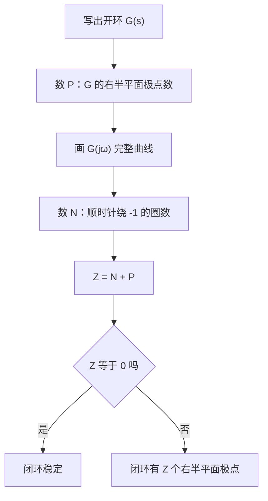

# Lab2 频率响应与动态模型

> [!info] 这份文件是干什么的
> 手册 `Computer lab exercise 2`（4 页）列了一串要敲的命令，但手册 §2 整节用的是**课上还没讲过**的频域工具（Bode、Nyquist、Nichols、两个裕度）。所以这份笔记比 Lab 1 那份多了一整节：本文第 2 节从零把频域讲一遍，第 3 节才是逐问的答案。配套的可运行脚本在 `大学文件/控制/实验/Lab2/代码/`。
> 所有数值都用 Python（sympy 符号 + scipy 时域）独立算过两遍，并已与 MATLAB 实测逐项对拍，对拍表见 [[#5 实测结果与待确认|第 5 节的逐项对拍]]。
> 相关讲义：[[A-I 控制系统导论]]、[[A-II 系统响应与稳定性]]、[[A-III 增益、根轨迹与系统特性]]；上一次实验：[[Lab1 MATLAB 控制工程入门]]。

## 1 这次实验在练什么，以及它和上一次的关系

手册的两条目标，对应关系是这样的：

| 手册目标 | 对应讲义 | 这次要用的 MATLAB 函数 |
| --- | --- | --- |
| Create and analyse Bode Diagrams and Nyquist plots | [[A-II 系统响应与稳定性#6 频率响应：传递函数在虚轴上的取值\|频率响应]]（只擦到边，其余见本文第 2 节） | `bode`、`nyquist`、`nichols`、`ngrid`、`margin` |
| Analyse Dynamic models | [[A-III 增益、根轨迹与系统特性#3.1 二阶系统的标准写法\|二阶标准型]]、[[A-II 系统响应与稳定性#5.1 极点为什么就是"系统自己会做的运动"\|极点即模态]] | `damp`、`dcgain`、`feedback`、`pzmap`、`impulse`、`lsim` |

第 4 节的电路网络（Exercise 2B）不在这两条目标里，它对应的是 Part B 第二讲的网孔分析（mesh analysis）。

> [!warning] 第 2 节的两个对象，就是 Lab 1 第 5 节的那两个
> 手册没有明说，但把式子对一下就看得出来：
>
> | Lab 2 | Lab 1 | 传递函数 |
> | --- | --- | --- |
> | §2.1 | §5.1 | $\dfrac{(s+1)(s+2)}{s(s+3)(s+4)}$ |
> | §2.2 | §5.2 | $\dfrac{K(s-1)(s-2)}{s^{2}+4s+16}$ |
>
> 也就是说，这次是把上次用根轨迹看过的同两个系统，换成频域再看一遍。上次得到的结论可以直接拿来互相验算——第二个系统的增益裕度会**恰好**等于上次算出的稳定边界 $K<4/3$，这在第 3.2 节里对得上。

## 2 先补一节：频域是怎么回事

Part A 的全部工具都装在 $s$ 平面上：极点位置决定模态，模态叠加成时域响应，稳定与否看极点是否全在左半平面。本节换一条路径——只用「对各个频率的正弦输入，系统的稳态响应有多大、滞后多少」这一组数据，同样能判定闭环稳定性，并且还能量出「离不稳定还有多远」。这条路径的三张标准图（Bode、Nyquist、Nichols）、一条判据（Nyquist 稳定判据）和两个裕度指标，是手册 §2 的全部工具。本节的讲法顺序是 Bode → Nyquist → 判据 → 两个裕度 → Nichols：Nichols 放在两个裕度之后，因为它的读法要用到裕度。

本节末尾落在本次实验的对象 $G(s)=\dfrac{(s-1)(s-2)}{s^{2}+4s+16}$ 上：它的相角裕度是负的，闭环却稳定。第 2.7 节用 Nyquist 判据把这件事讲通。

### 2.1 正弦输入下的稳态：为什么代入 s = jω

[[A-II 系统响应与稳定性#5.1 极点为什么就是"系统自己会做的运动"|Part A 建立过]]：冲激响应是各模态之和 $h(t)=\sum_i r_i\,e^{\hat p_i t}$，其中 $\hat p_i$ 是极点（实部定包络、虚部定振荡），$r_i$ 是各模态的权重，也就是部分分式展开的留数；系统稳定就意味着每个 $\hat p_i$ 实部为负、每个模态最终衰减到零。

把输入换成一条永不停息的正弦 $u(t)=A\sin\omega t$。输出里会同时出现两类成分：一类是系统自己的模态，另一类是被输入强行灌进来的、频率恰为 $\omega$ 的成分。系统稳定，第一类全部衰减掉；剩下的只有第二类。于是足够长的时间之后，输出必然还是一条频率为 $\omega$ 的正弦——频率不变，只有幅值被缩放、相位被平移。这两个改变量恰好由复数 $G(j\omega)$ 的模和辐角给出：

$$y_{\mathrm{ss}}(t)=A\,\lvert G(j\omega)\rvert\,\sin\!\big(\omega t+\angle G(j\omega)\big)\tag{a}$$

把 $s=j\omega$ 代进传递函数，得到的不是一个形式记号，而是一次实验就能测出来的两个数：输出与输入的幅值比 $\lvert G(j\omega)\rvert$，以及输出相对输入的相移 $\angle G(j\omega)$（为负表示滞后）。$G(j\omega)$ 作为 $\omega$ 的复值函数称为频率响应（frequency response）；它的模随 $\omega$ 的变化叫幅频特性（magnitude response），辐角随 $\omega$ 的变化叫相频特性（phase response）。

> [!example]- 式 (a) 的来历：部分分式展开
> 输入 $u(t)=A\sin\omega t$ 的拉氏变换是 $U(s)=\dfrac{A\omega}{s^{2}+\omega^{2}}$，它自己的两个极点在 $\pm j\omega$。输出
> $$Y(s)=G(s)\,\frac{A\omega}{s^{2}+\omega^{2}}$$
> 作部分分式展开，极点分成两组：$G$ 自己的极点 $\hat p_i$，以及输入带来的 $\pm j\omega$。
> $$Y(s)=\underbrace{\sum_i \frac{r_i}{s-\hat p_i}}_{\text{系统模态}}+\frac{c}{s-j\omega}+\frac{\bar c}{s+j\omega}$$
> 第一组的时域形式正是 $\sum_i r_i e^{\hat p_i t}$，稳定时全部衰减到零，这就是暂态。后两项的极点在虚轴上，永不衰减，这就是稳态。
>
> 求留数：
> $$c=\left.\frac{A\omega\,G(s)}{(s+j\omega)}\right|_{s=j\omega}=\frac{A\omega\,G(j\omega)}{2j\omega}=\frac{A\,G(j\omega)}{2j}$$
> 记 $G(j\omega)=M e^{j\varphi}$，其中 $M=\lvert G(j\omega)\rvert$、$\varphi=\angle G(j\omega)$，则稳态部分的时域表达式为
> $$c\,e^{j\omega t}+\bar c\,e^{-j\omega t}=\frac{AM}{2j}\Big(e^{j(\omega t+\varphi)}-e^{-j(\omega t+\varphi)}\Big)=AM\sin(\omega t+\varphi)$$
> 即式 (a)。整个推导只在一处用到稳定性：第一组求和项衰减到零。系统不稳定时那些项发散，稳态不存在，式 (a) 无意义。

[[A-II 系统响应与稳定性#6 频率响应：传递函数在虚轴上的取值|A-II 算过的一阶环节稳态响应]]已经用过这条结论的一个特例：稳定的一阶滞后 $\dfrac{1}{s+k}$（$k>0$），其相角

$$\angle\frac{1}{j\omega+k}=-\arctan\frac{\omega}{k}\tag{b}$$

从 $\omega=0$ 处的 $0°$ 单调走向 $\omega\to\infty$ 处的 $-90°$，并且在任何有限频率上都取不到 $-90°$。串联环节的相角相加，所以两节一阶滞后的总相角严格大于 $-180°$，至少要三节才可能真正凑够 $-180°$——三节相同的 $\dfrac{1}{s+k}$ 在 $\omega=k\sqrt3$ 处每节贡献 $-\arctan\sqrt3=-60°$，合计恰为 $-180°$。式 (b) 说明 A-II 那条「纯一阶滞后串联至少要三节才可能凑够 $-180°$」的观察讲的就是相频特性的走向。A-II 给的三个例外同样可以直接读出来：$\dfrac{K}{s^{2}}$ 的相角恒为 $-180°$；右半平面零点如 $\dfrac{K(1-s)}{s(s+1)}$ 额外提供滞后；纯延时 $e^{-j\omega T}$ 的相角是 $-\omega T$，随频率无上限地一路下滑。

### 2.2 Bode 图：把乘法变成加法

实际的开环传递函数总是若干简单环节的乘积，例如 $G=K\cdot\dfrac{1}{s}\cdot\dfrac{1}{1+s/\omega_1}$。对乘积取模与取辐角：

$$\lvert G_1G_2G_3\rvert=\lvert G_1\rvert\,\lvert G_2\rvert\,\lvert G_3\rvert,\qquad \angle(G_1G_2G_3)=\angle G_1+\angle G_2+\angle G_3$$

相角天然是加法，幅值却是乘法。手工作图没法把三条曲线相乘，但可以把它们相加。取对数正好把乘法换成加法：

$$\log\lvert G_1G_2G_3\rvert=\log\lvert G_1\rvert+\log\lvert G_2\rvert+\log\lvert G_3\rvert\tag{c}$$

Bode 图就是建立在式 (c) 上的一对图：上图纵轴是 $\lvert G(j\omega)\rvert$ 的对数（以 dB 计），下图纵轴是 $\angle G(j\omega)$（以度计），两张图共用一条对数的横轴 $\omega$。每增加一个串联环节，只需把它那条曲线加到已有曲线上，两张图都是如此。

**分贝的定义。** 幅值比 $\lvert G\rvert$ 换算成分贝（decibel）：

$$\lvert G\rvert_{\mathrm{dB}}=20\log_{10}\lvert G\rvert\tag{d}$$

系数是 20 而不是 10，来自这个单位的出身：贝尔原本衡量的是功率比，$10\log_{10}(P_2/P_1)$ 得到分贝数。控制里的 $\lvert G\rvert$ 是信号幅值之比，而功率与幅值是平方关系 $P\propto A^{2}$，所以 $10\log_{10}(A_2^{2}/A_1^{2})=20\log_{10}(A_2/A_1)$。几个要记住的换算：$\lvert G\rvert=1$ 是 $0$ dB，$\lvert G\rvert=2$ 是 $6.02$ dB，$\lvert G\rvert=10$ 是 $20$ dB，$\lvert G\rvert=1/\sqrt2$ 是 $-3.01$ dB。

**横轴取对数的两个理由。** 其一，实际系统关心的频段常跨三四个数量级，线性横轴装不下。其二，只有在对数横轴上，基本环节的幅值**渐近线**才是直线（真实曲线不是），从而可以用折线近似手绘。

十倍频程（decade）指频率变为 10 倍，记作 dec；倍频程（octave）指频率变为 2 倍。「斜率 $-20$ dB/dec」的意思是：频率每增大到 10 倍，幅值下降 20 dB，也就是 $\lvert G\rvert$ 变为原来的 $1/10$。同理 $-40$ dB/dec 表示频率增大 10 倍、幅值变为原来的 $1/100$。

**基本环节的渐近线。** 下表给出手绘所需的全部素材，$\omega_c$ 表示该因子的转折频率（corner frequency），即两条渐近线的交点频率。

| 环节 | 幅值渐近线 | 相角 |
| --- | --- | --- |
| 增益 $K>0$ | 水平线，高度 $20\log_{10}K$ dB | $0°$，与 $\omega$ 无关 |
| 增益 $K<0$ | 水平线，高度 $20\log_{10}\lvert K\rvert$ dB | $-180°$，与 $\omega$ 无关 |
| 积分器 $1/s$ | 斜率 $-20$ dB/dec，过 $\omega=1$ 处的 $0$ dB | $-90°$，与 $\omega$ 无关 |
| 微分器 $s$ | 斜率 $+20$ dB/dec，过 $\omega=1$ 处的 $0$ dB | $+90°$，与 $\omega$ 无关 |
| $n$ 重积分器 $1/s^{n}$ | 斜率 $-20n$ dB/dec，过 $\omega=1$ 处的 $0$ dB | $-90n°$，与 $\omega$ 无关 |
| 左半平面极点 $\dfrac{1}{1+s/\omega_c}$ | $\omega<\omega_c$ 取 $0$ dB；$\omega>\omega_c$ 转为 $-20$ dB/dec | 由 $0°$ 走向 $-90°$ |
| 左半平面零点 $1+s/\omega_c$ | $\omega<\omega_c$ 取 $0$ dB；$\omega>\omega_c$ 转为 $+20$ dB/dec | 由 $0°$ 走向 $+90°$ |
| 右半平面零点 $1-s/\omega_c$ | 与左半平面零点逐点相同 | 由 $0°$ 走向 $-90°$ |
| 二阶极点对 $\dfrac{1}{1+2\zeta s/\omega_n+(s/\omega_n)^{2}}$ | $\omega<\omega_n$ 取 $0$ dB；$\omega>\omega_n$ 转为 $-40$ dB/dec | 由 $0°$ 走向 $-180°$ |

一阶极点那一行的来历：$\omega\ll\omega_c$ 时 $1+j\omega/\omega_c\approx 1$，模为 1，即 $0$ dB 水平线；$\omega\gg\omega_c$ 时 $1+j\omega/\omega_c\approx j\omega/\omega_c$，模为 $\omega/\omega_c$，dB 值为 $-20\log_{10}(\omega/\omega_c)$，在对数横轴上是一条斜率 $-20$ dB/dec 的直线。两条直线交于 $\omega=\omega_c$，这就是转折频率的定义位置。渐近折线与真值的最大偏差恰在转折频率处：$\left\lvert\dfrac{1}{1+j}\right\rvert=\dfrac{1}{\sqrt2}$，即真值比折线低 $3.01$ dB。

这个 $3.01$ dB 是**一阶因子**的数，二阶因子完全不同：它在 $\omega_n$ 附近的偏差是 $\dfrac{1}{2\zeta\sqrt{1-\zeta^{2}}}$，$\zeta\to0$ 时无界，而且峰值不在 $\omega_n$ 而在 $\omega_n\sqrt{1-2\zeta^{2}}$（$\zeta<1/\sqrt2$ 时）。第 3.3.4 小节那个 $\zeta=0.35$ 的 $G$ 就有一个 $+3.67$ dB 的谐振峰，照折线画会整个漏掉。

表中各行都写成 $1+s/\omega_c$ 这种低频趋于 1 的归一化形式，实验里拿到的却常是 $\dfrac{1}{s+k}$ 这种未归一化的写法。两者的关系是 $\dfrac{1}{s+k}=\dfrac{1}{k}\cdot\dfrac{1}{1+s/k}$：转折频率是 $\omega_c=k$，但低频段的水平线不在 $0$ dB，而在 $-20\log_{10}k$ dB。画图前先把每个因子化成归一化形式、把所有常数因子归并进总增益 $K$，是必须先做的一步。

**相角图的对应规律。** 幅值渐近线在转折频率处折一次，相角则在转折频率**两侧各一个十倍频程**的范围内完成全部变化。以一阶极点为例：$\dfrac{1}{1+j\omega/\omega_c}$ 与 $\dfrac{\omega_c}{\omega_c+j\omega}$ 是同一个数，正实数因子不改变辐角，所以在式 (b) 中取 $k=\omega_c$ 即得 $\angle\dfrac{1}{1+j\omega/\omega_c}=-\arctan(\omega/\omega_c)$：

- $\omega=0.1\,\omega_c$ 时为 $-5.71°$，近似取 $0°$；
- $\omega=\omega_c$ 时恰为 $-45°$；
- $\omega=10\,\omega_c$ 时为 $-84.29°$，近似取 $-90°$。

于是相角的折线近似是：$0.1\omega_c$ 以下画 $0°$ 水平线，$10\omega_c$ 以上画 $-90°$ 水平线，中间用一条 $-45°/\mathrm{dec}$ 的斜线连接，斜线在 $\omega_c$ 处正好穿过 $-45°$。零点照此类推，只需把总变化量换成 $+90°$。

**二阶因子不能照搬这条。** 它的两端是否落到位取决于 $\zeta$：$\zeta=0.5$ 时 $0.1\omega_n$ 处是 $-5.77°$、$10\omega_n$ 处是 $-174.23°$，勉强可用；$\zeta=5$ 时两端只有 $-45.29°$ 与 $-134.71°$，规则完全失效。$\zeta$ 很小时两端虽然到位，中间那条直线插值也不像真实曲线——相角在 $\omega_n$ 附近近乎跳变。$\zeta$ 接近 1 时可用，过大过小都要另画。

**右半平面零点在两张图上的表现不对称**，这一点到 [[#2.7 本次实验的反例：相角裕度为负而闭环稳定|第 2.7 节那个反例]]会成为关键。因为 $\lvert 1-j\omega/\omega_c\rvert=\lvert 1+j\omega/\omega_c\rvert$，右半平面零点与同位置的左半平面零点的**幅值曲线逐点相同**；而 $\angle(1-j\omega/\omega_c)=-\arctan(\omega/\omega_c)$ 是滞后，与左半平面零点的 $+\arctan(\omega/\omega_c)$ 符号相反。右半平面零点只在相角上制造滞后、在幅值图上看不出来，这正是**非最小相位（non-minimum phase）**这个名字的来历：在同样的幅值特性下，它的相位比左半平面零点的版本更滞后，不是"最小"的那一个。[[A-II 系统响应与稳定性#6 频率响应：传递函数在虚轴上的取值|A-II 提过右半平面零点会额外贡献滞后]]，但没有给这个名字；[[Lab1 MATLAB 控制工程入门#3.4 §5 Exercise 1B：根轨迹分析|Lab 1 那个右半平面零点的根轨迹例子]]用过这个名字，也没有解释它。

**画一张 Bode 渐近折线的完整步骤**，以 $G(s)=\dfrac{10}{s(1+s/5)}$ 为例：

1. 把各因子归一化，读出所有转折频率并从小到大排序。此例只有一个转折频率 $\omega_c=5$（积分器没有转折频率）。
2. 从最低的转折频率以下的频段起画。该频段只剩 $K$ 与积分器，斜率为 $-20$ dB/dec；用 $\omega=1$ 处的值定位，$\lvert G(j1)\rvert\approx 10$ 即 $20$ dB，于是低频段是一条过 $(1,\,20\ \mathrm{dB})$ 的 $-20$ dB/dec 直线。
3. 每越过一个转折频率，就把斜率加上该因子的贡献：一阶极点 $-20$，一阶零点 $+20$，二阶极点对 $-40$，二阶零点对 $+40$。此例越过 $\omega=5$ 后斜率变为 $-40$ dB/dec。
4. 相角图：把各因子的相角折线逐条叠加。此例低频为 $-90°$（积分器），高频为 $-180°$（积分器加一阶极点）。

### 2.3 Nyquist 图：同一组数据换个画法

Bode 图把 $G(j\omega)$ 的两个实数属性拆到上下两张图里，各自对 $\omega$ 作曲线。Nyquist 图不拆：它把 $G(j\omega)$ 当作一个复数，直接在复平面上定点——$\lvert G(j\omega)\rvert$ 是该点到原点的距离，$\angle G(j\omega)$ 是该点与正实轴的夹角。$\omega$ 从 $0$ 增大到 $\infty$，这个点在复平面上划出一条曲线。

由此，$\omega$ 不再占一条坐标轴，而降格为沿曲线行进的参数，通常在曲线上标几个刻度并用箭头标出 $\omega$ 增大的方向。两张图装的是同一组数据：Bode 图上同一个 $\omega$ 处的幅值与相角，就是 Nyquist 曲线上某一点的极坐标。

**负频段是镜像。** $G(s)$ 的系数都是实数，所以 $G(-j\omega)=\overline{G(j\omega)}$：把 $\omega$ 取负，得到的点是原来那点关于实轴的镜像。完整的 Nyquist 曲线指 $\omega$ 从 $-\infty$ 走到 $+\infty$ 的整条轨迹，实际只需画 $\omega\ge 0$ 的一半，另一半照实轴翻折即可。判据要用的是完整曲线。

**曲线的两端。** $G$ 在 $s=0$ 处没有极点时，$\omega\to 0$ 那一端落在实轴上的 $G(0)$，即开环直流增益；$G$ 含积分器时这一端跑向无穷远，画法在第 2.4 节交代。$\omega\to\infty$ 那一端，若 $G$ 的分母次数严格高于分子，则模趋于零、曲线收进原点；若分子分母同次，则曲线收到一个非零的有限点。

### 2.4 Nyquist 稳定判据

**为什么盯着 −1 这个点。** 单位负反馈（unity negative feedback）下的闭环传递函数是 $T(s)=\dfrac{G(s)}{1+G(s)}$，闭环极点就是

$$1+G(s)=0\quad\Longleftrightarrow\quad G(s)=-1$$

的根。于是「某个 $s$ 是闭环极点」等价于「$G$ 把这个 $s$ 映到了复平面上的 $-1$ 点」。判定闭环稳定性，就是判定 $G(s)=-1$ 有没有解落在右半平面。复平面上的 $-1$ 点因此被称为临界点，是全部频域判据的参照物。

**判据本身。**

$$Z=N+P\tag{e}$$

三个量逐一解释：

- $Z$ 是**闭环**极点落在右半平面的个数（按重数计）。闭环稳定当且仅当 $Z=0$，这是要求的结论。这一步默认 $G$ 的分子分母在右半平面没有公共根，否则闭环极点与 $1+G$ 的零点对不上。
- $P$ 是**开环** $G(s)$ 的极点落在右半平面的个数。$G$ 是已知的，把它的极点解出来数一数即可。
- $N$ 是完整 Nyquist 曲线**顺时针**包围 $-1$ 点的圈数；逆时针包围记为负数，不包围记 $0$。这是要从图上读出来的量。

式 (e) 把一个解闭环特征方程的问题，换成了数一条开环曲线绕某点转了几圈的问题——后者只需要开环的频率响应数据，而这正是实验能直接测到的东西。

$N$ 的正方向有两套通行约定，读教材前要先确认用的是哪一套。本笔记按 $Z=N+P$，其中 $N$ 记**顺时针**包围数，这是 Ogata 的写法；另有教材（如手册参考书目里的 Nise）把 $N$ 定义为**逆时针**包围数，判据相应写成 $Z=P-N$。两者完全等价，只是 $N$ 的正方向相反。看到公式里是减号，就去查它对 $N$ 的方向是怎么规定的，不要直接套用。

> [!example]- 式 (e) 的来历：辐角原理
> 记 $F(s)=1+G(s)$。$F$ 的零点就是闭环极点（因为 $1+G=0$），$F$ 的极点就是 $G$ 的极点（加 1 不改变极点）。要数的是 $F$ 在右半平面的零点个数 $Z$。
>
> 取一条把整个右半平面围在内部的闭围线（contour），称为 Nyquist 围线（Nyquist contour）：沿虚轴从 $-j\infty$ 走到 $+j\infty$，再从右侧用一个半径趋于无穷的半圆绕回来，整条围线按顺时针方向走。
>
> 辐角原理（argument principle）：设 $F$ 在闭围线上没有零点也没有极点，则 $s$ 沿该围线顺时针走一圈时，像点 $F(s)$ 顺时针绕**原点**的圈数等于围线内部 $F$ 的零点数减极点数，即 $N=Z-P$，移项即得式 (e)。
>
> 最后把「$F$ 的像绕原点」换成「$G$ 的像绕 $-1$」：$F=1+G$ 只是把整个像平面平移了一个单位，$F$ 绕 $0$ 转的圈数与 $G$ 绕 $-1$ 转的圈数逐圈相同。而 $s$ 在虚轴上走时 $G(s)$ 的像正是 Nyquist 曲线；无穷大半圆那一段，只要分母次数不低于分子，映出来是一个点或一条不影响圈数的短弧。于是数 Nyquist 曲线绕 $-1$ 的圈数就够了。

**怎么数 N。** 从 $-1$ 点出发朝任意方向引一条射线（习惯沿负实轴向左），数曲线与它的交点：曲线按顺时针方向穿过射线记 $+1$，按逆时针方向穿过记 $-1$，代数和就是 $N$。射线方向可以任选，结果不变；选沿负实轴向左的那条最省事，因为只需检查曲线与负实轴的交点中有几个落在 $-1$ 的左边。

**开环含积分器时怎么绕开原点。** 辐角原理要求围线上没有 $F$ 的极点，而 $G$ 含 $1/s^{n}$ 时 $s=0$ 正落在虚轴上。做法是在原点处用一个半径 $\varepsilon\to 0$ 的小半圆**向右**绕过去，把原点排除在围线内部之外——因此原点处的开环极点不计入 $P$。

这段小半圆在 Nyquist 图上的样子：令 $s=\varepsilon e^{j\theta}$，$\theta$ 由 $-90°$ 转到 $+90°$，则 $G\approx K/s^{n}=(K/\varepsilon^{n})e^{-jn\theta}$，模趋于无穷，辐角由 $+90n°$ 顺时针扫到 $-90n°$。图上表现为：$\omega\to 0^{+}$ 那一端不落在纸面上任何有限位置，而是沿某个方向跑向无穷远；在无穷远处顺时针扫过 $n\times 180°$；再从另一个方向折回来，接上 $\omega\to 0^{-}$ 的那一端。这条无穷远的支路是围线闭合所必需的一段，数圈时必须算进去：$n=2$ 时它在无穷远处扫过 $360°$，会把从 $-1$ 向左的那条射线也扫过一次，直接改变 $N$ 的值。

判据的完整执行顺序：



### 2.5 增益裕度与相角裕度

判据回答稳不稳，裕度回答离不稳还有多远。两个裕度都是在量曲线到 $-1$ 点的距离，区别在于沿哪个方向量。

**相角穿越频率与增益裕度。** 相角穿越频率（phase crossover frequency）$\omega_{pc}$ 定义为满足 $\angle G(j\omega_{pc})=-180°$ 的频率。在这个频率上 $G(j\omega_{pc})$ 落在负实轴上，与 $-1$ 同在一条从原点出发的射线上，只是长度未必相同。增益裕度（gain margin）定义为

$$\mathrm{GM}=\frac{1}{\lvert G(j\omega_{pc})\rvert},\qquad \mathrm{GM}_{\mathrm{dB}}=-20\log_{10}\lvert G(j\omega_{pc})\rvert\tag{f}$$

它的含义是倍率：把开环增益 $K$ 整体乘上 $\mathrm{GM}$ 倍，曲线上 $\omega_{pc}$ 那一点恰好被拉到 $-1$。$\mathrm{GM}>1$（即 $\mathrm{GM}_{\mathrm{dB}}>0$）意味着穿点还在 $-1$ 的右边，增益尚有放大余地。

**幅值穿越频率与相角裕度。** 幅值穿越频率（gain crossover frequency）$\omega_{gc}$ 定义为满足 $\lvert G(j\omega_{gc})\rvert=1$（即 $0$ dB）的频率。在这个频率上曲线穿过以原点为圆心的单位圆，而 $-1$ 点本身也在单位圆上。相角裕度（phase margin）定义为

$$\mathrm{PM}=180°+\angle G(j\omega_{gc})\tag{g}$$

它的含义是角度：$\mathrm{PM}>0$ 时，在这个频率上再额外引入 $\mathrm{PM}$ 这么多的纯相位滞后（幅值不变），曲线上 $\omega_{gc}$ 那一点就会沿着单位圆滑到 $-1$；$\mathrm{PM}<0$ 时反过来，需要的是同样多的相位超前。

**两者的几何含义。** $-1$ 点既在负实轴上，又在单位圆上，所以有两种走到它的方式：

- 增益裕度量的是**沿实轴方向**的距离。曲线穿负实轴于 $-a$（$a=\lvert G(j\omega_{pc})\rvert$），$-a$ 与 $-1$ 在同一条射线上，两者相差一个倍率 $1/a$，这就是 GM。这条路径只动模、不动辐角，对应只调增益。
- 相角裕度量的是**沿单位圆方向**的距离。曲线穿单位圆于某点，该点与 $-1$ 都在单位圆上，两者相差一个圆心角，这就是 PM。这条路径只动辐角、不动模，对应只加相位滞后，比如延时或滞后校正。

**从 Bode 图上读。** GM：在相角图上找到 $\angle G=-180°$ 的频率，到幅值图上读同一频率的 dB 值，取相反数即得 $\mathrm{GM}_{\mathrm{dB}}$。PM：在幅值图上找到 $0$ dB 的频率，到相角图上读同一频率的相角，加 $180°$ 即得 PM。

> [!warning] PM 的符号不等于闭环稳定性
> **误**：$\mathrm{PM}>0$ 则闭环稳定，$\mathrm{PM}<0$ 则闭环不稳定。
> **正**：闭环稳定的判据是式 (e) 给出的 $Z=N+P=0$。PM 只是沿单位圆方向到 $-1$ 的一个单向距离，它对曲线整体绕不绕 $-1$ 并不掌握全部信息。
>
> PM 的符号要与判据结论一致，通常靠下面三条撑着：
>
> ① **开环稳定，即 $P=0$。** 否则式 (e) 里即使 $N=0$ 也得不到 $Z=0$。
> ② **幅值曲线只穿越 $0$ dB 一次，而且是自上而下穿**——低频段 $\lvert G\rvert>1$、高频段 $\lvert G\rvert<1$，也就是常见的低通形状。穿越不唯一则 $\omega_{gc}$ 不唯一、PM 不是一个数；穿越方向反过来则下面那条等价链会断。
> ③ **相角曲线只穿越 $-180°$ 一次**，等价于 Nyquist 曲线与负实轴只有一个交点。否则 $\omega_{pc}$ 不唯一，GM 也不是一个数。
>
> 三条同时成立时，下面四件事互相等价：$\lvert G(j\omega_{pc})\rvert<1$、$\omega_{pc}>\omega_{gc}$、$\angle G(j\omega_{gc})>-180°$、闭环稳定。多数教材例题满足这三条，所以 PM 被当作快捷指标用；任何一条被破坏都必须退回判据重新数圈。[[#2.7 本次实验的反例：相角裕度为负而闭环稳定|第 2.7 节那个实验对象]]破坏的正是 ② 里「自上而下」那半句。
>
> 还有一处口径要交代：式 (g) 里的 $\angle G(j\omega_{gc})$ 指从 $\angle G(j0^{+})$ 连续延拓过来的那一支，而不是折回 $(-180°,\,180°]$ 的读数。MATLAB 的 `margin` 报的是折回值，两者可能差 $360°$；本例两者恰好相同。

### 2.6 Nichols 图

第三种排布：横轴取 $\angle G(j\omega)$（单位为度），纵轴取 $\lvert G(j\omega)\rvert$（单位为 dB），$\omega$ 同样作为沿曲线行进的参数。它相当于把 Bode 两张图的纵轴拿来充当同一张图的两个坐标轴，把 $\omega$ 消掉。

这样排的好处是同时保留了另外两张图的长处：两个坐标轴上的量都是可加的（dB 相加、度数相加），所以串联环节依然可以叠加，这是 Bode 图的长处；同时临界点 $-1$ 在这张图上是一个明确的点——坐标 $(-180°,\ 0\ \mathrm{dB})$——曲线相对它的位置一眼可见，这是 Nyquist 图的长处。裕度读法随之变得直观：曲线穿过 $0$ dB 水平线时，横坐标到 $-180°$ 的水平距离就是 PM；曲线穿过 $-180°$ 竖线时，纵坐标到 $0$ dB 的竖直距离就是 $\mathrm{GM}_{\mathrm{dB}}$。

MATLAB 的 `ngrid` 命令在 Nichols 图上叠加一层等值线网格。这些线画的是**闭环**量：在单位负反馈下 $T=\dfrac{G}{1+G}$，网格中一族线是 $\lvert T\rvert$ 的等值线（标注为 dB），另一族是 $\angle T$ 的等值线（标注为度）。用法是把开环曲线画在这张网格上，曲线经过哪条等值线，就直接读出该频率下闭环的幅值或相角，不必另行计算闭环传递函数。闭环谐振峰值（resonant peak）$M_r$ 就是曲线相切到的那条最高的等幅值线。记号取 $M_r$ 而不是 $M_p$，是因为 [[A-III 增益、根轨迹与系统特性#3.1 二阶系统的标准写法|A-III 已经把 Mp 这个记号给了超调]]。

### 2.7 本次实验的反例：相角裕度为负而闭环稳定

手册 §2.2 的开环对象是

$$G(s)=\frac{(s-1)(s-2)}{s^{2}+4s+16}$$

取 $K=1$、单位负反馈。先把结构读出来：

- 零点 $s=1$ 与 $s=2$ 都在右半平面，即非最小相位；按 [[#2.2 Bode 图：把乘法变成加法|右半平面零点只在相角上滞后]]，两个右半平面零点各提供从 $0°$ 走向 $-90°$ 的滞后，合计 $-180°$。
- 极点 $s=-2\pm j3.464$（即 $\omega_n=4$、$\zeta=0.5$ 的二阶极点对）都在左半平面，因此 $P=0$。
- 两端的值：$G(0)=\dfrac{(-1)(-2)}{16}=0.125$，即 $-18.06$ dB；分子分母同为二次且首项系数都是 1，所以 $\omega\to\infty$ 时 $G\to 1$，即 $0$ dB。

> [!example]- 本例的 Bode 渐近折线
> 按 [[#2.2 Bode 图：把乘法变成加法|归一化的步骤]]先化形。$(s-1)(s-2)=2(1-s)\left(1-\dfrac{s}{2}\right)$，$s^{2}+4s+16=16\left[1+\dfrac{s}{4}+\left(\dfrac{s}{4}\right)^{2}\right]$，于是
> $$G(s)=\frac{1}{8}\cdot\frac{(1-s)\left(1-\dfrac{s}{2}\right)}{1+\dfrac{s}{4}+\left(\dfrac{s}{4}\right)^{2}}$$
> 三个转折频率由小到大是 $1$、$2$（两个右半平面零点）和 $4$（二阶极点对，$\omega_n=4$）。总增益 $1/8$ 给出低频水平线的高度 $20\log_{10}(1/8)=-18.06$ dB。
>
> | 频段 | 渐近线斜率 | 该频段末端的电平 |
> | --- | --- | --- |
> | $\omega<1$ | $0$ dB/dec | 水平停在 $-18.06$ dB |
> | $1<\omega<2$ | $+20$ dB/dec | $\omega=2$ 处为 $-12.04$ dB |
> | $2<\omega<4$ | $+40$ dB/dec | $\omega=4$ 处为 $0$ dB |
> | $\omega>4$ | $0$ dB/dec | 水平停在 $0$ dB |
>
> 高频段斜率归零（两个零点 $+40$、二阶极点对 $-40$，相抵），折线水平停在 $0$ dB——与前面算出的 $G(j\infty)=1$ 相符，这是构图正确的一个自检。
>
> 折线在 $\omega=4$ 才够到 $0$ dB，而真实曲线的 $0$ dB 穿越在 $\omega_{gc}=2\sqrt3\approx 3.46$：折线在该频率上读出的是 $-2.5$ dB，真值是 $0$ dB。三个转折频率挤在两个倍频程之内，各因子在自己转折频率附近的偏差（一阶因子最大 $3$ dB）在这里叠到了一起。渐近折线只用来判形状，$\omega_{gc}$、$\omega_{pc}$ 和两个裕度必须从真实曲线或解析式上取。
>
> 相角折线：两个右半平面零点各自从 $0°$ 走到 $-90°$，二阶极点对从 $0°$ 走到 $-180°$，叠加后总相角从 $0°$ 一路走到 $-360°$。途中必然经过 $-180°$ 与 $-207.80°$。

**两个裕度。** 相角穿越频率 $\omega_{pc}=2\sqrt2\approx 2.8284$，在该处 $G(j\omega_{pc})=-0.75$ 恰好落在负实轴上，由式 (f)

$$\mathrm{GM}=\frac{1}{0.75}=\frac{4}{3},\qquad \mathrm{GM}_{\mathrm{dB}}=2.4988\ \mathrm{dB}$$

幅值穿越频率 $\omega_{gc}=2\sqrt3\approx 3.4641$，在该处 $\angle G(j\omega_{gc})=-207.80°$，由式 (g)

$$\mathrm{PM}=180°+(-207.80°)=-27.80°$$

相角裕度是负的。这两个数都不是从渐近折线上读的：**渐近折线只用来判形状，$\omega_{gc}$、$\omega_{pc}$ 和两个裕度必须从真实曲线或解析式上取。**本例的折线要到 $\omega=4$ 才够到 $0$ dB，而真实的穿越在 $2\sqrt3\approx3.46$。

![[Lab2 非最小相位系统的 Nyquist 图.png]]

图上三样东西一起出现：曲线与负实轴的交点在 $-0.75$，临界点 $-1$ 在它左边，两者之间的那段距离就是 $\mathrm{GM}=4/3$ 的几何含义；方块标出的是 $\omega_{gc}$，它落在单位圆上却在第二象限，离 $-1$ 还差 $27.8°$ 没转到——这就是负相角裕度的来源。整条闭合曲线把 $-1$ 留在了外面。

> [!example]- 两个穿越频率的手算过程
> 代入 $s=j\omega$ 并把分子分母各自整理成实部加虚部：
> $$G(j\omega)=\frac{(j\omega-1)(j\omega-2)}{(j\omega)^{2}+4j\omega+16}=\frac{(2-\omega^{2})-j3\omega}{(16-\omega^{2})+j4\omega}\tag{h}$$
>
> **求 $\omega_{pc}$：** 要求 $G(j\omega)$ 为实数，等价于分子乘分母的共轭之后虚部为零：
> $$(-3\omega)(16-\omega^{2})-(2-\omega^{2})(4\omega)=0$$
> 除去 $\omega=0$ 这个根，$-3(16-\omega^{2})-4(2-\omega^{2})=0$，即 $7\omega^{2}=56$，$\omega^{2}=8$，$\omega_{pc}=2\sqrt2$。
> 代回式 (h)，分子为 $-6-j6\sqrt2=-6(1+j\sqrt2)$，分母为 $8+j8\sqrt2=8(1+j\sqrt2)$，公因子 $(1+j\sqrt2)$ 约去：
> $$G(j\,2\sqrt2)=\frac{-6}{8}=-0.75$$
>
> **求 $\omega_{gc}$：** 要求 $\lvert G\rvert=1$，即分子分母模长的平方相等。令 $x=\omega^{2}$：
> $$(2-x)^{2}+9x=(16-x)^{2}+16x\ \Longrightarrow\ x^{2}+5x+4=x^{2}-16x+256\ \Longrightarrow\ 21x=252$$
> 得 $x=12$，$\omega_{gc}=2\sqrt3$。
> 代回式 (h)，分子为 $-10-j6\sqrt3$，落在第三象限，辐角 $-133.90°$；分母为 $4+j8\sqrt3$，落在第一象限，辐角 $73.90°$。两者相减：
> $$\angle G(j\,2\sqrt3)=-133.90°-73.90°=-207.80°$$
>
> **两条唯一性的来历。** $21x=252$ 是 $x=\omega^{2}$ 的一次方程，正根唯一，所以 $\lvert G\rvert=1$ 在整个正频段只发生一次；$7\omega^{2}=56$ 的正根同样唯一，所以曲线与负实轴只有 $-0.75$ 这一个交点。

**两条唯一性，以及幅值曲线的走向。** 上面的手算顺带定下三件事。$\lvert G\rvert=1$ 在整个正频段只发生一次，曲线与负实轴也只有 $-0.75$ 这一个交点；而幅值是**自下而上**穿过 $0$ dB 的——低频段 $\lvert G(0)\rvert=0.125<1$，穿过 $0$ dB 之后还继续升到峰值 $+1.96$ dB（在 $\omega=\sqrt{12+4\sqrt{13}}\approx5.14$），再从上方回落到 $0$ dB，所以 $\omega>\omega_{gc}$ 的整个高频段都是 $\lvert G\rvert>1$。对照 [[#2.5 增益裕度与相角裕度|PM 可信所需的三条]]：① 与 ③ 都成立，② 的「只穿一次」成立、「自上而下」不成立。

**闭环却是稳定的。** 直接解闭环特征方程：

$$1+G(s)=0\ \Longrightarrow\ (s^{2}+4s+16)+(s-1)(s-2)=0\ \Longrightarrow\ 2s^{2}+s+18=0$$

三个系数同号，由 [[A-II 系统响应与稳定性#8 捷径二：Routh 稳定判据|Routh 判据]]即可断定两根都在左半平面；解出来是 $s=-0.25\pm j2.99$。闭环稳定，$Z=0$。

**用判据把这件事讲通。** 先把 Nyquist 曲线的形状描出来。$\omega=0$ 时曲线起于正实轴上的 $0.125$；随着 $\omega$ 增大相角一路下滑，曲线先沉入下半平面；$\omega=2\sqrt2$ 时它从下方穿过负实轴，穿点是 $-0.75$；此后相角继续减小，曲线翻到上半平面、绕回第一象限；$\omega\to\infty$ 时从上方贴近 $1$，总相角走到 $-360°$。整条正频段曲线顺时针绕原点走了整整一圈。负频段是它关于实轴的镜像，与正频段合成一条闭合曲线。

现在数 $N$。从 $-1$ 沿负实轴向左引射线，射线覆盖的是负实轴上 $-1$ 左边的部分。曲线与负实轴的交点只有 $-0.75$ 这一个——令 $G(j\omega)$ 的虚部为零得到的方程是 $7\omega^{2}=56$，正根唯一——而 $-0.75$ 在 $-1$ 的**右边**，不在射线上。射线与曲线没有交点，故

$$N=0,\qquad P=0,\qquad Z=N+P=0$$

闭环右半平面极点数为零，与特征多项式 $2s^{2}+s+18$ 解出的结论一致。曲线虽然绕原点转了一整圈，却把 $-1$ 留在了这一圈的外面。

**负的 PM 为什么在这里是假警报。** 关键在幅值是自下而上穿过 $0$ dB 的。在标准的低通形状里，$\omega_{pc}<\omega_{gc}$ 恰恰意味着不稳定——那时低频段 $\lvert G\rvert>1$，穿点落在 $-1$ 左边；这里方向反了，同一个先后关系反而对应稳定。相角在 $\omega_{pc}=2\sqrt2\approx2.83$ 就已经跌破 $-180°$，但那个频率上的幅值只有 $0.75$——曲线虽然转到了负实轴上，长度却不够，够不到 $-1$。等到 $\omega=3.46$ 幅值终于涨到 1 时，相角已经滑到 $-207.80°$，那一点在单位圆上，位置却在第二象限而不在 $-1$。式 (g) 的 PM 只量沿单位圆还差多少角度转到 $-1$，它读到相角超了 $27.80°$ 就报警，却不掌握「超相角发生的那个频段上模统统小于 1」这个事实。

被破坏的是 ② 里「自上而下」那半句，而这件事由两个彼此独立的特征合成。幅值之所以自下而上穿，是因为两个零点的转折频率（$1$ 与 $2$）都低于极点对的 $\omega_n=4$，而直流增益只有 $0.125$——这一条与零点在哪个半平面毫无关系：把两个零点镜像到左半平面，幅值曲线逐点不变。右半平面零点负责的是另一件事——本该是 $+180°$ 的超前变成了 $-180°$ 的滞后，相角这才够得到 $-180°$。两者叠起来，才出现「相角已经用超、幅值却还没涨上来」这种错位。

**增益裕度在这里是可信的，而且可以交叉验证。** 把开环增益改为一般的 $K$，闭环特征多项式为

$$(s^{2}+4s+16)+K(s-1)(s-2)=(1+K)s^{2}+(4-3K)s+(16+2K)$$

二次多项式的根全在左半平面等价于三个系数同号，此处即 $4-3K>0$，临界值 $K=4/3$——恰是式 (f) 算出的 $\mathrm{GM}$。在 $K=4/3$ 处一次项消失，方程成为 $\tfrac{7}{3}s^{2}+\tfrac{56}{3}=0$，根为 $s=\pm j2\sqrt2$，即纯虚根落在 $\pm j\omega_{pc}$ 上。这与 GM 的几何含义逐字吻合：增益放大 $4/3$ 倍时，曲线上 $\omega_{pc}$ 那一点正好被拉到 $-1$，闭环极点正好落到虚轴上的 $\pm j\omega_{pc}$。$K>4/3$ 时两根实部转正，$Z=2$，闭环失稳。

这个 $K<4/3$ 正是 [[Lab1 MATLAB 控制工程入门#3.4 §5 Exercise 1B：根轨迹分析|Lab 1 用根轨迹算出的稳定域]]。同一个系统、两条完全不同的路径、同一个答案，可以互相当作验算。

**本节留下的操作准则。** 拿到一组频率响应数据，$P$ 与 $N$ 决定结论，GM 与 PM 只是刻度。先照 [[#2.5 增益裕度与相角裕度|PM 可信所需的那三条前提]]验一遍：开环稳定、幅值自上而下只穿 $0$ dB 一次、相角只穿 $-180°$ 一次。三条都过，PM 可以放心当稳定性指标用；任何一条可疑——开环不稳定、非最小相位、有纯延时、幅值多次穿 $0$ dB、或者穿越方向反了——就回到式 (e) 数圈，或者干脆把闭环特征多项式解出来对一次。

## 3 逐节的答案与要点

### 3.1 §2.1 三张图与那个不存在的实轴交点

$$G(s)=\frac{(s+1)(s+2)}{s(s+3)(s+4)}$$

零点在 $-1$、$-2$，极点在 $0$、$-3$、$-4$。原点上那个极点说明它是 1 型系统（开环含 $n$ 个原点极点就叫 $n$ 型），低频段 $\lvert G\rvert$ 按 $1/\omega$ 上升。分母比分子高一次，高频段按 $1/\omega$ 下降。

**(a) Bode。** 四个转折频率分别是 $1$、$2$（零点）与 $3$、$4$（极点），挤在两个倍频程之内。按 [[#2.2 Bode 图：把乘法变成加法|归一化的做法]]：

$$G(s)=\frac{2}{12}\cdot\frac{(1+s)\left(1+\dfrac{s}{2}\right)}{s\left(1+\dfrac{s}{3}\right)\left(1+\dfrac{s}{4}\right)}=\frac{1}{6}\cdot\frac{(1+s)\left(1+\dfrac{s}{2}\right)}{s\left(1+\dfrac{s}{3}\right)\left(1+\dfrac{s}{4}\right)}$$

低频段只剩 $\dfrac{1/6}{s}$，斜率 $-20$ dB/dec；越过 $\omega=1$ 与 $\omega=2$ 各加 $+20$，越过 $\omega=3$ 与 $\omega=4$ 各加 $-20$，于是斜率依次是 $-20 \to 0 \to +20 \to 0 \to -20$ dB/dec。相角低频起于 $-90°$（积分器），高频回到 $-90°$（$+90°+90°-90°-90°-90°$）。

**(b) Nyquist。** 含一个积分器，所以 $\omega\to 0^{+}$ 那一端跑向无穷远：按 [[#2.4 Nyquist 稳定判据|原点极点处的小半圆规则]]，$n=1$ 时曲线从 $-j\infty$ 出发。$\omega\to\infty$ 时收进原点。

**(c) 实轴交点——手册问的这个东西不存在。** 把 $s=j\omega$ 代进去并整理：

$$\operatorname{Im}G(j\omega)=\frac{-\left(\omega^{4}+7\omega^{2}+24\right)}{\omega\left(\omega^{4}+25\omega^{2}+144\right)}\tag{1}$$

分子那个双二次式以 $\omega^{2}$ 为变量看是 $x^{2}+7x+24$，判别式 $49-96=-47<0$，没有实根；再加上首项与常数项都为正，所以它对一切实数 $\omega$ 恒为正。于是式 (1) 的 $\operatorname{Im}G(j\omega)$ 对一切 $\omega>0$ **恒为负**，永远不会变号。

> [!warning] 手册问的是「点击 Nyquist 图找出实轴交点」，而这条曲线在任何有限的非零频率上都不与实轴相交
> 这不是画错了图。相角在 $\omega\to0^{+}$ 的极限是 $-90°$（下图作图窗口的最低频 $\omega=0.01$ 处已是 $-89.5°$），从那里出发，在 $\omega=2.1198$ 处升到最高的 $-41.756°$，然后回落，$\omega\to\infty$ 时趋于 $-90°$——全程被夹在 $-90°$ 与 $-41.756°$ 之间，既够不到 $0°$，也够不到 $-180°$。整条曲线待在第四象限（实部为正、虚部为负）。
>
> 实部那一端也有确定的极限。把式 (h) 那一步的分子分母同乘分母的共轭、取实部整理，得
>
> $$\operatorname{Re}G(j\omega)=\frac{4\omega^{2}+22}{49\omega^{2}+\left(12-\omega^{2}\right)^{2}}\tag{2}$$
>
> 式 (2) 的分母 $49\omega^{2}+(12-\omega^{2})^{2}$ 展开就是 $\omega^{4}+25\omega^{2}+144$，与式 (1) 的分母只差一个 $\omega$ 因子，是同一个量的两种写法。分子 $4\omega^{2}+22$ 对一切 $\omega$ 恒为正，所以 $\operatorname{Re}G(j\omega)>0$。「曲线整条待在第四象限」要两条一起才成立：式 (1) 管住虚部恒负，式 (2) 管住实部恒正。
>
> 令 $\omega\to 0$ 得 $\dfrac{22}{144}=\dfrac{11}{72}\approx 0.152778$。所以曲线是从 $\left(\dfrac{11}{72},\,-\infty\right)$ 这个方向上来、绕过第四象限、再收回原点的一条弧。
>
> ![[Lab2 一型系统的 Nyquist 图.png]]
>
> 这和 Lab 1 §5.1 是同一类陷阱：[[Lab1 MATLAB 控制工程入门#2 手册里的三个坑\|上次那道题的分离点方程解出两个根却一个都不在轨迹上]]，这次是实轴交点压根不存在。**答题时要写的不是「找不到」，而是「为什么不存在」**——把式 (1) 的分子无实根这一步写出来，才是拿分的答案。

**(d) Nichols。** 用 `nichols(G); ngrid`。相角全程不低于 $-90°$，横坐标离 $-180°$ 至少还有 $90°$，所以曲线离 $(-180°,\,0\ \mathrm{dB})$ 这个临界点很远。这个相角下界比 (c) 用到的「虚部恒负」更强：虚部恒负只说明曲线碰不到负实轴，并不保证它离 $-1$ 有多远——一条曲线完全可以无限逼近 $-1$ 而始终不穿过它。

### 3.2 §2.2 非最小相位系统的两个裕度

这一问的完整分析在[[#2.7 本次实验的反例：相角裕度为负而闭环稳定|PM 为负而闭环仍稳定的完整推演]]，这里只列答案：

| 量 | 值 | 频率 |
| --- | --- | --- |
| 增益裕度 GM | $4/3\approx1.3333$，即 $2.4988$ dB | $\omega_{pc}=2\sqrt2\approx2.8284$ rad/s |
| 相角裕度 PM | $-27.80°$ | $\omega_{gc}=2\sqrt3\approx3.4641$ rad/s |

手册没给 $K$ 的值，上表按 $K=1$ 算。改变 $K$ 时两个量的变化方式完全不同，这一点值得单独记住：

- $\mathrm{GM}$ 与 $K$ 成反比，$\mathrm{GM}(K)=\dfrac{4}{3K}$；因为 $K$ 只缩放幅值、不动相角，$\omega_{pc}$ 不随 $K$ 变。
- $\mathrm{PM}$ 没有这么简单的公式：$K$ 一变，$\omega_{gc}$ 就跟着挪到幅值曲线上的另一点，相角也就换了一个值。

**这一问最该写进报告的一句话**：$\mathrm{PM}=-27.80°$ 是负的，但闭环在 $K=1$ 时确实稳定（特征多项式 $2s^{2}+s+18$，根 $-0.25\pm j2.99$）。原因是相角跌破 $-180°$ 发生在幅值还不到 1 的频段上，曲线够不着 $-1$，所以不包围它。判稳要用 $Z=N+P$，不能只看 PM 的符号。

### 3.3 §3 Exercise 2A：动态模型分析

#### 3.3.1 特征值、自然频率与阻尼比

$$H(s)=\frac{4s+1}{s^{2}+3s+5}$$

分母与二阶标准型 $s^{2}+2\zeta\omega_n s+\omega_n^{2}$ 逐项对照：$\omega_n^{2}=5$、$2\zeta\omega_n=3$，于是

$$\omega_n=\sqrt5=2.236068,\qquad \zeta=\frac{3}{2\sqrt5}=0.670820$$

特征值（也就是极点）$s=\dfrac{-3\pm\sqrt{9-20}}{2}=-1.5\pm j1.658312$。$0<\zeta<1$，欠阻尼。

分子那个零点在 $s=-1/4$。按 [[A-II 系统响应与稳定性#5.1 极点为什么就是"系统自己会做的运动"\|零点只改模态权重、不改极点]]，它不改变极点位置，只改变两个模态的留数权重——所以 `damp` 给出的 $\omega_n$ 与 $\zeta$ 只由分母决定，与分子无关。

#### 3.3.2 MIMO 模型的直流增益

$$H(s)=\begin{bmatrix} 1 & \dfrac{s-1}{s^{2}+s+3} \\[2ex] \dfrac{1}{s+1} & \dfrac{s+2}{s-3} \end{bmatrix}$$

逐元素代 $s=0$：

$$H(0)=\begin{bmatrix} 1 & -\dfrac{1}{3} \\[2ex] 1 & -\dfrac{2}{3} \end{bmatrix}$$

MATLAB 里用 `dcgain` 一次得到整个矩阵。读法：第 $i$ 行第 $j$ 列是「第 $j$ 个输入加一个单位阶跃、其余输入为零时，第 $i$ 个输出的稳态值」。

> [!warning] 这个模型本身是不稳定的，它的「直流增益」只是形式上的代入
> 第 (2,2) 个元素 $\dfrac{s+2}{s-3}$ 的极点在 $s=+3$，位于右半平面。按 [[A-II 系统响应与稳定性#5.2 稳定性于是变成一句几何判据\|极点全在左半平面才稳定]]，这一通道的阶跃响应按 $e^{3t}$ 发散，根本不存在稳态值。
>
> `dcgain` 不会因此报错，它只是机械地代入 $s=0$。**把 $-2/3$ 说成「稳态输出」是错的**；正确的说法是「传递函数在 $s=0$ 处的取值」。同理，第 2.1 节式 (a) 的整个频率响应解释对这一通道也不成立——那条推导的唯一前提就是模态会衰减。
>
> 手册这一问只要求「find DC gain」，所以照算即可，但报告里应当点明这件事。

#### 3.3.3 MIMO 的 Bode 图

`bode(Hmimo)` 画出的是 $2\times2$ 的一组子图：第 $i$ 行第 $j$ 列那一格，是从第 $j$ 个输入到第 $i$ 个输出这条通道的 Bode 图。四格各自独立，没有合成的意思。

#### 3.3.4 按 ζ 与 ωn 造一个二阶环节

$\zeta=0.35$、$\omega_n=3.4$ rad/s 代进标准型：

$$G(s)=\frac{\omega_n^{2}}{s^{2}+2\zeta\omega_n s+\omega_n^{2}}=\frac{11.56}{s^{2}+2.38s+11.56}$$

直流增益 $G(0)=1$——标准型的分子取 $\omega_n^{2}$ 就是为了让它等于 1。

#### 3.3.5 闭环模型

手册图 2 是标准负反馈：前向通道 $G$，反馈通道 $H$，所以

$$T(s)=\frac{G(s)}{1+G(s)H(s)}$$

代入并通分（分子分母同乘 $H$ 的分母 $s^{2}+3s+5$）：

$$T(s)=\frac{11.56\left(s^{2}+3s+5\right)}{\left(s^{2}+2.38s+11.56\right)\left(s^{2}+3s+5\right)+11.56(4s+1)}$$

$$=\frac{11.56s^{2}+34.68s+57.8}{s^{4}+5.38s^{3}+23.7s^{2}+92.82s+69.36}\tag{3}$$

直流增益有个干净的验算：

$$T(0)=\frac{G(0)}{1+G(0)H(0)}=\frac{1}{1+1\times\frac15}=\frac56=0.833333$$

与式 (3) 的 $57.8/69.36$ 一致。

#### 3.3.6 闭环零极点与冲激响应

式 (3) 的分母解出四个闭环极点，分子解出两个闭环零点：

| 闭环极点 | $\omega_n$ | $\zeta$ |
| --- | --- | --- |
| $-0.170560\pm j4.258302$ | $4.261716$ | $\mathbf{0.040021}$ |
| $-4.109618$ | $4.109618$ | $1$ |
| $-0.929263$ | $0.929263$ | $1$ |

闭环零点是 $-1.5\pm j1.658312$——**恰好是 $H$ 的两个极点**。这不是巧合：$T=\dfrac{G}{1+GH}$ 通分时分子多出来的正是 $H$ 的分母，所以反馈通道的极点会原样变成闭环的零点。

> [!warning] 这一问真正的答案是那个 0.0400
> 你在 [[#3.3.4 按 ζ 与 ωn 造一个二阶环节|按 ζ=0.35 造的那个二阶环节]]按 $\zeta=0.35$ 造了 $G$，闭环之后主导极点（dominant pole）对的阻尼比掉到了 $\mathbf{0.0400}$，只剩原来的 $11.4\%$。四个极点里 $-0.170560\pm j4.258302$ 实部最接近虚轴、衰减最慢，所以它主导整个响应：振荡频率 $4.258$ rad/s，对应周期 $1.476$ s，而包络按 $e^{-0.17056t}$ 衰减，时间常数 $5.86$ s。
>
> 换句话说，**你设计 $G$ 时选的那个 $\zeta$，在闭环里基本没被保留下来**。反馈通道 $H$ 自己是个 $\zeta=0.67$ 的二阶环节，它和 $G$ 串在回路里之后，闭环特征多项式是四次的，根的位置与两个二阶环节各自的 $\zeta$ 都不再有简单关系。

冲激响应因此是一条振荡了十几个周期才平息的曲线。

#### 3.3.7 指数输入下的响应，以及手册那段评价题

输入 $r(t)=e^{-0.5t}$ 的时间常数是 $2$ s，到 $t=9.2$ s 时已经衰到初值的 $1\%$。但输出在那之后还在明显振荡——振的不是输入，而是 [[#3.3.6 闭环零极点与冲激响应|第 3.3.6 小节那个 ζ=0.04 的闭环模态]]。

![[Lab2 闭环对指数输入的响应.png]]

用 `lsim` 在 $1$ ms 网格上算出来：$\lvert y\rvert$ 在 $t=0.666$ s 达到峰值 $0.7686$；此后逐渐衰减，$t=10$ s 时 $y=-0.0273$，$t=20$ s 时 $y=+0.0119$，$t=40$ s 时 $y=-0.000267$。

**这一问要交的四个数**（单位阶跃，细网格取值）：

| 指标 | 值 |
| --- | --- |
| 主导极点对的 $\zeta$ | $0.0400$ |
| 主导极点对的 $\omega_n$ | $4.2617$ rad/s |
| 超调 $M_p$ | $26.996\%$ |
| 2% 调节时间 $t_s$ | $19.19$ s |
| 稳态值 $T(0)$ | $0.8333$，即 $16.67\%$ 静差 |

其中超调只能实测，不能用公式代：$\zeta=0.0400$ 代进二阶公式 $M_p=e^{-\pi\zeta/\sqrt{1-\zeta^{2}}}$ 会给出 $88.18\%$，与实测的 $26.996\%$ 差了三倍多。**二阶超调公式只对没有零点的纯二阶系统成立**，而这个闭环另有两个实极点和一对零点。手册那段评价题的完整写法见下面的折叠块。

> [!example]- 手册 §3.7 后面那段评价题怎么答
> 问的是三件事：这个系统的动态特性能不能用于真实工程；用 $\zeta$、$\omega_n$ 和时域响应作证据；哪个参数影响最大。要用的数就是正文那张四数表。
>
> **结论：不可接受。** 下面三条里，前两条是同一件事——主导极点对的位置——的两种读法，第三条与它无关。
>
> 其一，**振太久**。$t_s=19.19$ s，而振荡周期只有 $2\pi/4.258=1.476$ s——系统要来回晃 13 个周期才安定下来。任何要求响应迅速的场合都无法接受；对机械结构还有疲劳问题。
>
> 顺带说清一处容易对不上的地方：纯二阶估计给出 $t_s\approx4/(\zeta\omega_n)=23.5$ s、约 $15.9$ 个周期，都比实测大。原因与下面超调公式失效是同一个——振荡模态在阶跃响应里的幅度只有 $0.4496$，占终值 $0.8333$ 的 $54\%$，所以它比同 $\zeta$、同 $\omega_n$ 的纯二阶系统更早进 $\pm2\%$ 带。按真实幅度算 $\ln\left[0.4496/(0.02\times0.8333)\right]/0.1706=19.3$ s，与实测吻合。
>
> 其二，**阻尼低到不正常**。$\zeta=0.0400$ 意味着几乎没有阻尼。工程上二阶主导系统常取 $\zeta\approx0.5\sim0.8$，$0.04$ 低了一个数量级。低阻尼还意味着对参数变化极其敏感：极点离虚轴只有 $0.17$，被控对象稍有漂移就可能推过去。
>
> 其三，**有 $16.67\%$ 的静差**。$T(0)=5/6$，阶跃指令永远跟不到位。回路里没有积分环节，这是[[A-I 控制系统导论#3.3 这 0.69 是由两笔完全不同的账凑出来的\|比例式回路的固有静差]]。
>
> **哪个参数影响最大：$\zeta$。** 对纯二阶系统，$\omega_n$ 决定的只是时间尺度——把 $\omega_n$ 放大一倍，整条响应曲线在时间轴上压缩一半，形状（超调百分比、振荡几个周期后衰完）不变；$\zeta$ 决定的才是形状本身。本例这个分工只是近似成立（另外两个实极点与那对零点不随 $\omega_n$ 一起缩放），但结论不变：$\omega_n=4.26$ 不慢，问题全在 $0.04$ 这个阻尼上。
>
> **那三倍差距的来历**：$88.18\%$ 与实测 $26.996\%$ 的差别来自另外两个实极点（$-4.11$ 与 $-0.929$）和那对闭环零点（$-1.5\pm j1.658$）——它们把响应重新塑形了。这正是 [[A-III 增益、根轨迹与系统特性#6.2 增益该怎么选\|有零点时不能只看极点下结论]]那条教训的又一个实例。报告里引用 $\zeta$ 作为证据没问题，超调的数必须实测。

### 3.4 §4 Exercise 2B：电路网络

#### 3.4.1 网孔方程

手册图 3 有三个独立网孔。取全部网孔电流为顺时针，从左上、左下、右侧依次记作 $I_1$、$I_2$、$I_3$：

- $I_1$（左上）：经过电源 $V$、竖直的电阻 $1$、以及中间那条 $2s$ 串 $1$ 的支路；
- $I_2$（左下）：经过中间那条 $2s$ 串 $1$ 的支路、竖直的电感 $4s$、底部的电感 $3s$；
- $I_3$（右侧）：经过竖直的电阻 $1$、竖直的电感 $4s$、以及电容 $1/s$。

因为电容只在第三个网孔里，$I_3$ 就是流过电容的电流，正是手册 §4.3 要的那个量。

> [!example]- 手册图 3 的拓扑（手上没有手册时照这个复原）
> 三条水平导线，上、中、下。最左侧一条竖线把它们连起来：电源 $V$ 接在上导线与中导线之间（$+$ 端朝上），中导线左端到下导线之间是一段零阻抗导线，所以中、下两条线的左端是同一个节点。
> 中导线从左端往右依次串 $2s$ 电感与 $1\,\Omega$ 电阻，右端落在节点 B。
> 节点 B 往上是竖直的 $1\,\Omega$ 电阻，接到上导线；往下是竖直的 $4s$ 电感，接到下导线。
> 下导线从左端到 B 的正下方是 $3s$ 电感，再往右是一段导线。
> 最右侧一条竖线是 $1/s$ 的电容，跨上、下两条导线。

自阻抗（self-impedance）是该网孔上全部阻抗之和，互阻抗（mutual impedance）是两个网孔共用支路的阻抗（取负号）：

$$Z_{11}=1+(1+2s)=2s+2,\qquad Z_{22}=(2s+1)+4s+3s=9s+1,\qquad Z_{33}=1+4s+\frac1s$$
$$Z_{12}=Z_{21}=2s+1,\qquad Z_{13}=Z_{31}=1,\qquad Z_{23}=Z_{32}=4s$$

于是三个网孔方程是

$$\begin{aligned}
(2s+2)\,I_1-(2s+1)\,I_2-1\cdot I_3&=V\\
-(2s+1)\,I_1+(9s+1)\,I_2-4s\,I_3&=0\\
-1\cdot I_1-4s\,I_2+\left(4s+1+\tfrac1s\right)I_3&=0
\end{aligned}\tag{4}$$

只有第一个网孔经过电源。按顺时针绕行时，从电源的 $-$ 端进、$+$ 端出，是一次电压升，所以 $V$ 落在等号右边。把绕行方向取成逆时针，三个电流会整体反号，$I_3/V$ 的符号随之翻转——写答案时必须把方向约定一并写出来。

#### 3.4.2 三个网孔电流

把式 (3) 写成 $\mathbf{Z}\mathbf{I}=[V,0,0]^{\mathsf T}$，左乘 $\mathbf{Z}^{-1}$ 解出来（MATLAB 里就是 `I = Z\b`，`syms` 下走符号运算）：

$$\frac{I_1}{V}=\frac{20s^{3}+13s^{2}+10s+1}{\Delta},\qquad
\frac{I_2}{V}=\frac{8s^{3}+10s^{2}+3s+1}{\Delta},\qquad
\frac{I_3}{V}=\frac{8s^{3}+13s^{2}+s}{\Delta}$$

三者共用同一个分母，它就是阻抗矩阵的行列式乘 $s$：

$$\Delta=24s^{4}+30s^{3}+17s^{2}+16s+1\tag{5}$$

#### 3.4.3 传递函数与它的性质

$$\frac{I_3(s)}{V(s)}=\frac{8s^{3}+13s^{2}+s}{24s^{4}+30s^{3}+17s^{2}+16s+1}
=\frac{s\left(8s^{2}+13s+1\right)}{24s^{4}+30s^{3}+17s^{2}+16s+1}\tag{6}$$

分子有一个因子 $s$，所以 $\left.\dfrac{I_3}{V}\right|_{s=0}=0$。这是物理上必然的：直流下电容是开路，稳态电容电流为零。**这个零点是检验整道题算对没算错的第一道关卡**——如果算出来的 $I_3/V$ 在 $s=0$ 不为零，一定是某处符号或元件位置弄错了。

极点（式 (5) 的根）与对应的阻尼：

| 极点 | $\omega_n$ | $\zeta$ | 时间常数 |
| --- | --- | --- | --- |
| $-0.031893\pm j0.746311$ | $0.746992$ | $\mathbf{0.042696}$ | $31.35$ s |
| $-0.066700$ | $0.066700$ | $1$ | $14.99$ s |
| $-1.119513$ | $1.119513$ | $1$ | $0.89$ s |

四个极点全在左半平面，网络稳定——无源 RLC 网络本来就该如此，这是第二道关卡。

> [!example]- 手册 §4.3 后面那段评价题怎么答
> 问的是四件事：这个传递函数适不适合用在实际控制系统里；从响应速度、稳定性、实现三方面考虑；建模时做了哪些简化假设；这些假设怎么影响结果的准确性。
>
> **适不适合：不适合**，主要不是因为不稳定，而是因为又慢又晃。
>
> 响应速度方面，最慢的那对极点实部只有 $-0.0319$，时间常数 $31.4$ s，2% 沉降要一百二十多秒。把它放进一个控制回路，它就是回路里最慢的那一环，整个系统的带宽会被它按住。
>
> 稳定性方面，网络自身稳定（四个极点全在左半平面），但主导极点对的 $\zeta$ 只有 $0.0427$，几乎没有阻尼，会在 $0.747$ rad/s 上振荡将近两分钟。加比例反馈并不会把它推不稳定：式 (6) 的分子 $s(8s^{2}+13s+1)$ 的三个根（$0$、$-0.0810$、$-1.5440$）全在闭左半平面，分母只比分子高一阶，所以根轨迹只有一条沿负实轴去无穷的渐近线，增益裕度是无穷大——$K$ 从 $0$ 扫到 $10^{8}$，闭环极点的实部最大值始终为负，主导极点对的阻尼反而随增益变好（$K=0$ 时 $0.043$，$K=1$ 时 $0.33$，$K=5$ 时 $0.81$）。问题不在闭环稳定性，而在于它开环又慢又几乎不阻尼：$31.35$ s 的主导时间常数会按住整个回路的带宽，回路里有用的动态全得由控制器提供。
>
> 实现方面有两条：其一，式 (6) 是三阶分子、四阶分母，阶数偏高，做成控制器要么降阶、要么接受额外的状态；其二，元件值 $2\,\mathrm{H}$、$3\,\mathrm{H}$、$4\,\mathrm{H}$ 这个量级的电感体积大、成本高，而 $1\,\mathrm{F}$ 的电容更是不切实际——这套数值显然是为了让代数好看而设的教学值，不是可采购的器件。
>
> **做了哪些简化假设，以及影响：**
>
> | 假设 | 实际情况 | 对结果的影响 |
> | --- | --- | --- |
> | 元件理想、集总参数（lumped parameter） | 电感有绕线电阻，电容有等效串联电阻与漏电流 | **这是最要命的一条。** 那个 $\zeta=0.0427$ 全靠电路里只有一个 $1\,\Omega$ 电阻在耗能；真实电感的串联电阻会显著加大阻尼，实测到的振荡会比式 (6) 预测的衰减快得多 |
> | 元件值精确 | 电感常有 $\pm10\%$ 以上容差，电容 $\pm5\%\sim20\%$ | 极点位置随之漂移；$\zeta$ 这么小的时候，极点离虚轴本来就只有 $0.03$，按这些容差做蒙特卡洛，主导极点对的 $\zeta$ 在 $0.031$ 到 $0.056$ 之间，约为标称 $0.0427$ 的 $\pm30\%$ |
> | 线性、时不变 | 铁芯电感会饱和，电容容值随电压与温度变 | 大信号下传递函数不再适用 |
> | 零初始条件 | 电感电流、电容电压未必从零开始 | 拉氏变换里被丢掉的初值项会叠加一段自由响应 |
> | 电源为理想电压源 | 真实源有输出阻抗 | 相当于在第一个网孔里再串一个阻抗，$Z_{11}$ 改变，全部极点跟着变 |
> | 无分布参数、无耦合 | 高频下引线电感、杂散电容、电感之间的互感都会出现 | 本例最快的极点才 $1.12$ rad/s，工作频段很低，这一条的影响可以忽略 |
>
> 一句话收束：式 (6) 作为课堂练习是准确的，但它准确描述的是一个理想化的电路；真实电路里**阻尼会比它预测的大**，因为模型把所有寄生耗能都抹掉了。

## 4 怎么跑

脚本在 `大学文件/控制/实验/Lab2/代码/`，在 MATLAB 里把当前目录切到那里，然后

```matlab
>> lab2_run_all
```

它按顺序跑三个脚本，图全部写进 `../figures/`：

| 脚本 | 对应手册 |
| --- | --- |
| `lab2_s2_freq.m` | §2.1、§2.2（Bode、Nyquist、Nichols、两个裕度） |
| `lab2_ex2A_dynamics.m` | §3.1–§3.7（Exercise 2A） |
| `lab2_ex2B_network.m` | §4.1–§4.3（Exercise 2B，需要 Symbolic Math Toolbox） |

三处与 Lab 1 相同的处理，原因见 [[Lab1 MATLAB 控制工程入门#5 实测结果与待确认|上次的记录]]：导图前调 `theme(gcf,'light')`（否则深色主题导出来是黑底），显式覆盖英文坐标轴标签（这台 MATLAB 界面是中文），以及把手册里要求「点击图形」的操作改写成可复现的数值扫描。

> [!warning] §2.1(c) 手册要求用鼠标点击 Nyquist 图取交点，脚本里换成了扫频
> 点击的结果没法写进脚本、也没法复现，所以 `lab2_s2_freq.m` 改成在 $10^{-4}$ 到 $10^{5}$ 之间取 20 万个频点，检查 $\operatorname{Im}G(j\omega)$ 有没有变号。这既回答了手册的问题，又给出了「为什么没有交点」的证据。真到实验课上被要求演示，照样可以用 `[x,y] = ginput(1)` 在图上点。

## 5 实测结果与待确认

**2026-09-18 已在 MATLAB R2026a Update 5（Apple Silicon）上全程跑通**，三个脚本、十二张图。命令窗口输出的每一个数都与我事先算的一致——数值来源是两条互相独立的路：符号部分用 sympy（求根、化简、网孔方程的符号解、两个穿越频率的解析式），时域部分用 scipy（阶跃、冲激、`lsim`）。逐项对拍的结果：

| 量 | 我先算的 | MATLAB |
| --- | --- | --- |
| $\omega_{pc}$、$G(j\omega_{pc})$ | $2\sqrt2=2.828427$、$-0.75$ | $2.828419$、$-0.750000$ |
| $\mathrm{GM}$ | $4/3=1.333333$（$2.4988$ dB） | $1.333340$（$2.4988$ dB） |
| $\omega_{gc}$、$\mathrm{PM}$ | $2\sqrt3=3.464102$、$-27.7958°$ | $3.464103$、$-27.795815°$ |
| $H$ 的 $\omega_n$、$\zeta$ | $2.2360680$、$0.6708204$ | 同前七位 |
| 闭环 $T$ 的分子分母 | $[11.56,\,34.68,\,57.8]$、$[1,\,5.38,\,23.7,\,92.82,\,69.36]$ | 逐项相同 |
| 闭环主导极点的 $\zeta$ | $0.040021$ | $0.040021$ |
| 闭环超调、$t_s$ | $26.9956\%$、$19.1869$ s | $26.9956\%$、$19.1868$ s |
| $I_3/V$ 的系数 | $[8,\,13,\,1,\,0]$／$[24,\,30,\,17,\,16,\,1]$ | 逐项相同 |

`lab2_ex2B_network.m` 末尾还做了一次**不依赖符号解**的交叉验证：在五个频率上直接数值求解 $\mathbf{Z}(j\omega)\mathbf{I}=[1,0,0]^{\mathsf T}$，与式 (6) 的传递函数求值逐点相符，最大偏差 $4\times10^{-16}$。

环境：Control System Toolbox、Symbolic Math Toolbox 均在位，许可证 294300（格拉斯哥大学校园许可）。

**跑通过程中改掉的两处：**

- **两张 Nyquist 图默认视窗都没法看。** §2.1 那个含积分器，MATLAB 自动缩放到 $10^{19}$ 量级，有意思的那段弧全挤在原点；§2.2 那个把 $-1$ 正好压在边框上、$-0.75$ 的交点也没标出来。两张都改成手动取频点自己画，并标上单位圆、$-1$、两个穿越点。
- **`stepinfo` 对 $I_3/V$ 返回 `NaN` 的调节时间。** 它的终值恰好是 0（电容隔直），$\pm2\%$ 的带宽也就是 0，判据无从成立。改成量「降到自身峰值的 2% 以下不再回来」的时刻，得 $120.8$ s。这不是报错，是定义在终值为零时失效。

**手册本身的两处问题。**

- §2.1(c) 要求找的实轴交点不存在，理由见 [[#3.1 §2.1 三张图与那个不存在的实轴交点|第 3.1 节那两个恒不变号的分子]]。这一问答「为什么不存在」才是完整答案。
- §2.2 没有给出 $K$ 的值，而「find gain, and phase margins」需要一个具体的 $K$ 才有数值答案。本文按 $K=1$ 给出，并附 $\mathrm{GM}(K)=\dfrac{4}{3K}$ 这个随 $K$ 变化的关系。实验课上可以顺口问一句出题人的本意。

**仍然没有解决的事**（与 Lab 1 相同）：要不要交报告、交什么格式、什么时候交，两份手册都只字未提。课程手册只说 Lab Report 占 10%、2026/11/27 截止。这次的两段评价题（手册 §3.7 与 §4.3 之后）明显是被评分的部分，写法见上文两个折叠块。
