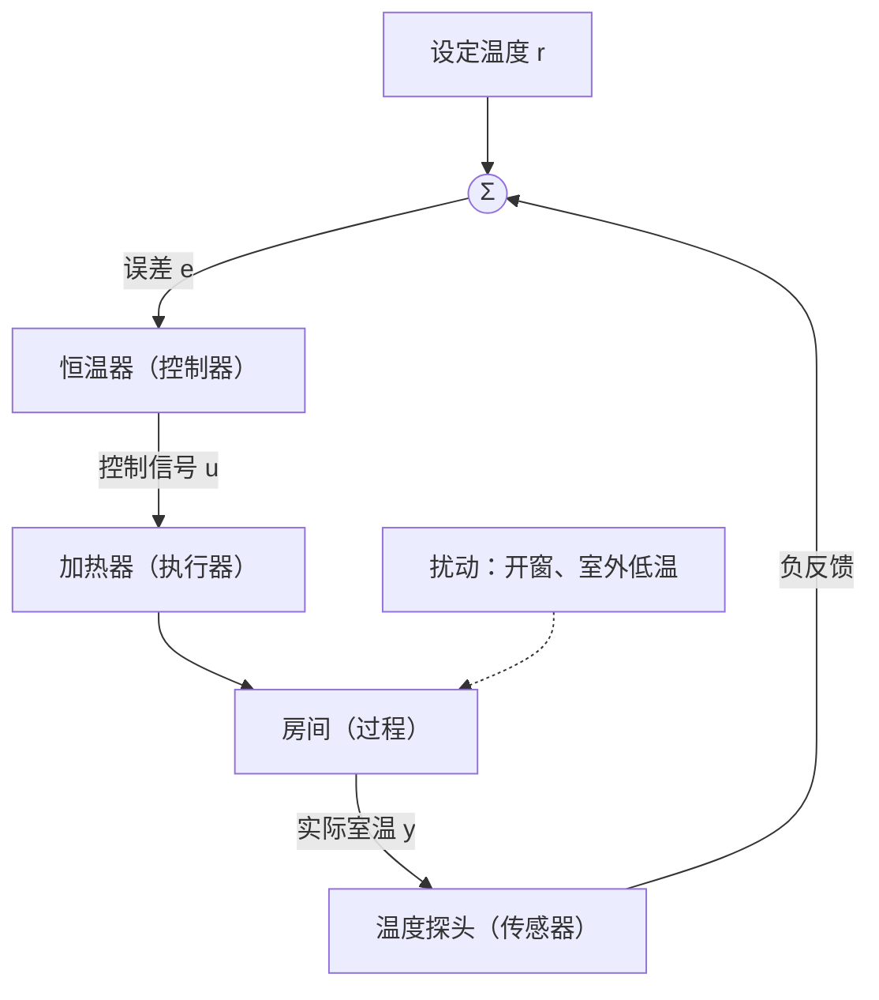

# A-I 控制系统导论

> [!info] 这一讲在做什么
> Part A 三讲回答的是同一个问题的三段：**反馈把系统的行为改成了什么样，我又能把它改到什么程度。**
> 这一讲负责第一段——反馈到底买到了什么、代价是什么。买到的是抗扰与对模型误差的不敏感，代价是系统可能不稳定；而"可能不稳定"正是 A-II 要用一套把微分方程变成代数式的工具去描述、A-III 要用一张图去量化的东西。
> 课程总览与考情见 [[00 课程信息与考情]]。对应课件 `Part A - I`，15 页。

## 1 把术语一次性钉在一张图上

控制系统（control system）就是**接收一个"想要的值"，去操纵某个物理过程，使这个过程的输出逼近那个值的装置**。

课件用汽车巡航控制当贯穿全讲的例子，所有术语都能在同一张图上指出位置，所以先把图摆出来，术语跟着图走。

![[A-I 巡航控制系统框图.png]]

| 术语 | 英文 | 在巡航控制里是谁 |
| --- | --- | --- |
| 被控变量 | controlled variable | 实际车速 $y(t)$，被测量、被控制的量，也就是系统输出 |
| 参考输入、设定值 | reference, setpoint | 你按下的目标车速 $r(t)$ |
| 误差 | error | $e(t)=r(t)-y(t)$，比较点的输出 |
| 控制器 | controller | 巡航控制计算机，把误差算成控制信号 |
| 控制信号、控制输入 | control signal | 油门指令 $u(t)$ |
| 执行器 | actuator | 发动机与传动系，把油门指令变成驱动力 |
| 过程 | process | 车辆运动本身（质量、气动阻力、滚动阻力） |
| 被控对象 | plant | 过程加执行器合起来的那一整块 |
| 扰动 | disturbance | 路面坡度 $\theta(t)$（定量分析页改记作 $w$，见下方提示），会把输出往坏处带的信号 |
| 传感器 | sensor | 车速表，把实际车速量出来送回比较点 |
| 系统 | system | 上述部件为同一目标组合起来的整体 |

> [!warning] 勘误：课件的扰动记号前后不一致
> 概念框图页标的是 $\theta(t)$（Road Grade, Uphill (+) / Downhill (−)），到了开环、闭环两页定量分析改标 $w$（题干原文 "grade, *w* is 1"）。**课件从未说明两者关系，也没在同一页同时用过。**本笔记术语表随框图记 $\theta$，第 3 节起随分析页记 $w$，指的是同一条扰动支路。

有两处容易混：

**plant 与 process 不是一回事。** process 指被控的那个物理过程，plant 则是 process 加上 actuator。
考试题里说"为这个 plant 设计控制器"时，执行器的动态已经算在被控对象里了，不该再单列一块。

**扰动不一定来自外部。** 坡度、阵风是外部扰动；元件老化、参数漂移、内部发热同样算扰动。
课件在定义里明写了 internal/external 两种。

> [!warning] 课件这两页对 plant 的划法自相矛盾
> 术语页写的是 plant = process + actuator，按这个口径，上图里 Engine & Drivetrain 与 Vehicle Dynamics 两块合起来才是 plant。
> 但同一讲的这张框图只把 Vehicle Dynamics 那一块标成 (Plant)，把发动机与传动系另算一块。
> 答题时以**术语页的定义**为准；读框图时留意标注不一定严格。

## 2 分水岭只有一条

课件把开环与闭环的差别列成六条：开环不测输出、靠预设值与经验、不能自动纠错也不能响应扰动；闭环能让实际值贴住要求值、但延迟会带来不稳定。

这六条不是六件事，是同一件事的推论。真正的分水岭只有一条：

> [!note] 开环与闭环的唯一判据
> **控制信号是不是由"实际输出"参与算出来的。**
> 是，就是闭环（closed-loop，CL）；不是，就是开环（open-loop，OL）。

其余各条都从这一条推得出来：

- 控制信号里不含 $y$ 的信息，那么无论输出偏到哪儿，控制器都发同一个指令——所以不能纠错、不能抗扰；
- 既然不看输出，控制器就只能靠事先标定的值动作，而这些值来自一个**假定的**被控对象模型——所以模型一错，输出跟着错；
- 反过来，闭环里 $y$ 参与了 $u$ 的运算，而 $u$ 又反过来决定 $y$，信号形成了一个回路——回路里的滞后会让系统有可能失稳。

闭环把输出量回来之后做的是**减法** $e=r-y$，这种接法叫**负反馈**（negative feedback）：输出偏高就减小控制作用，偏低就加大，方向总是与偏差相反。本课出现的闭环一律是负反馈。

## 3 把差别算成数字

课件给了同一辆车的两张图，一张开环一张闭环，参数完全一样，问同一个问题：参考速度 $r=65$ km/h、坡度 $w=1$ 时，实际速度 $y$ 是多少。
两个数字算出来，反馈的价值就不再是形容词了。

### 3.1 开环：扰动 100% 透传

![[A-I 巡航控制开环分析.png]]

信号从左到右走一遍：控制器把 $r$ 缩小 10 倍得到油门指令，被控对象内部先扣掉坡度带来的阻力，再放大 10 倍变成车速。

$$
u=\frac{r}{10},\qquad
y=10\left(u-0.5w\right)=10\left(\frac{r}{10}-0.5w\right)=r-5w \tag{1}
$$

代入 $r=65$、$w=1$：

$$
y=65-5=60 \ \text{km/h},\qquad e=r-y=5 \ \text{km/h}
$$

式 $(1)$ 的形状值得看两眼。$r$ 前面的系数正好是 1，因为控制器增益 $1/10$ 恰好是被控对象增益 $10$ 的倒数——**在没有坡度时，开环一分不差**。
而 $w$ 前面的系数是 $-5$：坡度信号先被 $0.5$ 缩放，再被那个 $10$ 倍增益原样放大，直接落在输出上。控制器对此毫不知情，也无从补偿。

### 3.2 闭环：同样的元件，改一根线

![[A-I 巡航控制闭环分析.png]]

改动只有两处：把输出量回来与 $r$ 相减，控制器增益从 $1/10$ 改成 $10$。于是

$$
u=10\left(r-y\right),\qquad
y=10\left(u-0.5w\right)=10\Bigl(10(r-y)-0.5w\Bigr)
$$

把含 $y$ 的项并到左边：

$$
101\,y=100\,r-5\,w
\qquad\Longrightarrow\qquad
y=\frac{100\,r-5\,w}{101} \tag{2}
$$

代入同样的数：

$$
y=\frac{6500-5}{101}=\frac{6495}{101}=64.31 \ \text{km/h},\qquad e=0.69 \ \text{km/h}
$$

误差从 5 km/h 掉到 0.69 km/h。

### 3.3 这 0.69 是由两笔完全不同的账凑出来的

先给一个此后反复要用的名字。信号从比较点出发，绕控制器、被控对象、传感器一圈回到比较点，这一圈的总增益叫**回路增益**（loop gain），本课统一记作 $L$。本例中

$$
L=\underbrace{10}_{\text{控制器}}\times\underbrace{10}_{\text{被控对象}}=100
$$

把误差写成表达式，比记住"0.69"有用得多：

$$
e=r-y=r-\frac{100r-5w}{101}=\frac{r+5w}{101}=\frac{r+5w}{1+L} \tag{3}
$$

分子上是两项，来源完全不同：

**扰动残差** $5w/(1+L) = 5/101 = 0.0495$ km/h。开环时这一项是 $5w=5$，闭环把它压小了 $1+L=101$ 倍。
**扰动被压缩的倍数就是 $1+L$。**

**跟踪残差** $r/(1+L) = 65/101 = 0.6436$ km/h。这一项开环里根本没有，是闭环自己带来的。
它占了 0.69 里的绝大部分——本例中闭环的主要误差来源不是坡度，而是闭环自身。

> [!warning] 常见误解：闭环就是"把误差消成零"
> 本例里纯比例控制留下了**静差**（steady-state error，稳态误差；指过渡过程结束、输出不再变化之后仍然残留、不会自己消失的那部分误差），原因在式子里写得很清楚：控制作用是 $u=10e$，要让车跑起来 $u$ 必须非零，于是 $e$ 必须非零。**误差正是驱动控制作用的燃料，它不可能被烧到零。**
>
> 但这条推理有一个前提：**回路里没有积分环节**。本例的被控对象是一个静态增益，$u=0$ 就 $y=0$，所以推理成立。
> 若被控对象（或控制器）里含有积分器，积分器可以在输入为零时仍然维持非零输出，"误差为零则控制量为零"这一步就断了——此时纯比例控制对阶跃输入的静差**恰好为零**。[[Tutorial A 全解#(b) 比例控制加单位负反馈的三阶系统|Tutorial A 的 Q1(b)]] 的被控对象正是这种情形。
>
> 准确的说法要带上条件：**回路里不含积分环节时，纯比例控制必然留静差，且静差随 $L$ 增大而减小、但永远不为零**；真正把它消成零，只能靠积分作用（控制器里的，或被控对象自带的）。

### 3.4 闭环不是天然更好，回路增益不够时反而更差

把控制器增益记作 $K$（本课此后一律用大写 $K$ 表示控制器增益），重做一遍式 $(2)$、式 $(3)$。此时回路增益 $L=10K$：

$$
y=\frac{10K\,r-5w}{1+10K},\qquad e=\frac{r+5w}{1+10K} \tag{4}
$$

| 控制器增益 $K$ | 回路增益 $L$ | 实际速度 $y$（km/h） | 误差 $e$（km/h） | 其中跟踪残差 | 其中扰动残差 |
| --- | --- | --- | --- | --- | --- |
| 1 | 10 | 58.64 | 6.36 | 5.91 | 0.45 |
| 10（课件用的） | 100 | 64.31 | 0.69 | 0.64 | 0.05 |
| 100 | 1000 | 64.93 | 0.070 | 0.065 | 0.005 |
| 1000 | 10000 | 64.993 | 0.0070 | 0.0065 | 0.0005 |

$K=1$ 那一行值得停一下：误差 6.36 km/h，**比开环的 5 km/h 还大**。
原因就在式 $(4)$ 的分子里多了一个 $r$：回路增益小的时候，闭环新添的跟踪残差比它省下来的扰动还多。

临界点就是"闭环误差恰好等于开环的 5 km/h"那一点。把 $r=65$、$w=1$ 代进式 $(4)$：

$$
\frac{65+5}{1+10K}<5
\quad\Longrightarrow\quad
1+10K>\frac{70}{5}=14
\quad\Longrightarrow\quad
K>1.3
$$

结论要说准：**反馈本身不保证更好，"高回路增益的反馈"才更好。**
而回路增益不能无限加大，因为第 4 节的代价在那儿等着。

### 3.5 反馈的第二件商品：对模型误差不敏感

开环那个"零跟踪误差"其实是脆的，它依赖控制器增益 $1/10$ **恰好**是被控对象增益 $10$ 的倒数。
现实里被控对象的增益会漂：车上多坐了三个人、发动机老化、轮胎气压变了。把实际增益记作 $G$（标称值 10），在无坡度（$w=0$）下比一比：

$$
\text{开环：} \ y=\frac{G}{10}r
\qquad\qquad
\text{闭环：} \ y=\frac{10G}{1+10G}\,r \tag{5}
$$

让 $G$ 从 10 变成 11，也就是被控对象增益漂了 $+10\%$：

| | $G=10$ 时 $y/r$ | $G=11$ 时 $y/r$ | 输出的相对变化 |
| --- | --- | --- | --- |
| 开环 | 1.0000 | 1.1000 | $+10\%$ |
| 闭环 | 0.9901 | 0.9910 | $+0.09\%$ |

10% 的模型误差在开环里原样出现在输出上，在闭环里被压成 0.09%，压缩比约 111，又是那个 $1+L$。

课件末尾那行 "Simplicity, cost, accuracy, adaptability"（简单性、成本、精度、适应性）里的 accuracy 与 adaptability，落到实处就是这两个 $1/(1+L)$：
**扰动被除以 $1+L$，被控对象的参数变化也被除以 $1+L$。** 这就是反馈全部价值的来源。

## 4 代价：闭环把静态问题变成了动态问题

课件对代价只写了一行：CL – delays → instability。这一行需要展开，否则它只是一句要背的话。

前面三节的推导偷偷用了一个假设——每个方块都是**瞬时**的纯增益，信号进去立刻出来。现实中没有这种元件：发动机响应油门要时间，车速表出数要时间，控制器采样计算要时间。于是误差信号绕回路一圈回来时，反映的已经不是"此刻的误差"，而是**一段时间之前的误差**。

滞后本身不致命，致命的是滞后与频率的配合。设想回路里出现一个频率为 $\omega$ 的小波动：

1. 它绕回路一圈，幅度被乘以回路增益的大小，相位被推迟一个角度；
2. 负反馈在比较点做的是减法，相当于再把信号翻转 $180^{\circ}$；
3. 如果在某个频率上，**回路自身的滞后恰好也是 $180^{\circ}$**，两个 $180^{\circ}$ 加起来是 $360^{\circ}$——绕一圈回来正好同相，本该抵消误差的信号变成了加强误差的信号；
4. 此时只要回路增益的大小还不小于 1，这个频率的波动每绕一圈都被放大一点，振荡就自己维持甚至发散下去。

这就是 "delays → instability" 的机制：**反馈把一个走一遍就结束的静态计算，换成了一个信号反复绕圈的动态过程；动态过程有自己的模态，而模态可能发散。**
开环没有这个问题——信号从左到右走一遍就完了，开环元件稳定则系统永远稳定。

> [!note] 这条线索直接通向后两讲
> 既然要判断"绕圈之后会不会发散"，就需要一个能描述"绕圈"的数学对象，还需要一个能一眼看出发散与否的指标——这就是 [[A-II 系统响应与稳定性]] 要建立的传递函数与极点。
> 而"回路增益到底能开多大才不越界"，则是 [[A-III 增益、根轨迹与系统特性]] 的根轨迹要回答的。
> 第 3 节说"增益越大误差越小"，第 4 节说"增益太大会不稳定"——Part A 剩下的两讲，本质上是在这两句话之间找那条线。

## 5 课件练习：室温控制系统

课件用一张室内示意图给出这个系统，并提了三问：说明它怎么工作（设室外温度低于参考温度）、画出框图、画出典型的温度响应。

### 5.1 它怎么工作

恒温器里存着设定温度，探头量出实际室温，两者相减得到误差。
室外比室内冷，房间持续向外散热，室温有往下掉的趋势；温度一低于设定值，误差变正，恒温器就让加热器工作，把热量补回去；温度回到设定值附近，误差回零，加热随之减弱。
开窗、进人、阳光这些都是扰动，它们改变的是房间的热量收支，但**控制器不需要知道是哪一种**——任何扰动只要把室温拉偏，就会在误差上显形，控制器随即反应。

### 5.2 框图

结构与巡航控制**逐块对应**，只是每一块换了物：

对照第 1 节的术语表可以逐项验收：被控变量是室温，控制信号是加热功率，执行器是加热器，过程是房间，plant 是"加热器 + 房间"，扰动从被控对象那一侧进来，传感器在反馈支路上。

### 5.3 典型响应

![[A-I 室温控制典型响应.png]]

图里有三段值得逐段读：

**上升段。** 室温从初始值升向设定值。若控制作用较强，会**冲过头**（overshoot，超调）再摆回来；这是闭环特有的现象，开环加热器不会超调，因为它压根不知道"到了"。

**稳定段。** 连续调节（蓝线）稳稳停在设定值上；开关式控制（粉线）则在设定值上下持续来回，因为它只有"全开"和"全关"两档，只能靠反复切换让**平均值**贴住设定值。两条线的平均温度一样，住户的体感完全不同——这正是 [[Tutorial A 全解#(a)(ii) 完美抗扰为什么住户仍可能不满意，提一个改进|Tutorial A Q1(a)(ii)]] 要答的那个问题。

**扰动段。** 开窗后室温下掉，误差变正，控制器加大供热，温度逐渐拉回设定值。回不到原位的偏差就是静差；掉下去的深度和拉回来的快慢，正是"抗扰性能"这个词的具体含义。

## 6 闭环的可靠性上限，就是反馈信息的质量

课件把失效原因归成五类，可以按"信息在回路里走到哪一段出了问题"来记：

| 失效类型 | 出问题的环节 | 后果 |
| --- | --- | --- |
| 传感器故障 | 测量 | 读数错误、噪声大、反馈中断 |
| 执行器故障 | 施加控制 | 电机或阀门失灵、控制作用不足 |
| 通信延迟 | 信号传输 | 对变化响应迟缓，可引起振荡 |
| 外部扰动 | 被控对象 | 意外环境影响、超出设计的负载或工况 |
| 系统设计不良 | 控制器本身 | 控制器不稳定、增益整定过大 |

课件的讨论题是最好的例子：**如果温控器的传感器永远报 22 °C，房间温度会怎样？**

关键在于反馈链断了而控制器并不知情。无论房间实际多冷多热，控制器拿到的测量值恒为 22 °C，于是它算出的误差**恒定不变、完全不随真实室温变化**——控制器被钉死在一个固定的控制动作上。

具体往哪个方向失控，取决于设定值：课件配图画的是温控器旁边一台被打了红叉的暖气片，对应**设定值不高于 22 °C** 的情形，此时误差恒为非正，控制器判断"已经达标"停止加热，房间温度一路掉到与室外热平衡为止。反过来若**设定值高于 22 °C**，误差恒为正，加热器永不停机，房间会一直升温到过热——同样是失控，只是方向相反。

> [!warning] 课件没给设定温度
> 原题只说 "If a thermostat sensor always reports 22°C"，**从头到尾没有给出 setpoint**。22 °C 是传感器读数，不是设定值——课件第 9 页把 measured temperature 与 setpoint 明确分开写过。所以这道题不能直接写成 $e = 22 - 22 = 0$，那要先假定设定值也是 22 °C。

注意这比开环还糟：开环加热器至少还按预设功率老老实实工作；这个坏掉的闭环则被一个"一切正常"的假读数骗停了。所以课件那句总结是准确的——**闭环控制系统的可靠性上限，就是它反馈信息的质量。**

## 7 课件练习：判断输入、输出与类型

判据始终是第 2 节那一条：控制决策里有没有用到实际输出。

> [!example]- 三个系统逐个判
> **自动交通信号灯。** 要先分清问的是哪个输出。
> 传统定时式信号灯：输入是预设的配时方案（各相位绿灯时长），输出是各方向的通行权状态。控制器按时钟表切换，从不测量路口实际有多少车——**开环**。路口空无一车时它照样让绿灯走完，这正是开环"不能响应扰动"的直接体现。
> 带地感线圈或摄像头的自适应信号灯：被控变量变成了排队长度或通行流量，检测器把它量回来参与配时决策——**闭环**。
>
> **汽车巡航控制。** 输入是设定车速，输出是实际车速，车速表把实际车速送回比较点，误差驱动油门——**闭环**。本讲的主例，坡度就是它要对抗的扰动。
>
> **水箱液位控制。** 输入是期望液位（浮球阀的安装高度决定），输出是实际液位。浮球随水面升降，直接带动阀门开度：液位高则阀关小，液位低则阀开大——**闭环**，而且传感器与执行器是同一个机械件，不需要电子元件。
> 反例：若改成"以固定流量注水固定时长"，就退化成开环，水的蒸发或者出水口流量变化都会让最终液位偏离。

## 本讲速记

- **开环与闭环的唯一判据**：控制信号是否由实际输出参与算出。课件列的其余各条差别都是这一条的推论。闭环在比较点做减法，称负反馈。
- **plant = process + actuator**；扰动含内部与外部两类。课件术语页与巡航框图对 plant 的划法不一致，以术语页为准。
- **回路增益 $L$**：信号绕回路一圈的总增益。巡航例中 $L=10\times10=100$。
- 巡航例：开环 $y=r-5w$，误差 5 km/h，**扰动 100% 透传**；闭环 $y=(100r-5w)/101$，误差 0.69 km/h。
- 闭环误差 $e=\dfrac{r+5w}{1+L}$ 拆成两笔：**扰动残差被 $1+L$ 除**，**跟踪残差是闭环新添的**。本例中跟踪残差（0.64）反而是误差主项，不是坡度（0.05）。
- **静差的准确说法**：回路里**不含积分环节**时，纯比例控制必然留静差，且随 $L$ 增大而减小但永不为零；回路里含积分器时，纯比例控制对阶跃的静差恰为零。要真正消掉静差只能靠积分作用。
- **闭环不是天然更好**：$K=1$ 时误差 6.36，比开环的 5 还大；要 $K>1.3$ 闭环才占优。反馈的好处来自**高回路增益**。
- 反馈的两件商品都是同一个因子：**扰动除以 $1+L$，被控对象参数变化也除以 $1+L$**。10% 的增益漂移在开环里全额出现，在闭环里只剩 0.09%。
- 代价：反馈把静态计算变成信号绕圈的动态过程。若某频率上回路滞后达 $180^{\circ}$ 且回路增益不小于 1，负反馈变正反馈，振荡自持——这就是 delays → instability。
- 室温控制的框图与巡航控制逐块对应；典型响应含上升（可能超调）、稳定（开关控制有纹波）、扰动（下掉后被拉回）三段。
- 五类失效按环节记：传感器、执行器、通信延迟、外部扰动、设计不良。**闭环的可靠性上限就是反馈信息的质量**；传感器恒报设定值会让控制器误判达标而彻底停止动作，比开环更糟。

---

下一讲 [[A-II 系统响应与稳定性]]，把这一讲末尾那个"会不会发散"的问题正式化：用拉普拉斯变换把微分方程变成代数式得到传递函数，再说明**极点位置如何决定系统的每一个模态**，最后给出不解方程就能判稳的 Routh 判据。

浏览器版（配巡航控制增益滑条、室温响应对比）：[HTML/A-I 控制系统导论.html](HTML/A-I%20%E6%8E%A7%E5%88%B6%E7%B3%BB%E7%BB%9F%E5%AF%BC%E8%AE%BA.html)
